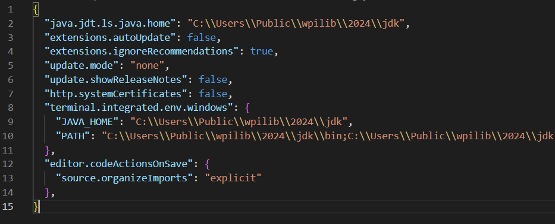

Organize Imports
================

Visual Studio Code provides many settings to speed up programming. The Java extensions installed by WPILib allow for a setting to automatically insert the correct imports and organize them in your Java code when that file is saved. To enable this feature, first navigate to the user settings by opening the command palette with :kbd:`Ctrl+Shift+P`, then type User Settings (JSON) and press enter. Finally, add this section of code to the end of the user settings.

.. code-block:: json

    "editor.codeActionsOnSave": {
        "source.organizeImports": "explicit"
    },

The end result should look something like this.

Now whenever you save your files with :kbd:`Ctrl+S` or by clicking Save under the File dropdown, the necessary imports will be automatically inserted into your Java code for any classes you're using. If there is an ambiguous import, a dropdown will be provided for the user to select the correct one.