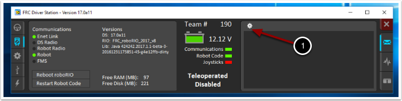
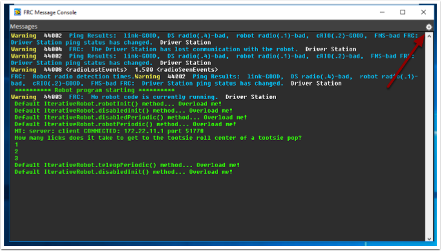
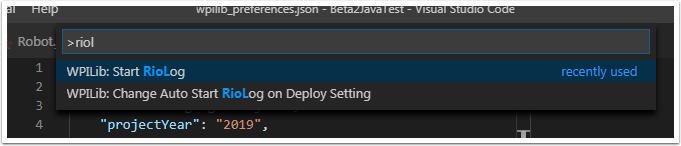
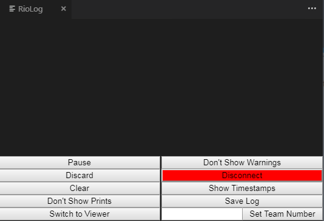

.. include:: <isonum.txt>

Viewing Console Output
======================

For viewing the console output of text based programs the roboRIO implements a NetConsole. There are two main ways to view the NetConsole output from the roboRIO: The Console Viewer in the FRC Driver Station and the Riolog plugin in VS Code.

.. note:: On the roboRIO, the NetConsole is only for program output.  If you want to interact with the system console you will need to use SSH or the Serial console.

Console Viewer
--------------

Opening the Console Viewer
~~~~~~~~~~~~~~~~~~~~~~~~~~

|Opening Console Viewer|

To open Console Viewer, first open the FRC\ |reg| Driver Station. Then, click on the gear at the top of the message viewer window (1) and select "View Console".

Console Viewer Window
~~~~~~~~~~~~~~~~~~~~~

|Console Viewer Window|

The Console Viewer window displays the output from our robot program in green.  The gear in the top right can clear the window and set the level of messages displayed.

Riolog VS Code Plugin
---------------------

The Riolog plugin is a VS Code view that can be used to view the NetConsole output in VS Code (credit for the original Eclipse version: Manuel Stoeckl, FRC1511).

Opening the RioLog View
~~~~~~~~~~~~~~~~~~~~~~~

|Opening Riolog View|

By default, the RioLog view will open automatically at the end of each roboRIO deploy. To launch the RioLog view manually, press :kbd:`Ctrl+Shift+P` to open the command palette and start typing "RioLog", then select the WPILib: Start RioLog option.

Riolog Window
~~~~~~~~~~~~~

|Riolog Window|

The RioLog view should appear in the top pane. The Riolog contains a number of controls for manipulating the console:

- **Pause/Resume Display** - This will pause/resume the display. In the background, the new packets will still be received and will be displayed when the resume button is clicked.
- **Discard/Accept Incoming** - This will toggle whether to accept new packets. When packets are being discarded the display will be paused and all packets received will be discarded. Clicking the button again will resume receiving packets.
- **Clear** - This will clear the current contents of the display.
- **Don't Show/Show Prints** - This shows or hides messages categorized as print statements
- **Switch to Viewer** - This switches to viewer for saved log files
- **Don't Show/Show Warnings** - This shows or hides messages categorized as warnings
- **Disconnect/Reconnect** - This disconnects or reconnects to the console stream
- **Show/Don't Show Timestamps** - Shows or hides timestamps on messages in the window
- **Save Log** - Copies the log contents into a file you can save and view or open later with the RioLog viewer (see Switch to Viewer above)
- **Set Team Number** - Sets the team number of the roboRIO to connect to the console stream on, set automatically if RioLog is launched by the deploy process

