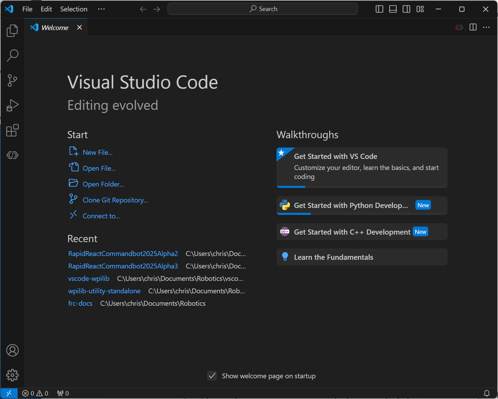
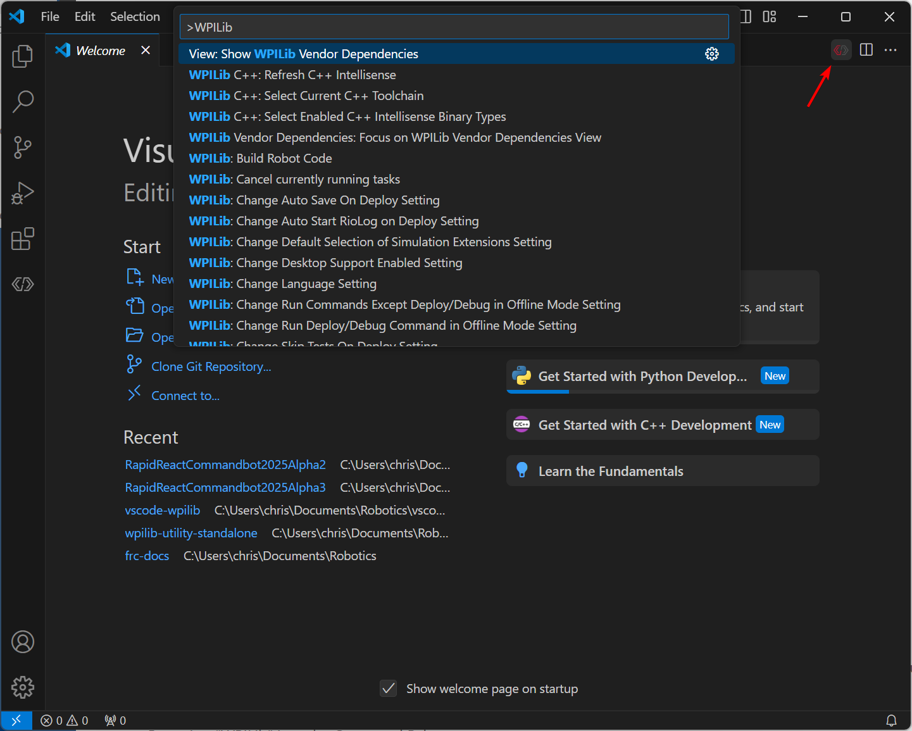

.. include:: <isonum.txt>

Visual Studio Code Basics and the WPILib Extension
==================================================

Microsoft's Visual Studio Code is the supported IDE for C++ and Java development in FRC. This article introduces some of the basics of using Visual Studio Code and the WPILib extension.

Welcome Page
------------

|Welcome Screen|

When Visual Studio Code first opens, you are presented with a Welcome page. On this page you will find some quick links that allow you to customize Visual Studio Code as well as a number of links to help documents and videos that may help you learn about the basics of the IDE as well as some tips and tricks.

You may also notice a small WPILib logo way up in the top right corner. This is one way to access the features provided by the WPILib extension (discussed further below).

User Interface
--------------

The most important link to take a look at is probably the basic User Interface document. This document describes a lot of the basics of using the UI and provides the majority of the information you should need to get started using Visual Studio Code for FRC.

Command Palette
---------------

The Command Palette can be used to access or run almost any function or feature in Visual Studio Code (including those from the WPILib extension). The Command Palette can be accessed from the View menu or by pressing :kbd:`Ctrl+Shift+P` (:kbd:`Cmd+Shift+P` on macOS). Typing text into the window will dynamically narrow the search to relevant commands and show them in the dropdown.

In the following example "wpilib" is typed into the search box after activating the Command Palette, and it narrows the list to functions containing WPILib.

WPILib Extension
----------------

|WPILib Commands|

The WPILib extension provides the FRC\ |reg| specific functionality related to creating projects and project components, building and downloading code to the roboRIO and more. You can access the WPILib commands one of two ways:

- By typing "WPILib" into the Command Palette
- By clicking on the WPILib icon in the top right of most windows. This will open the Command Palette with "WPILib" pre-entered

.. note:: It is **not** recommended to install the `Visual Studio IntelliCode <https://marketplace.visualstudio.com/items?itemName=VisualStudioExptTeam.vscodeintellicode>`_ plugin with the FRC installation of VS Code as it is known to break IntelliSense in odd ways.

For more information about specific WPILib extension commands, see the other articles in this chapter.

