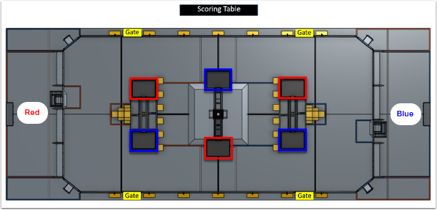
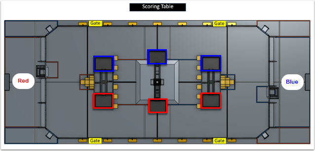
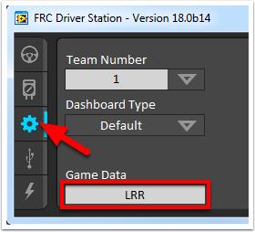

2018 Game Details
=================

.. note:: In the 2018 game, FIRST® POWER UP℠, the assignment of plates to alliances is randomized at the start of the match. To aid teams in programing autonomous routines, the Field Management System (FMS) will provide information to each team on the location of the plates assigned to their alliance. This page details the structure of that data and describes how to use it in each of the software languages.

The Data
--------

Timing
^^^^^^

Plate assignment data is provided to each robot (via the Driver Station) by the FMS just prior to the start of each match. The data will be sent after the "3...2...1...Go", and a short animation of the plate lighting will illustrate the randomization to ensure robots have time to receive and react to the data. To ensure your program properly responds to the data, you should either poll the data in a fairly fast loop while Disabled (~20ms) or retrieve the data once on the transition to Autonomous Enabled.

Initial States
^^^^^^^^^^^^^^

The initial state of the Game Data returned from the Robot code is non-deterministic. Before the data for the current match is sent the data returned will depend on what data is currently stored in the DS. This may be data from the last match, data from testing using the text box in the DS, or empty. If the data is empty, an empty (not NULL) string is returned. It is recommended to read the data as described above (and check string length if polling in Disabled) to avoid acting on incorrect data.

Plate Assignment Data
^^^^^^^^^^^^^^^^^^^^^

Data regarding plate assignment is provided to each robot based on their alliance. In other words, the Blue alliance will receive data corresponding to the location of the Blue plates and the Red alliance will receive data corresponding to the location of the Red plates. The data is referenced from the perspective of the Drive Team looking out from their Player Station. The data consists of three characters, each 'L' or 'R', representing the location (Left or Right) of the Alliance's plate on each element, starting with the element closest to the Alliance.

Example 1
^^^^^^^^^

Red Alliance: "LRL"

Blue Alliance: "LRL"

Red Alliance: "RRR"

Blue Alliance: "RRR"

.. tabs::

  .. tab:: Java

    The Game Data in Java is accessed using the ``getGameSpecificMessage`` method in the ``DriverStation`` class. If you are using the ``IterativeRobot`` or ``TimedRobot`` classes (or Command Based, which is based on one of those) you can query the Game Data in the ``AutonomousInit()`` method. If you are using ``SimpleRobot``, you can query it at the beginning of your ``Autonomous()`` method.

    The example below grabs the first character (the direction of the Switch) and uses an if statement with a comparison to the 'L' character to determine what code to run. Similar concepts can be extrapolated to using a switch statement instead, or combing this comparison with other means of selecting auto modes such as a ``SendableChooser``.

    .. code-block:: java

      String gameData;
      gameData = DriverStation.getInstance().getGameSpecificMessage();
      if (gameData.length() > 0) {
        if (gameData.charAt(0) == 'L') {
          //Put left auto code here
        } else {
          //Put right auto code here
        }
      }

  .. tab:: C++

    The Game Data in C++ is accessed using the ``GetGameSpecificMessage`` method in the ``DriverStation`` class. If you are using the ``IterativeRobot`` or ``TimedRobot`` classes (or Command Based, which is based on one of those) you can query the Game Data in the ``AutonomousInit()`` method. If you are using ``SimpleRobot``, you can query it at the beginning of your ``Autonomous()`` method.

    The example below grabs the first character (the direction of the Switch) and uses an if statement with a comparison to the 'L' character to determine what code to run. Similar concepts can be extrapolated to using a switch statement instead, or combing this comparison with other means of selecting auto modes such as a ``SendableChooser``.

    .. code-block:: c++

      std::string gameData;
      gameData = frc::DriverStation::GetInstance().GetGameSpecificMessage();
      if(gameData.length > 0) {
        if(gameData[0] == 'L') {
        //Put left auto code here
        } else {
        //Put right auto code here
        }
      }

  .. tab:: LabVIEW

    The Game Data in LabVIEW is accessed from the ``Game Specific Data`` VI. This VI can be found in the ``WPI Robotics Library`` -> ``Driver Station`` palette.

    The most obvious location to query the Game Data in LabVIEW is at the beginning of the ``Autonomous Independent`` VI. You can use this information either in addition to, or in place of the "Auto Selector" code that is already present in the default template.

    In the example below, the ``String Subset`` VI (from the String palette) is used to grab just the first character (the direction of the Switch). This information is then used with a Case Structure (make sure to rename the cases appropriately) inside the existing Auto Selector case structure. This construct allows for Left and Right versions of multiple auto routines (e.g. Switch, Scale, Drive, etc.). The example shows the "L" case of the inner structure.

    .. image:: images/2018-game-details/labview.png

Testing Game Specific Data
--------------------------

You can test your Game Specific Data code without FMS by using the Driver Station. Click on the Setup tab of the Driver Station, then enter the desired test string into the Game Data text field. Wait a few seconds to make sure the data has been transmitted to the robot, then Enable the robot in Autonomous mode.
