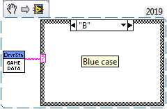

.. include:: <isonum.txt>

2020 Game Data Details
======================

In the 2020 *FIRST*\ |reg| Robotics Competition game, the Position Control objective requires alliances to select a specific color transmitted to them when specific pre-requisites have been met. The field will transmit the selected color to teams using Game Data. This page details the timing and structure of the sent data and provides examples of how to access it in the three supported programming languages.

The Data
--------

Timing
^^^^^^
Color assignment data is sent to both alliances simultaneously once the first alliance in a match has reached Capacity on Stage 3 of the Shield Generator (see the Game Manual for more complete details). Between the beginning of the match and this point, the Game Data will be an empty string.

Data format
^^^^^^^^^^^
The selected color for an alliance will be provided as a single character representing the color (i.e. 'R' = red, 'G' = green, 'B' = blue, 'Y' = yellow). This color indicates the color that must be placed underneath the Control Panel's color sensor in order to complete the Position Control objective (see the Game Manual for information about the location of the Control Panel sensor).

Accessing the Data
------------------
The data is accessed using the Game Data methods or VIs in each language. Below are descriptions and examples of how to access the data from each of the three languages. As the data is provided to the Robot during the Teleop period, teams will likely want to query the data in Teleop periodic code, or trigger reading it off a button press or other action after they have reached Stage 3 capacity.

C++/Java
^^^^^^^^
In C++ and Java the Game Data is accessed by using the GetGameSpecificMessage method of the DriverStation class. Teams likely want to query the data in a Teleop method such as Teleop Periodic in order to receive the data after it is sent during the match. Make sure to handle the case where the data is an empty string as this is what the data will be until the criteria are reached to enable Position Control for either alliance.

.. tabs::

  .. code-tab:: java

    import edu.wpi.first.wpilibj.DriverStation;

    String gameData;
    gameData = DriverStation.getInstance().getGameSpecificMessage();
    if(gameData.length() > 0)
    {
      switch (gameData.charAt(0))
      {
        case 'B' :
          //Blue case code
          break;
        case 'G' :
          //Green case code
          break;
        case 'R' :
          //Red case code
          break;
        case 'Y' :
          //Yellow case code
          break;
        default :
          //This is corrupt data
          break;
      }
    } else {
      //Code for no data received yet
    }

  .. code-tab:: c++

    #include <frc/DriverStation.h>

    std::string gameData;
    gameData = frc::DriverStation::GetInstance().GetGameSpecificMessage();
    if(gameData.length() > 0)
    {
      switch (gameData[0])
      {
        case 'B' :
          //Blue case code
          break;
        case 'G' :
          //Green case code
          break;
        case 'R' :
          //Red case code
          break;
        case 'Y' :
          //Yellow case code
          break;
        default :
          //This is corrupt data
          break;
      }
    } else {
      //Code for no data received yet
    }

LabVIEW
^^^^^^^
The Game Data in LabVIEW is accessed from the Game Specific Data VI. This VI can be found in the WPI Robotics Library -> Driver Station palette.

LabVIEW teams will likely want to query the data in the Teleop or PeriodicTasks VIs and may choose to gate the query behind a button press or other action. The code below reads the data and then uses a case structure to react differently to each of the 5 possible cases (empty, or any of the 4 letters).

Testing Game Specific Data
--------------------------
You can test your Game Specific Data code without FMS by using the Driver Station. Click on the Setup tab of the Driver Station, then enter the desired test string into the Game Data text field. The data will be transmitted to the robot in one of two conditions: Enable the robot in Teleop mode, or when the DS reaches the End Game time in a Practice Match (times are configurable on the Setup tab). It is recommended to run at least one match using the Practice functionality to verify that your code works correctly in a full match flow.

.. image:: images/2020-Game-Data/ds-game-data.png
