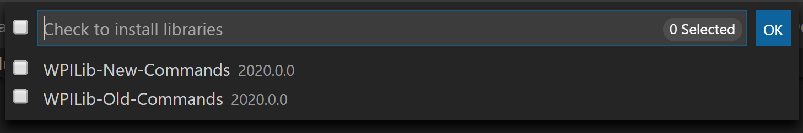

3rd Party Libraries
===================

A number of software components were broken out of WPILib starting in 2017 and are now maintained by the third parties who produce the hardware. See `this <https://www.firstinspires.org/robotics/frc/blog/2017-control-system-update>`__ blog for more details.

Libraries
---------

.. warning:: These are **not** links to directly plug in to the VS Code -> Install New Libraries (online) feature. Click these links to visit the vendor site to see whether they offer online installers, offline installers, or both.

`Analog Devices ADIS16448 IMU <https://github.com/juchong/ADIS16448-roboRIO-Driver>`__ - Driver for ADIS16448 IMU. More info `here <https://wiki.analog.com/first/first_robotics_donation_resources#adis16448_imu_board_for_first_robotics>`__

`Analog Devices ADIS16470 IMU <https://github.com/juchong/ADIS16470-roboRIO-Driver>`__ - Driver for ADIS16470 IMU. More info `here <https://wiki.analog.com/first/first_robotics_donation_resources#adis16470_imu_board_for_first_robotics>`__

`Copperforge LibCu Software Library <https://copperforge.cc/docs/software/libcu/>`__ - Library for all Copperforge devices including the Lasershark

`CTRE Phoenix Toolsuite <https://www.ctr-electronics.com/control-system/hro.html#product_tabs_technical_resources>`__ - Contains CANCoder, Canifier, Pigeon, Talon FX, Talon SRX, and Victor SPX Libraries and Phoenix Tuner program for configuring CTRE CAN devices

`Digilent <https://reference.digilentinc.com/dmc-60c/getting-started>`__ - DMC-60C library

`Playing With Fusion Driver <https://www.playingwithfusion.com/docview.php?docid=1205>`__ - Library for all PWF devices including the Venom motor/controller

`Kauai Labs <https://pdocs.kauailabs.com/navx-mxp/software/roborio-libraries/>`__ - Libraries for NavX-MXP, NavX-Micro, and Sensor Fusion

`Mindsensors Libraries <http://www.mindsensors.com/blog/how-to/how-to-use-sd540c-and-canlight-with-roborio>`__ - Contains libraries for SD540C and CANLight

`Rev Robotics Color Sensor V3 <http://www.revrobotics.com/rev-31-1557/>`__ - Library for Rev Robotics Color Sensor included in 2020 Kit of Parts

`Rev Robotics SPARK MAX <https://www.revrobotics.com/sparkmax-software/>`__ - SPARK MAX Library

`Scansense Sweep <https://github.com/PeterJohnson/sweep-sdk/releases>`__ - C/Java Libraries for Scansense Sweep LIDAR (packaged by Peter Johnson)

WPILib Command Libraries
------------------------

The WPILib :doc:`old </docs/software/old-commandbased/index>` and :doc:`new </docs/software/commandbased/index>` command libraries have been split into vendor libraries in order to reduce the chances of mixing the two which will not work correctly. They are both installed by the wpilib installer for offline installation. They may also be installed with the following online links:

`Old Command Library <https://raw.githubusercontent.com/wpilibsuite/allwpilib/master/wpilibOldCommands/WPILibOldCommands.json>`__

`New Command Library <https://raw.githubusercontent.com/wpilibsuite/allwpilib/master/wpilibNewCommands/WPILibNewCommands.json>`__

The Mechanism
-------------

In support of this effort NI (for LabVIEW) and FIRST/WPI (for C++/Java) have developed mechanisms that should make it easy for vendors to plug their code into the WPILib software and for teams to use that code once it has been installed. A brief description of how the system works for each language can be found below.

The Mechanism - LabVIEW
^^^^^^^^^^^^^^^^^^^^^^^

For LabVIEW teams, you may notice a few new Third Party items on various palettes (specifically, one in Actuators, one in Actuators->Motor Control labeled “CAN Motor”, and one in “Sensors”). These correspond to folders in ``C:\Program Files\National Instruments\LabVIEW 2016\vi.lib\Rock Robotics\WPI\Third Party``.

For a library to insert VI’s in these palettes, they simply make a subfolder in one of these three Third Party folders containing their VIs and they will be added automatically. To control the appearance of the palette (have some VI’s not show up, set the Icon for the folder, etc.) there is a process to create a dir.mnu file for your directory. We will be working on documenting that process shortly.

To use installed Third Party libraries, simply locate the VIs in one of these 3 locations and drag them into your project as you would with any other VI.

The Mechanism - C++/Java
^^^^^^^^^^^^^^^^^^^^^^^^

For C++ and Java a JSON file describing the vendor library is installed on your system to ``~/wpilib/YYYY/vendordeps`` (where YYYY is the year and ~ is ``C:\Users\Public`` on Windows). This can either be done by an offline installer or the file can be fetched from an online location using the menu item in Visual Studio Code. This file is then used from VS Code to add to the library to each individual project. Vendor library information is managed on a per-project basis to make sure that a project is always pointing to a consistent version of a given vendor library. The libraries themselves are placed in the Maven cache at ``C:\Users\Public\wpilib\YYYY\maven``. Vendors can place a local copy here with an offline installer (recommended) or require users to be online for an initial build to fetch the library from a remote Maven location.

The JSON file allows specification of complex libraries with multiple components (C++, Java, JNI, etc.) and also helps handle some complexities related to simulation. Vendors choosing to provide a remote URL in the JSON also enable users to check for updates from within VS Code.

.. note:: The vendor JSON files are actually processed by GradleRIO once they are in your projects vendordeps folder. If you are using another IDE, you will need to manually create a “vendordeps” folder in your project and copy any desired vendor JSON files from the “wpilib/YYYY” folder (where they should be placed by an offline installer) or download them directly from the vendor and place them into the folder in the project.

Adding an Offline-Installed Library
^^^^^^^^^^^^^^^^^^^^^^^^^^^^^^^^^^^

.. image:: images/3rd-party-libraries/adding-offline-library.png

To add a vendor library that has been installed by an offline installer, press **Ctrl+Shift+P** and type WPILib or click on the WPILib icon in the top right to open the WPILib Command Palette and begin typing **Manage Vendor Libraries**, then select it from the menu. Select the option to **Install new libraries (offline)**.

Select the desired libraries to add to the project by checking the box next to each, then click OK. The JSON file will be copied to the **vendordeps** folder in the project, adding the library as a dependency to the project.

Checking for Updates (Offline)
^^^^^^^^^^^^^^^^^^^^^^^^^^^^^^

Remember: Dependencies are now version managed and done on a per-project bases. Even if you have installed an updated library using an offline installer, you will need to Manage Vendor Libraries and select **Check for updates (offline)** for each project you wish to update.

Checking for Updates (Online)
^^^^^^^^^^^^^^^^^^^^^^^^^^^^^

Part of the JSON file that vendors may optionally populate is an online update location. If a library has an appropriate location specified, running **Check for updates (online)** will check if a newer version of the library is available from the remote location.

Removing a Library Dependency
^^^^^^^^^^^^^^^^^^^^^^^^^^^^^

To remove a library dependency from a project, select **Manage Current Libraries** from the **Manage Vendor Libraries** menu, check the box for any libraries to uninstall and click OK. These libraries will be removed as dependencies from the project.
