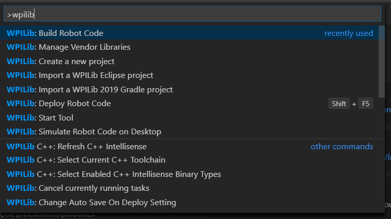
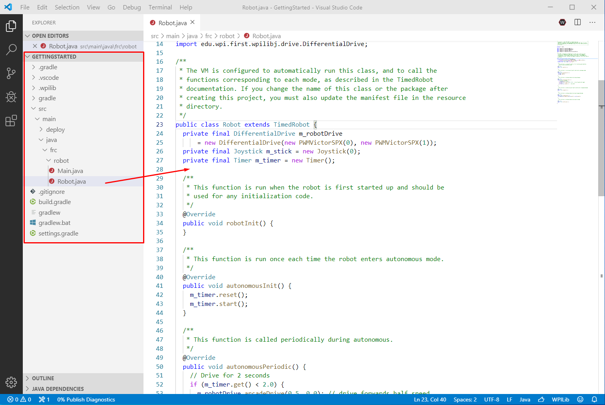

Creating a Robot Program
========================

Once everything is installed, we're ready to create a robot program.  WPILib comes with several templates for robot programs.  Use of these templates is highly recommended for new users; however, advanced users are free to write their own robot code from scratch.

Choosing a Base Class
---------------------

To start a project using one of the WPILib robot program templates, users must first choose a base class for their robot.  Users subclass these base classes to create their primary :code:`Robot` class, which controls the main flow of the robot program.  There are three choices available for the base class:

TimedRobot
~~~~~~~~~~

Documentation:
`Java <http://first.wpi.edu/FRC/roborio/release/docs/java/edu/wpi/first/wpilibj/TimedRobot.html>`__
- `C++ <http://first.wpi.edu/FRC/roborio/release/docs/cpp/classfrc_1_1TimedRobot.html>`__

Source:
`Java <https://github.com/wpilibsuite/allwpilib/blob/master/wpilibj/src/main/java/edu/wpi/first/wpilibj/TimedRobot.java>`__
- `C++ <https://github.com/wpilibsuite/allwpilib/blob/master/wpilibc/src/main/native/cpp/TimedRobot.cpp>`__

The :code:`TimedRobot` class is the the base class recommended for most users.  It provides control of the robot program through a collection of :code:`init()` and :code:`periodic()` methods, which are called by WPILib during specific robot states (e.g. autonomous or teleoperated).  By default, periodic methods are called every 20ms; this can be changed by overriding the :code:`getPeriod()` method.

.. tabs::

    .. code-tab:: c++

        #include <frc/TimedRobot.h>

        class Robot : public frc::TimedRobot {
            public:
                void RobotInit() override; // This is called once when the robot code initializes
                void RobotPeriodic() override; // This is called every period regardless of mode
                void AutonomousInit() override; // This is called once when the robot first enters autonomous mode
                void AutonomousPeriodic() override; // This is called periodically while the robot is in autonomous mode
                void TeleopInit() override; // This is called once when the robot first enters teleoperated mode
                void TeleopPeriodic() override; // This is called periodically while the robot is in teleopreated mode
                void TestInit() override; // This is called once when the robot enters test mode
                void TestPeriodic() override; // This is called periodically while the robot is in test mode
        };

    .. code-tab:: java

        import edu.wpi.first.wpilibj.TimedRobot;

        public class Robot extends TimedRobot {

            @Override
            public void robotInit() {
                // This is called once when the robot code initializes
            }

            @Override
            public void robotPeriodic() {
                // This is called every period regardless of mode
            }

            @Override
            public void autonomousInit() {
                // This is called once when the robot first enters autonomous mode
            }

            @Override
            public void autonomousPeriodic() {
                // This is called periodically while the robot is in autonomous mode
            }

            @Override
            public void teleopInit() {
                // This is called once when the robot first enters teleoperated mode
            }

            @Override
            public void teleopPeriodic() {
                // This is called periodically while the robot is in teleopreated mode
            }

            @Override
            public void testInit() {
                // This is called once when the robot enters test mode
            }

            @Override
            public void testPeriodic() {
                // This is called periodically while the robot is in test mode
            }

        }

IterativeRobotBase
~~~~~~~~~~~~~~~~~~

Documentation:
`Java <http://first.wpi.edu/FRC/roborio/release/docs/java/edu/wpi/first/wpilibj/IterativeRobotBase.html>`__
- `C++ <http://first.wpi.edu/FRC/roborio/release/docs/cpp/classfrc_1_1IterativeRobotBase.html>`__

Source:
`Java <https://github.com/wpilibsuite/allwpilib/blob/master/wpilibj/src/main/java/edu/wpi/first/wpilibj/IterativeRobotBase.java>`__
- `C++ <https://github.com/wpilibsuite/allwpilib/blob/master/wpilibc/src/main/native/cpp/IterativeRobotBase.cpp>`__

This is identical to TimedRobot, except the main robot loop is not run automatically - users are required to implement it inside of the :code:`startCompetition()` method.  This gives more freedom for advanced users to handle the loop timing in different ways, but is also less-convenient.

Rather than checking the mode and calling the various :code:`init()` and :code:`periodic()` methods themselves, user implementations can simply call the :code:`loopFunc()` method from their main loop implementation.  However, the :code:`robotInit()` method must be called manually.

RobotBase
~~~~~~~~~

Documentation:
`Java <http://first.wpi.edu/FRC/roborio/release/docs/java/edu/wpi/first/wpilibj/RobotBase.html>`__
- `C++ <http://first.wpi.edu/FRC/roborio/release/docs/cpp/classfrc_1_1RobotBase.html>`__

Source:
`Java <https://github.com/wpilibsuite/allwpilib/blob/master/wpilibj/src/main/java/edu/wpi/first/wpilibj/RobotBase.java>`__
- `C++ <https://github.com/wpilibsuite/allwpilib/blob/master/wpilibc/src/main/native/cpp/RobotBase.cpp>`__

The :code:`RobotBase` class is the most minimal base-class offered, and is generally not recommended for direct use.  No robot control flow is handled for the user; everything must be written from scratch inside the :code:`startCompetition()` method.

Not Using a Base Class
~~~~~~~~~~~~~~~~~~~

If desired, users can omit a base class entirely and simply write their program in a :code:`main()` method, as they would for any other program.  This is *highly* discouraged - users should not "reinvent the wheel" when writing their robot code - but it is supported for those who wish to have absolute control over their program flow.

.. warning:: Users should *not* modify the :code:`main()` method of a robot program unless they are absolutely sure of what they are doing.

Creating a New WPILib Project
-----------------------------

Once we've decided on a base class, we can create our new robot project.  Bring up the VSCode command palette with Control+Shift+P:

|Command Palette|

Then, type "WPILib" into the prompt.  Since all WPILib commands start with "WPILib," this will bring up the list of WPILib-specific VSCode commands:

|WPILib Commands|

Now, select the "Create a new project" command:

|Create New Project|

This will bring up the "New Project Creator Window:"

|New Project Creator|

The elements of the New Project Creator Window are explained below:

1. **Project Type**: The kind of project we wish to create.  This can be an example project, or one of the project templates provided by WPILib.  Templates exist for each of the robot base classes.  Additionally, a template exists for :ref:`Command-based <what-is-command-based>` projects, which are built on the :code:`TimedRobot` base class but include a number of additional features - this type of robot program is highly recommended for new teams.
2. **Language**: This is the language (C++ or Java) that will be used for this project.
3. **Template Type**: If this is a template project, this specifies the type of template that will be used.
4. **Project Location**: This determines the folder in which the robot project will be located.
5. **Create New Folder**: If this is checked, a new folder will be created to hold the project within the previously-specified folder.  If it is *not* checked, the project will be located directly in the previously-specified folder.  An error will be thrown if the folder is not empty and this is not checked.
6. **Project Name**: The name of the robot project.  This also specifies the name that the project folder will be given if the Create New Folder box is checked.
7. **Team Number**: The team number for the project, which will be used for package names within the project and to locate the robot when deploying code.

Once all the above have been configured, click "Generate Project" and the robot project will be created.

.. note:: Any errors in project generation will appear in the bottom right-hand corner of the screen.

|New Project Configured|

Opening The New Project
-----------------------

After successfully creating your project, Visual Studio Code will give the option of opening the project as shown below. We can choose to do that now or later by typing Ctrl-O (Command+O on mac) and select the folder where We saved our project.

Once opened we will see the project hierarchy on the left. Double clicking on the file will open that file in the editor.

TODO: Replace this image with an up-to-date one (also, ew light theme)
|Opened Robot Project|

C++ Configurations (C++ Only)
-----------------------------

For C++ projects, there is one more step to set up IntelliSense.  Whenever we open a project, we should get a pop-up in the bottom right corner asking to refresh C++ configurations.  Click "Yes" to set up IntelliSense.

|CPP Configurations|

.. |Create New Project| image:: images/creating-robot-program/create-new-project.png
.. |New Project Creator| image:: images/creating-robot-program/new-project-creator.png
.. |New Project Configured| image:: images/creating-robot-program/new-project-creator-configured.png

.. |CPP Configurations| image: images/creating-robot-program/cpp-configurations.png