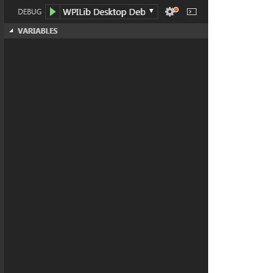
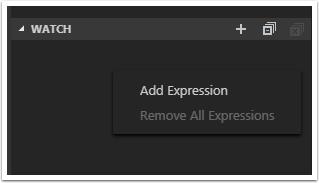
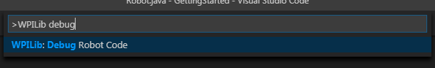

Debugging a Robot Program
=========================

Inevitably, a program will not behave in the way we expect it to behave.  When this occurs, it becomes necessary to figure out why the program is doing what it is doing, so that we can make it do what we want it to do, instead.  Such an undesired program behavior is called a "bug," and this process is called "debugging."

A debugger is a tool used to control program flow and monitor variables in order to assist in debugging a program. This section will describe how to set up a debug session for an FRC robot program.

.. note:: For beginning users who need to debug their programs but do not know/have time to learn how to use a debugger, it is often possible to debug a program simply by printing the relevant program state to the console.  However, it is strongly recommended that students eventually learn to use a debugger.

Breakpoints
-----------

A "breakpoint" is a line of code at which the debugger will stop the program execution so that the user can examine the program state.  This is extremely useful while debugging, as it allows the user to pause the program at specific points in problematic code to determine where exactly the program is deviating from the expected behavior.

Setting a Breakpoint
~~~~~~~~~~~~~~~~~~~~

|Setting a Breakpoint|

Double-click in the left margin of the source code window to set a breakpoint in your user program: A small red circle indicates the breakpoint has been set on the corresponding line.

Viewing Program State
~~~~~~~~~~~~~~~~~~~~~

|Debug Tab|

When the program is stopped at a breakpoint, various pieces of program state can be viewed from the debug tab.  The Debug tab is accessed by clicking on the debug icon on the far left pane.  Within the debug tab, the program state can be viewed from an assortment of "panes."

The Variables Pane
^^^^^^^^^^^^^^^^^^

|Variables Pane|

The Variables view shows the current values of variables. To see a variable that is not displayed, select the “Watch” pane and enter the variable name. This will show the variable’s value if it’s in-scope. Clicking on the arrows next to a variable name will expand the tree and show its `fields <https://en.wikipedia.org/wiki/Field_(computer_science)>`__.

Watch Pane
^^^^^^^^^^

|Watch Pane|

The Watch Pane can be used to monitor specific variables or expressions while debugging. To add an expression, right-click and select Add Expression.

Call Stack
^^^^^^^^^^

|Call Stack|

The Call Stack pane is used to display the current `call stack <https://en.wikipedia.org/wiki/Call_stack>`__ of the running program. This can be used to monitor the current call hierarchy of the program while debugging.

Breakpoint Pane
^^^^^^^^^^^^^^^

|Breakpoint Pane|

The Breakpoint Pane displays all of the current breakpoints. To temporarily disable a breakpoint without permanently removing it, click the corresponding checkbox.

Running the Debugger
--------------------

|Start Debugging|

Press Ctrl+Shift+P and type WPILib or click on the WPILib Menu item to open the Command palette with WPILib pre-populated. Type Debug and select the Debug Robot Code menu item to start debugging. The code will download to the roboRIO and begin debugging.

The debugger will automatically pause at the first breakpoint it encounters.  The user can then tell the debugger when to proceed to the next breakpoint.

Debugging with Console
Another way to debug your program is to use System.out.println statements in your code and receive them using the RioLog in VSCode. 

.. |Setting a Breakpoint| image:: images/debugging-robot-program/setting-a-breakpoint.png
.. |Debug Tab| image:: images/debugging-robot-program/debug-tab.png

.. |Call Stack| image:: images/debugging-robot-program/call-stack.png
.. |Breakpoint Pane| image:: images/debugging-robot-program/breakpoint-pane.png
