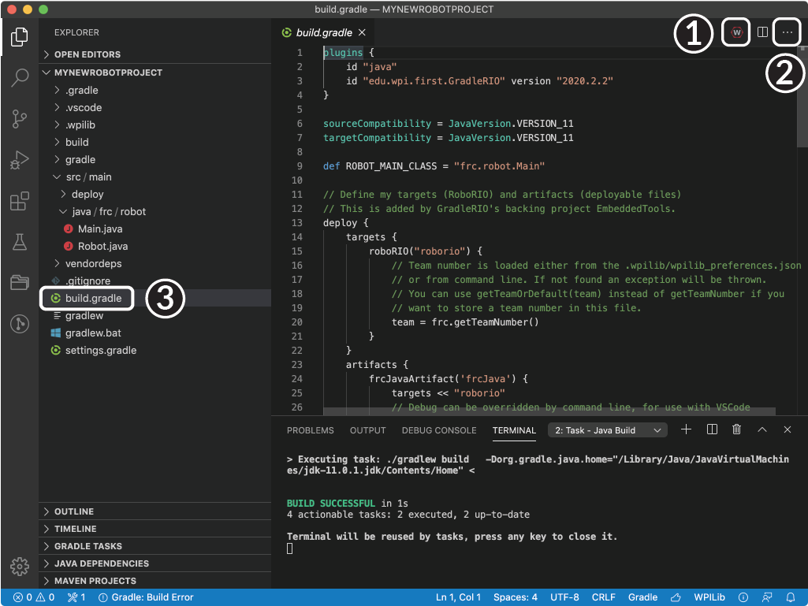
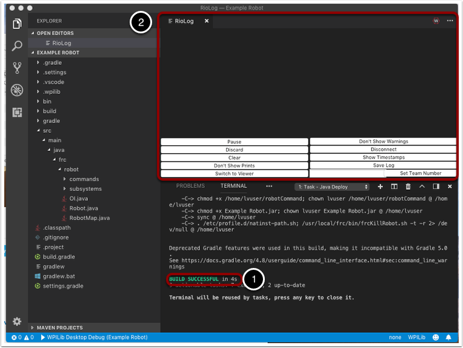

Building and Deploying Robot Code
=================================

Robot projects must be compiled ("built") and deployed in order to run on the RoboRIO.  Since the code is not compiled natively on the robot controller, this is known as "cross-compilation."

To build and deploy a robot project, do one of:

1. Open the Command Palette and enter/select "Build Robot Code"
2. Open the shortcut menu indicated by the ellipses in the top right corner of the VS Code window and select "Build Robot Code"
3. Right-click on the build.gradle file in the project hierarchy and select "Build Robot Code"

TODO: This should display option 1 (also, ew light theme)
|Building Options|

Deploy robot code by selecting "Deploy Robot Code" from any of the three locations from the previous instructions. That will build (if necessary) and deploy the robot program to the roboRIO. If successful, we will see a "Build Successful" message (2) and the RioLog will open with the console output from the robot program as it runs (1).

TODO: The numbering in this image is backwards.
|Build Successful|

