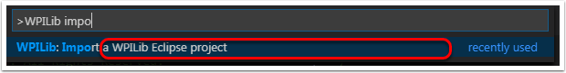
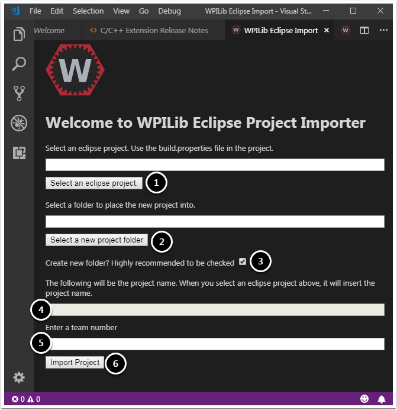

Importing an Eclipse project into VS Code
=========================================

To make it easy for teams to use existing projects with the new IDE, WPILib includes a wizard for importing Eclipse projects into VS Code. This will generate the necessary Gradle components and load the project into VS Code. The importer automatically imports the old command framework 3rd party library.

Launching the Import Wizard
---------------------------

|Launching Import Wizard|

Press Ctrl+Shift+P and type "WPILib" or click the WPILib icon to locate the WPILib commands. Begin typing "Import a WPILib Eclipse project" and select it from the dropdown.

|Eclipse Project Importer|

You'll be presented with the WPILib Eclipse Project Upgrade window. This is similar to the process of creating a new project and the window and the steps are shown below.  This window contains the following elements:

1. **Eclipse Project Selection**: Selects the Eclipse project to be imported.  Users should select the build.properties file in the root directory of the eclipse project.
2. **Project Location**: This determines the folder in which the robot project will be located.
3. **Create New Folder**: If this is checked, a new folder will be created to hold the project within the previously-specified folder.  If it is *not* checked, the project will be located directly in the previously-specified folder.  An error will be thrown if the folder is not empty and this is not checked.
4. **Project Name**: The name of the robot project.  This also specifies the name that the project folder will be given if the Create New Folder box is checked.
5. **Team Number**: The team number for the project, which will be used for package names within the project and to locate the robot when deploying code.

Click "Upgrade Project" to begin the upgrade.

The eclipse project will be upgraded and copied into the new project directory. You can then either open the new project immediately (the pop-up shown below should appear in the bottom right) or open it later using the Ctrl-O (or Command-O for macOS) shortcut.

|Opening Project|

C++ Configurations (C++ Only)
-----------------------------

For C++ projects, there is one more step to set up IntelliSense. Whenever you open a project, you should get a pop-up in the bottom right corner asking to refresh C++ configurations.  Click "Yes" to set up IntelliSense.

|C++ Configurations|

.. |Opening Project| image:: images/importing-eclipse-project/opening-project.png
.. |C++ Configurations| image:: images/importing-eclipse-project/cpp-configurations.png
