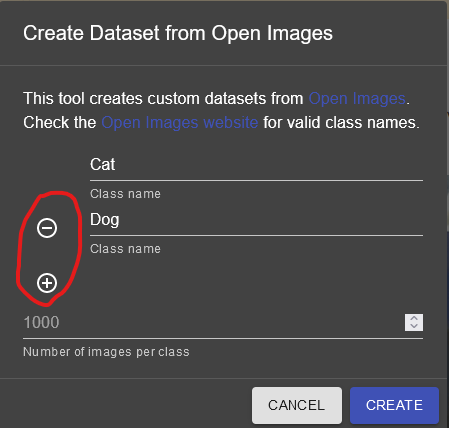

Creating a Dataset with Open Images
===================================

For the detection of more generic objects, Axon's creator can be used to make a dataset from OpenImages.

Creating a Dataset
------------------

Click the create a dataset button to begin.

Choosing the Classes
-----------------------

Next, you need to pick the classes that you would like to detect. They must be selected from the categories that are available in the Open Images dataset. More information on the dataset can be found here: `Open Images <https://storage.googleapis.com/openimages/web/index.html>`__ .

.. image:: images/open-images/class-name.png
  :alt: Choose the Class Name you want to get images of.

Furthermore, using the add button, you can choose to make a dataset containing more than one class. Subsequently, you can also remove classes using the remove button.

Choosing the Number of Images
-----------------------------

Finally, you can select the amount of images that you want for each class category in your dataset.

.. image:: images/open-images/number.png
  :alt: Set the number of images you want.
