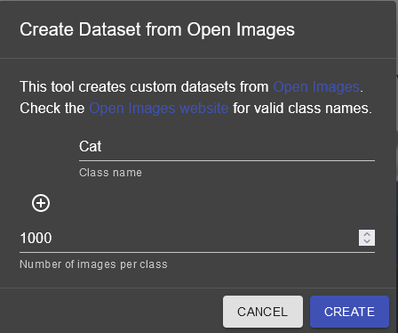

Creating a Dataset with Open Images
===================================

For the detection of more generic objects, Axon's dataset creator can be used to make a dataset from `Google's Open Images dataset <https://storage.googleapis.com/openimages/web/index.html>`__ .

Creating a Dataset
------------------

Click the :guilabel:`Create Dataset` button to begin.

.. image:: images/open-images/create-button.png
  :alt: Create Dataset Button.

Choosing the Class Names
^^^^^^^^^^^^^^^^^^^^^^^^

Next, you need to pick the classes that you would like to detect. They must be selected from the classes available at the `Open Images dataset website <https://storage.googleapis.com/openimages/web/index.html>`__ . Change the :guilabel:`category` in the top bar to see available classes. In the below picture, :guilabel:`Cat` is selected, but other class names like :guilabel:`Caterpillar` are shown to be valid.

When you have determined the valid class names of the objects that you wish to detect, you can type them into dialog as shown below.

.. image:: images/open-images/class-name.png
  :alt: Choose the Class Name you want to get images of.

Furthermore, using the :guilabel:`add` button, you can choose to make a dataset containing more than one class. Subsequently, you can also remove classes using the :guilabel:`remove` button.

.. image:: images/open-images/add-remove.png
  :alt: Add or remove classes.

Choosing the Number of Images
^^^^^^^^^^^^^^^^^^^^^^^^^^^^^

Finally, you can select the amount of images that you want for each class category in your dataset and click :guilabel:`CREATE`.

Waiting
-------

The creation process will take from a couple seconds to several minutes, depending on the size of your dataset. The newly-created dataset will be automatically imported into the dataset pane on the left side of the screen, but there is a :guilabel:`Download` button for sending the dataset to a teammate.

