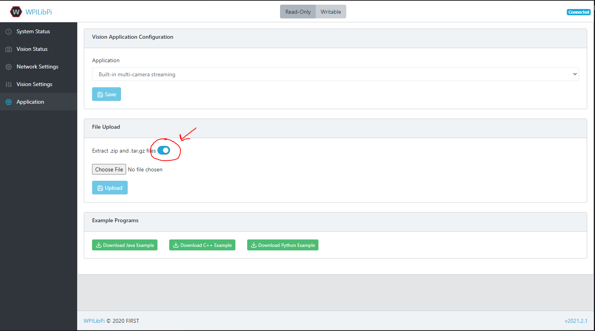
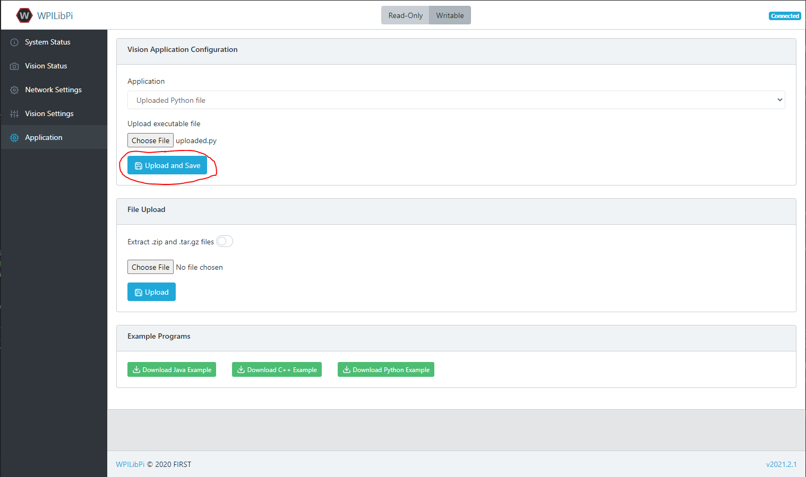
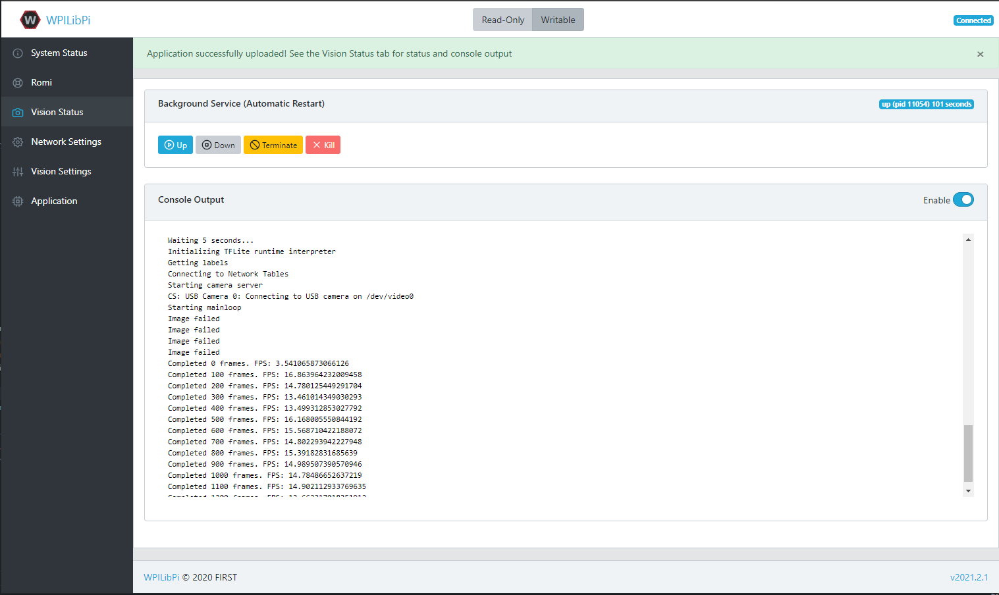
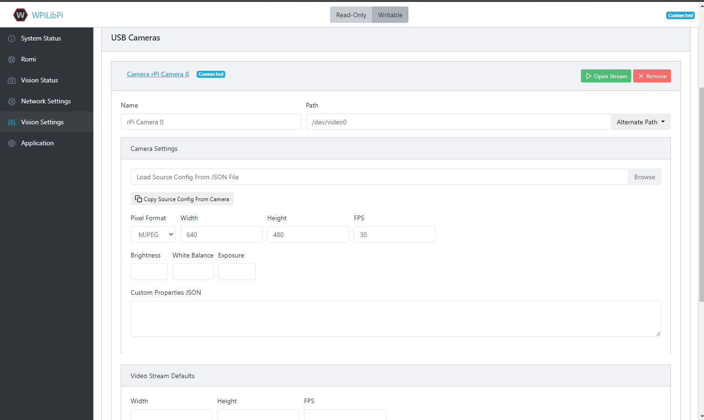
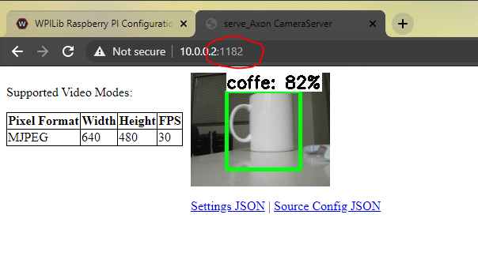
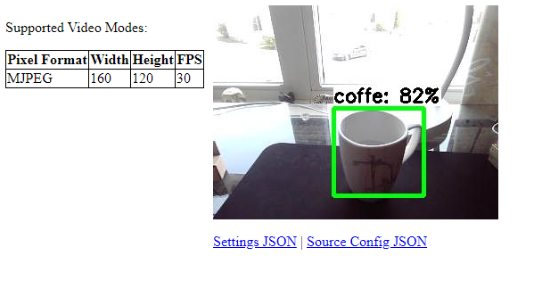
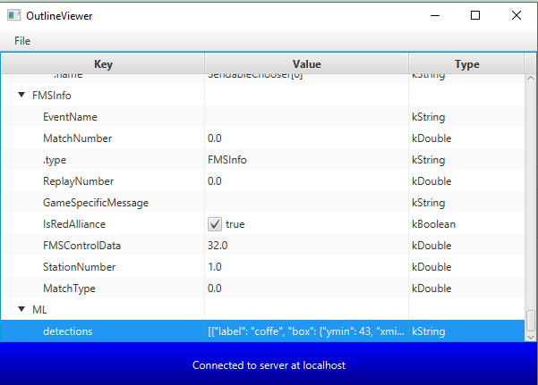

Inferencing on a Raspberry Pi
=============================

Prerequisites
-------------

This section requires a Romi or a Raspberry Pi that is running the WPILibPi Image. Instructions to the following can be found here :ref:`WPILibPi Setup <docs/software/vision-processing/wpilibpi/walkthrough-video:A Video Walkthrough of using WPILibPi with the Raspberry Pi>`. Furthermore, a USB camera needs to be plugged into the Raspberry Pi.

Uploading the Model to the Pi
-----------------------------

To upload your tflite model to the Raspberry Pi, you must connect to it and open the Web-interface. Select the Application tab, go to the File Upload section and turn the Extract slider on.

Once this is checked, you can upload the zip that you downloaded from Axon onto the Pi.

Inferencing
-----------

Once the model has been uploaded, now the Pi needs python code to utilize it. Here is a link to the provided inference script through the release page: `Github <https://github.com/wpilibsuite/Axon/releases/>`__

Once this is downloaded, utilize the Vision Application Configuration section to upload the python file.

Once uploaded, utilize the Vision Status tab to check on the state of the script. You should be able to see an update with a framerate indicating that everything is working.

Head to the vision settings tab. First click on the camera stream and change the resolution to be greater than 300 pixels by 300 pixels (e.g. 640 by 480).

Then click on open stream to view the camera stream. Switch the port number at the top to move through the various camera streams until you arrive at the desired one.

Then you can see the Output Stream from the Machine Learning Model. You should be able to see the Raspberry Pi identifying objects!

Network Tables
--------------

.. note:: When using a Romi, robot code must be running on the simulator to receive network tables data.

The python script from the releases page that is responsible for inferencing, also pushes that data to network tables. To see the results, one can use the OutlineViewer tool which can be found here: :ref:`OutlineViewer <docs/software/wpilib-tools/outlineviewer/index:OutlineViewer>` .

.. note:: Use Server Location "localhost" when running on a Romi

