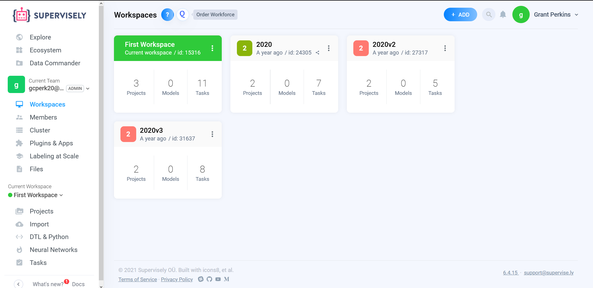
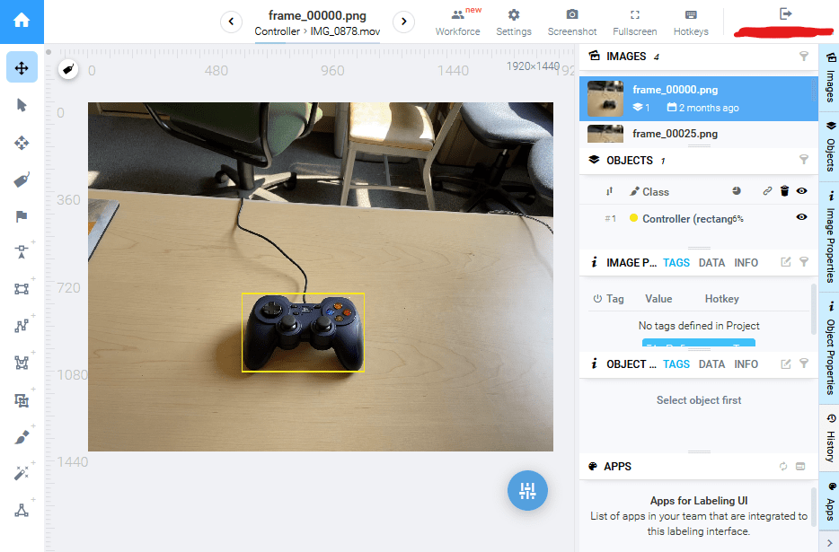
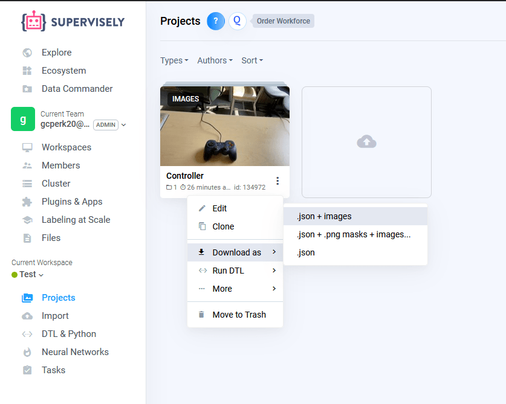

Labeling a Dataset with Supervisely
===================================

The quality of a neural network is fully dependent on the quality of the dataset used to train it. To create a custom dataset, perhaps to train a neural network to recognize the new game piece, Axon supports datasets created using `Supervisely <https://supervise.ly>`__. This page describes how to create label, and export a dataset made with Supervisely.

Record a Video
--------------

The first step to creating a dataset is getting images. A dataset should have several thousand images. To get this many images, the easiest way is to record a short video, roughly 1 to 5 minutes long. The video should clearly display the object(s) you wish to detect in several angles. Below is an example clip of a video used to teach a neural network to recognize a video game controller.

.. raw:: html

    <video width="640" height="480" controls autoplay muted>
      <source src="https://first.wpi.edu/wpilib/frc-docs/videos/ml/dataset_video_example.mp4" type="video/mp4">
    </video>

Import Video to Supervisely
---------------------------

Now that the images for the dataset are gathered, they can be labeled. To do this, Axon supports the use of `https://supervise.ly <https://supervise.ly>`__ . An account is required to use the site.

The workflow is organized in Workspaces, and Projects. A Workspace can have multiple users, so one FRC team can share a workspace. A Workspace also can contain multiple projects.

Inside of a Workspace, the video recorded in the previous step can be imported.

.. image:: images/dataset/import.png
  :alt: The import button needed to import your video.

In the import page, the most important step is choosing the correct :guilabel:`Import plugin`. The correct plugin is "Videos (split into frames)." The setting configurations do not need to be changed.

With the correct plugin selected, the video can be dragged in to the upload box. This will upload the video to Supervisely, and move to a different screen (shown below). Here, the project should be given a name, and the import should be started, which will convert the video into several thousand individual images.

.. image:: images/dataset/name_import.png
  :alt: Naming the Project.

Labeling the Images
-------------------

With the project now set up, the data can be labeled. Labeling data means drawing boxes around the objects a neural network would want to detect, so the neural network knows when it is right and when it is wrong when it tries to detect where an object is. The boxes drawn should tightly wrap the entire visible object within each image.

Within the Project, select the :guilabel:`Rectangle` tool. Supervisely will prompt you to create a class, i.e. define what kind of object you are about to label. More classes can be made later. Then, click twice in opposite corners around the object you wish to label. An example of a good label is below.

Click the :guilabel:`Rectangle` tool to label another object within the same image, if there is one. If there is a misclick, the corners of the rectangle can be dragged to better label the object. Otherwise, move on to the next image. It is important to label every single visible object that one wishes to detect, else the neural network will pick up bad habits. The job of labeling data can be tedious, but it can also be shared between members of an FRC team through the Workspace.

Downloading the Dataset
-----------------------

With all the images labeled, the dataset can be downloaded off of Supervisely for use in Axon. Within the Workspace, click on the triple-dot icon of the project you wish to download. Select the :guilabel:`.json and images` download option.

You are now ready to begin training a neural network.
