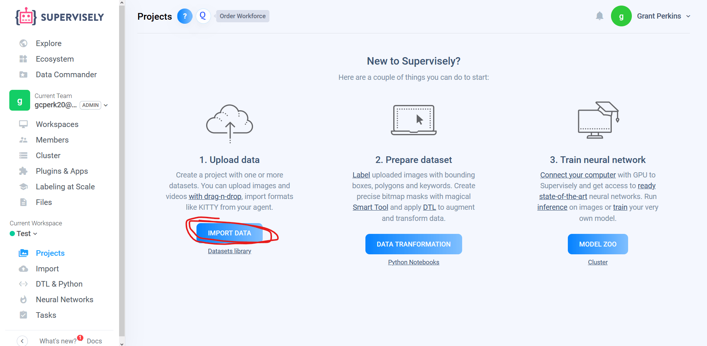

abeling a Dataset with Supervisely
==================================

The quality of a neural network is fully dependent on the quality of the dataset used to train it. To create a custom dataset, perhaps to train a neural network to recognize the new game piece, Axon supports datasets created using `Supervisely <https://supervise.ly>`__. This page describes how to create label, and export a dataset made with Supervisely.

Record a Video
--------------

The first step to creating a dataset is getting images. A dataset should have several thousand images. To get this many images, the easiest way is to record a short video, roughly 1 to 5 minutes long. The video should clearly display the object(s) you wish to detect in several angles. Below is an example clip of a video used to teach a neural network to recognize a video game controller.

Import Video to Supervisely
---------------------------

Now that the images for the dataset are gathered, they can be labeled. To do this, Axon supports the use of `https://supervise.ly <https://supervise.ly>`__ An account is required to use the site.

The workflow is organized in Workspaces, and Projects. A Workspace can have multiple users, so one FRC team can share a workspace. A Workspace also can contain multiple projects.

.. image:: images/dataset/workspaces.png
  :alt: An view of what a user's workspaces may look like inside of Supervisely.

Inside of a Workspace, the video recorded in the previous step can be imported.

In the import page, the most important step is choosing the correct "Import plugin". The correct plugin is "Videos (split into frames)." The setting configurations do not need to be changed.

.. image:: images/dataset/video_split.png
  :alt: The correct plugin selected.

With the correct plugin selected, the video can be dragged in to the upload box. This will upload the video to Supervisely, and move to a different screen (shown below). Here, the Project should be given a name, and the import should be started, which will convert the video into several thousand individual images.

.. image:: images/dataset/name_import.png
  :alt: Naming the Project.

Labeling the Images
-------------------

Downloading the Set
-------------------

