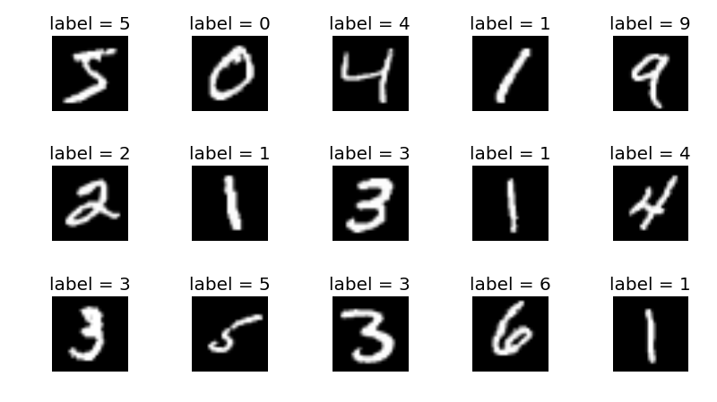
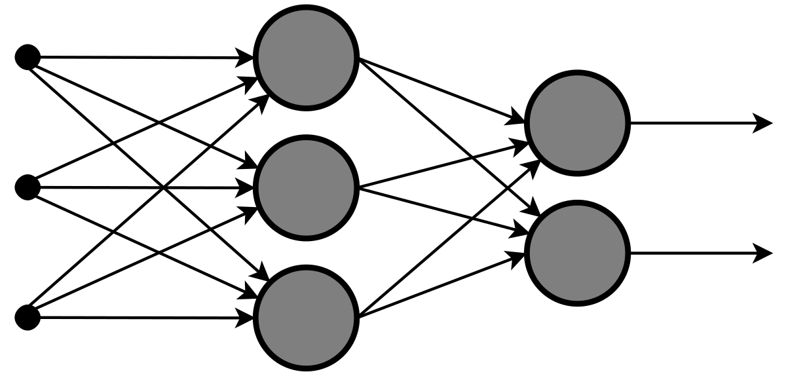
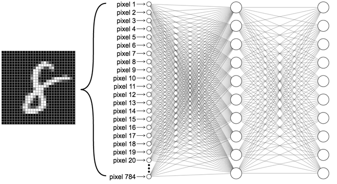
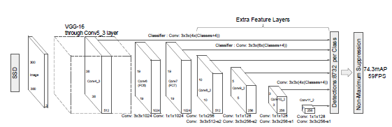

Introduction to Machine Learning
================================

Machine learning is a giant optimization problem. A neural network is a series of matrices, where the number contained within the matrices need to be tuned as precisely as possible to make the best predictions possible. To understand what this means better, let's look at a classic machine learning problem: MNIST.

MNIST
-----

MNIST ("Modified National Institute of Standards and Technology") is a commonly used datatset in Computer Vision that deals with classification. The dataset itself is a collection of images showing hand-drawn numbers. The challenge is to create an algorithm that can recognize what number is represented by a given image, which is solvable by developing a neural network.

Here we have an over-simplified neural network. It has three layers, arranged vertically. The furthest left layer is called the input layer. When feeding an image into the neural network, the input layer is set to have the same values as our image. The middle layer is called a hidden layer. This layer focuses on computation, and does not directly interact with by the programmer. The final layer in this neural network is called the output layer and contains the end result.

Having discussed the nodes (the circles) that make up the layers, it is important to discuss the connections (the arrows) between the layers. Each arrow represents a set of operations between two nodes. This type of neural network is a fully-connected neural network, so the operations that the arrows represent are shown below.

.. math:: Y = WX + b

Where :math:`Y` is a non-input matrix layer, and :math:`X` is the matrix directly before (to the left) of :math:`Y`. :math:`W` is a matrix of weights that act as coefficients on :math:`X`. :math:`b` is a matrix of biases that add to the result of the product of :math:`W` and :math:`X`. During the training/learning process, the values within :math:`W` and :math:`b` are adjusted so :math:`Y` is the best possible value from any :math:`X`. In a large neural network, there are millions of weights and biases, resulting in billions of linear algebra operations. This absurd amount math often requires a powerful computer, and/or a lot of time.

With this understanding of a basic neural network, let's look at a simple neural network that can be used for the MNIST problem.

This neural network has an input layer, one hidden layer, and an output layer. The input layer is made of 784 nodes, as the MNIST dataset is made out of pictures that are 28x28 pixels. Each pixel is either 0 or 1. This input layer is multiplied by a weights matrix and a bias matrix is added, resulting in the hidden layer. The hidden layer is multiplied by another weight matrix and another bias matrix is added, resulting in the output layer. The output layer is made of exactly 10 nodes, representing 0 through 9. The actual value of each node represents the confidence of that node being correct. For example, if node 0 has a value of .91, and node 1 has a value of .23, then the input image is more likely a 0 than a 1.

MobileNet V2
------------

The neural network that Axon uses is much more complex than the one described for the MNIST problem. It is a convolutional neural network (CNN), distinctly different than the fully-connected neural network used for MNIST.

If you would like to learn more about the MobileNet architecture, you can read `here. <https://arxiv.org/abs/1704.04861>`__ This knowledge is not necessary to use Axon to successfully deploy a neural network on your robot.
