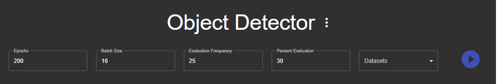
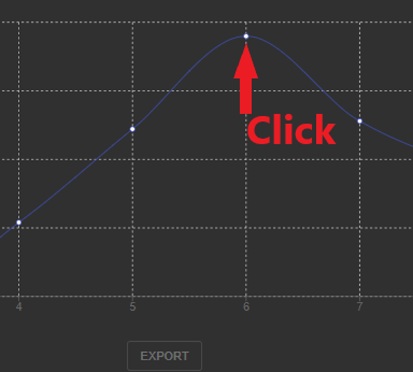

:orphan:

Retraining Mobilenet V2
=======================

Upload a dataset
----------------

To retrain the mobilenet object detection model using Axon, first upload the dataset you would like to retrain with, using the button on the tree to the left. 

.. image:: images/axon-mobilenet-1.png

Once you have uploaded a dataset, you should see it in the tree above this button. 

Create a project
----------------

Next, you must create a project. A project will hold the data from the retraining, and any tflite exports or tests you create with the retrained model.

To create a project, click the add project button, below the add dataset button. 

.. image:: images/axon-mobilenet-2.png

A dialog will appear, asking you to name the project. Pick a name and click create. When you create your project, you will see it above the button to the left. 
Click on the project, and you will be taken to its page. 

Start retraining
----------------

At the top of the project window, there are several parameters to specify how you want the model to be retrained. 

Epochs: The number of times the dataset will be passed through the model during training. 

Batch Size: The amount of images to use in each training iteration. 

Evaluation Frequency: The amount of epochs to run before each evaluation of the models precision. 

Percent Evaluation: The percent of the dataset to be reserved exclusively for evaluation of the models precision during training.

Datasets: The datasets you would wish to retrain with.
Edit these input parameters to fit your needs, and tick the checkboxes of the desired datasets from the dropdown. 

When you are ready to start the retraining, click the play button to the right of the dataset dropdown. 

When an evaluation happens, a checkpoint is produced. This is a copy of the model at a particular point in the training. While the model trains, you will see checkpoints appear as points on the graph. 

Exporting a checkpoint as a tflite
----------------------------------

To export a checkpoint as a .tflite model for use, select the desired checkpoint by clicking the point on the graph.  

This will select the checkpoint. Export this checkpoint by clicking the export button below the graph.

.. image:: images/axon-mobilenet-5.png

You will soon see an export appear below the button. 
