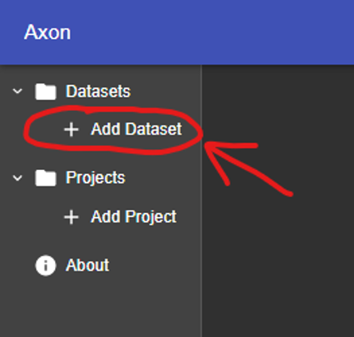

Retraining Mobilenet V2
=======================

Upload a Dataset
----------------

To retrain the mobilenet object detection model using Axon, first upload the dataset you would like to retrain with.

Once you have uploaded a dataset, you should see it in the tree above this button.

Create a Project
----------------

Next, you must create a project. A project will hold the data from the retraining, and any tflite exports or tests you create with the retrained model.

To create a project, click the :guilabel:`Add Project` button.

A dialog will appear, asking you to name the project. Pick a name and click :guilabel:`Create`. When you create your project, you will see it above the button to the left.

Click on the project, and you will be taken to its page.

Start Retraining
----------------

At the top of the project window, there are several parameters to specify how you want the model to be retrained.

**Epochs**: The number of times the dataset will be passed through the model during training.

**Batch Size**: The amount of images to use in each training iteration.

**Evaluation Frequency**: The amount of epochs to run before each evaluation of the models precision.

**Percent Evaluation**: The percent of the dataset to be reserved exclusively for evaluation of the models precision during training.

**Datasets**: The datasets you would wish to retrain with.
Edit these input parameters to fit your needs, and tick the checkboxes of the desired datasets from the dropdown.

.. image:: images/training/axon-mobilenet-3.png

When you are ready to start the retraining, click the play button to the right of the dataset dropdown.

When an evaluation happens, a checkpoint is produced. This is a copy of the model at a particular point in the training. While the model trains, you will see checkpoints appear as points on the graph.

Exporting a Checkpoint in TFLite Format
---------------------------------------

To export a checkpoint as a TFLite model for use, select the desired checkpoint by clicking the point on the graph.

.. image:: images/training/axon-mobilenet-4.png

This will select the checkpoint. Export this checkpoint by clicking the export button below the graph.

You will soon see an export appear below the button.

.. image:: images/training/axon-mobilenet-6.png

When the export has completed, you may click the menu to the right of an exported model, providing options to rename, delete, download, and test the export.

Click the download button, and your browser will download a tarfile containing two TFLite models, one of which is optimized for the Coral TPU. There is also a label map file, for use when converting the model's output to a human-readable format.

Testing an Exported Model
-------------------------

To test an exported model, open the testing dialog by clicking the "Test" button in the menu of the export you would like to test.

.. image:: images/training/axon-mobilenet-10.png

First, click the "Select Video" box, and click the "+" that will appear to upload a video.

This will open a window that allows you to upload a ``.mp4`` file.

.. image:: images/training/axon-mobilenet-12.png

Drop a `.mp4` in the dropzone, or click to select the file. Once the file is in the dropzone, click "Save".

When uploaded, you will see the video in the dropdown menu, allowing you to select it for the test.

You have the option to change the name of the annotated output video produced by the test.

Click the "Test" button, and you will see the test begin.

The test uses your model to annotate the video, creating a stream for you to watch as it happens. Click the "View" button, and the stream will open in a separate tab.

When the test completes, you will see it at the bottom of the test dialog.

You can download the annotated video. Click the download icon next to the test’s name, and your browser will begin the download. The video is currently a ``.mp4`` within a ``.zip``.
