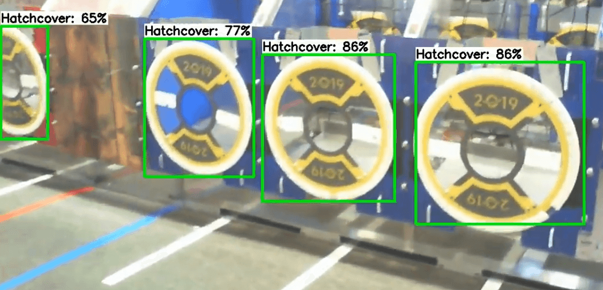

Using Inference Output on a Robot
=================================

The provided script for running inference on a coprocessor outputs all inference data over NetworkTables for ease of access.

Output Format
-------------

Because there can be any number of detected objects in a given image, the inference data is sent in a JSON string to the ``ML/detections`` NetworkTables entry. By compiling all data into a single entry, it is certain that the labels match with the bounding boxes, which may not be true if these items were separate entries.

The JSON string has the following format:

.. code-block:: JSON

  [
    {
      "label": "blue robot",
      "box": {
        "ymin": 25,
        "xmin": 10,
        "ymax": 100,
        "xmax": 150
      },
      "confidence": 0.75
    },
    {
      "label": "red robot",
      "box": {
        "ymin": 111,
        "xmin": 163,
        "ymax": 240,
        "xmax": 320
      },
      "confidence": 0.99
    }
  ]

The example above shows the value of the ``ML/detections`` entry if two objects are detected. It is a list of objects, where the ``label`` attribute means the kind of object that was detected. The ``box`` attribute describes the bottom left and top right corners of the bounding box, i.e. the box that completely surrounds the detected object within the image. There will be an empty list if no objects are detected. The ``confidence`` attribute is how confident the model is that the given object is correctly detected.

There are three more NetworkTables entries that the provided script uses to help the programmer. The first is ``ML/fps``, which tells the programmer how many frames their model is processing per second. Another is ``ML/coral``, which tells the programmer is a Google Coral USB accelerator is currently being used. This is included in case someone removes the Coral from the robot and forgets to put it back, or a similar scenario. The final NetworkTables entry is ``ML/resolution``, which is the string ``WIDTH, HEIGHT``, telling the programmer the size of the processed image, for use with calculations.

Applications of Inference
-------------------------

Machine learning is applicable to the FIRST Robotics Competition when non-uniform objects need to be detected, i.e. a hatch panel from the 2019 game.

A model could also be trained to recognize other robots, if a collision-avoidance system were wanted to be implemented. The WPILib team has found that uniform objects, such as the 2020 Power Cells, are also easily detected by neural networks, but other algorithms may be more appropriate.
