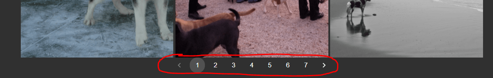

Viewing Datasets in Axon
========================

Axon allows for the viewing of supervisely and open-images datasets.

Stats
-----

Clicking on a dataset in the pane on the left will allow you to view all the images in the dataset. The size of the set and the classnames/labels in the dataset are displayed.

Navigation
----------

All the images will be displayed 48 to a page. You can use the pagination navigator at the bottom to move through large datasets and find specific images if desired.

