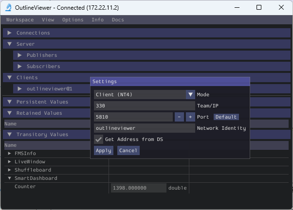

OutlineViewer
=============

.. image:: /docs/controls-overviews/images/control-system-software/outline-viewer.png

OutlineViewer is a utility used to view, modify and add to the contents of the NetworkTables for debugging purposes. It displays all key value pairs currently in the NetworkTables and can be used to modify the value of existing keys or add new keys to the table. OutlineViewer is included in the Java and C++ language installations.

In Visual Studio Code, press :kbd:`Ctrl+Shift+P` and type ``WPILib`` or click the WPILib logo in the top right to launch the WPILib Command Palette. Select :guilabel:`Start Tool`, then select :guilabel:`OutlineViewer`.

To connect to your robot, open OutlineViewer and set the ``Server Location`` to be your team number. After you click start, OutlineViewer will connect.  If you have trouble connecting to OutlineViewer please see the :ref:`Dashboard Troubleshooting Steps <docs/software/dashboards/labview-dashboard/troubleshooting-dashboard-connectivity:Troubleshooting Dashboard Connectivity>`.

.. note:: You can use ``localhost`` instead of a team number to point OutlineViewer at a simulated robot or a Romi.

To add additional key/value pairs to NetworkTables, right click on a location and choose the corresponding data type.

.. note:: LabVIEW teams can use the Variables tab of the LabVIEW Dashboard to accomplish the same functionality as OutlineViewer.
