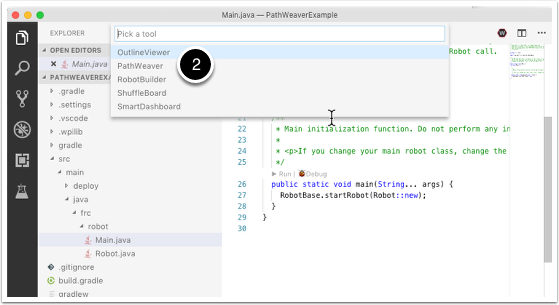

Creating a Pathweaver Project
=============================
PathWeaver is the tool used to draw the paths for a robot to follow. The paths for a single program are stored in a PathWeaver project.

Starting Pathweaver
-------------------
PathWeaver is started by clicking on the ellipsis icon in the top right of the corner of the VSCode interface. You must select a source file from the WPILib project to see the icon. Then click on "Start tool" and then click on"PathWeaver" as shown below.

.. image:: images/pathweaver-1.png

Creating a PathWeaver project 
-----------------------------
To create a PathWeave project, click on "Create project" then fill out the project creation form. Notice that hovering ove any of the fields in the form will display more information about what is required.

.. image:: images/pathweaver-3.png

**Project directory:** this is normally top level project directory that contains the build.gradle and src files for your robot program. Choosing this directory is the expected way to use PathWeaver and will cause it to locate all the output files in the correct directories for automatic path deployment to your robot.

**Output directory:** the directory where the paths are stored for deployment to your robot. If you specified the top level project folder of our robot project in the previous step (as recommended) filling in the project directory is optional.

**Game:** the game (which FRC game is being used) will cause the correct field image overlay to be used. You can also create your own field images and the procedure will be described later in this document.

**Length Unit:** the units to be used in describing your robot and for the field measurements when using PathWeaver. It's best to use units that match the rest of the field documentation to avoid errors in creating paths.

**Time Step:** is the time that each generated point should be driven. Shorter time steps cause more points to be generated and may significantly improve the accuracy of the followed path. If you are using the default TimedRobot class, we recommend using a time step of 20ms or 0.02 seconds.

**Max Velocity:** the maximum speed attainable by your robot. This is the most important parameter of the robot profile since it causes generated paths to never exceed this speed. You can either calculate this velocity using knowledge of your robot design or by measuring it. One method of measuring the Max Velocity is driving in a straight line then measuring the speed after the robot has reached full speed. Another method is spinning in place at full speed for 10 rotations and using the formula for circumference divided by 10 for total distance traveled and the time to complete for the distance traveled.

**Max Acceleration:** this is the maximum acceleration your robot is capable of achieving. A good starting point is 6.56 ft/sec2 or 2m/sec2 for a kit of parts drivetrain.

**Max Jerk:** this is the rate of change of the robots acceleration expressed as dist/sec3. This is mostly a user preference and a recommended starting point is 197 ft/sec3 or 60m/sec3.

**Wheel Base:** the distance between the left and right wheels of your robot.

PathWeaver user interface 
-------------------------

.. image:: images/pathweaver-4.png

The PathWeaver user interface consists of:

1. The field area where the robot will travel. It is on this image the robot paths will be drawn to visualize the motion.
2. The properties of the currently selected waypoint
3. The groups of paths that will be used together. It is a way of seeing all the paths the robot might travel in a single run.
4. The individual paths that a robot will follow, The paths may be grouped together as a Path Group in order to better visualize the total robot movement in a multi-path sequence.
5. The drawn paths are used to create the set of wheel velocities the robot will use when following your path. There is one velocity generated for every unit of time as described in the Time Base parameter of your project.
6. Allows the PathWeaver project properties to be edited (includes Project directory, time step, field drawing, etc.) as described at the beginning of this article.

