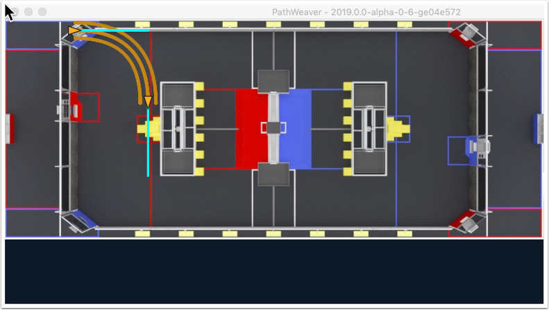

Drawing the path the robot will follow
======================================
The main feature of PathWeaver is that it allows the path the robot will follow to be easily visualized. In the following picture you can see a path that goes from a robot starting point to a finish point that follows a smooth path with minimum accelerating and decelerating. Paths can have any number of waypoints that can allow more complex driving to be described. In this case there are 5 waypoints (including the start and stop) depicted with the triangle icons. Each waypoint consists of a X, Y position on the field as well as a robot heading described as the X and Y tangent lines.

Notice also that the path shows the left and right wheel tracks as well as the robot centerline to make it easier to visualize the robot on the path and avoid obstacles. To get better performance, PathWeaver draws the path when you are interactively manipulating it using an estimation algorithm. The three depicted paths (left, right, and center) are computed using a PathFinder generated path when you stop editing the waypoints. This is the same data that the robot will use to actually follow the path while driving. The following sections will show how to create this path.

.. image:: images/pathweaver-5.png

Creating the initial path
-------------------------
To start creating a path, click the + (plus) button in the path window. A default path will be created that probably does not have the proper start and end points. The path also shows the tangent vectors (teal lines) for the start and end points. By changing the angle of the tangent vectors, the path followed is affected.

Drag the start and end points of the path to the desired locations. Notice that in this case, the path drives through the edge of a field element (Switch from the FRC 2018 game) and ends with the robot facing towards the bottom of the field drawing. The path should instead drive around the Switch and end up pointing towards the Scale.

.. image:: images/pathweaver-7.png

Changing a waypoint heading
---------------------------
The robot heading can be changed by dragging the tangent vector (teal) line to that it faces the Scale side. That causes the robot to end the path facing in the right direction, but it now is driving through the center of the Switch.

.. image:: images/pathweaver-8.png

Adding additional waypoints to control the robot path
-----------------------------------------------------
Adding additional waypoints and changing their tangent vectors can affect the path that is followed. Additional waypoints can be added by dragging in the middle of the path. In this case, adding two additional waypoints for the first turn and another waypoint for the final turn will help the robot make the turns more smoothly without collisions.

.. image:: images/pathweaver-9.png

Locking the tangent lines
-------------------------
Locking tangent lines prevents them from changing when the path is being manipulated. The tangent lines will also be locked when the point is moved.

More precise control of waypoints
---------------------------------
While PathWeaver makes it simple to draw paths that the robot should follow, it is sometimes hard to precisely set where the waypoints should be placed. In this case, setting the waypoint locations can be done by entering the X and Y value which might come from an accurate CAD model of the field. The points can be entered in the X and Y fields when a waypoint is selected.

Adding additional related paths
-------------------------------
There are times when multiple related paths might be necessary. For example, a red vs. blue side where something isn't symmetric or transpose of the X or Y axis would be needed. In this case a path can be duplicated, then the Horizontal or Vertical axis can be flipped between the old path and the duplicate. To do this create a duplicate path using the "Duplicate" button, then use the "Flip H" or "Flip V" buttons for the new path to modify it.
