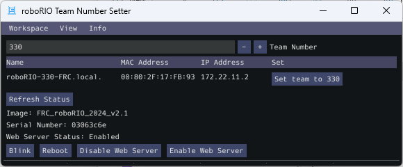

roboRIO Team Number Setter
==========================

The roboRIO Team Number Setter is a cross-platform utility that can be used to set the team number on the roboRIO. It is an alternative to the roboRIO imaging tool for setting the team number.

In Visual Studio Code, press :kbd:`Ctrl+Shift+P` and type ``WPILib`` or click the WPILib logo in the top right to launch the WPILib Command Palette. Select :guilabel:`Start Tool`, then select :guilabel:`roboRIOTeamNumberSetter`.

Connect to the roboRIO over USB to use the tool, as this is the simplest method when the team number hasn't been set.

Setting Team Number
-------------------

Enter your team number in the :guilabel:`Team Number` field and select :guilabel:`Set team to xxxxx`. This will take about a second, then press the :guilabel:`Reboot` button to reboot the roboRIO so the new team number takes effect.

Enabling/Disabling Webserver
----------------------------

The :doc:`roboRIO's webserver </docs/software/roborio-info/roborio-web-dashboard>` provides some debuging and enables some configuration. However, it also takes memory away from the robot program. You can disable it by clicking on the :guilabel:`Disable Web Server` button. If you'd like to enable it again, you can click :guilabel:`Enable Web Server`.

roboRIO Identification
----------------------

Clicking the :guilabel:`Blink` button will cause the roboRIO's Radio LED to blink a few times to help identify the roboRIO.
