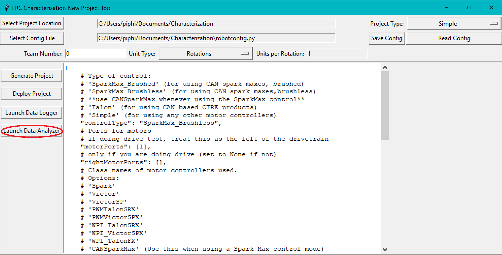
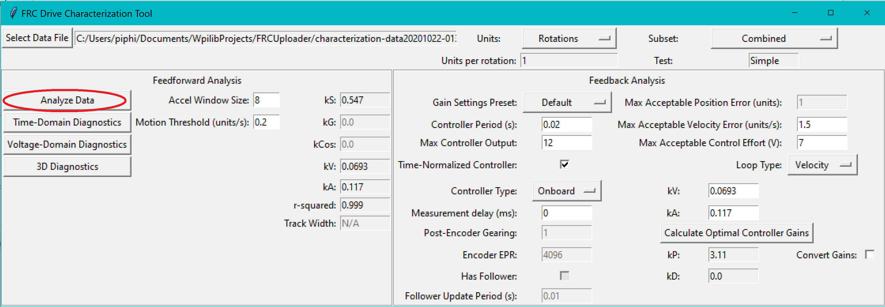
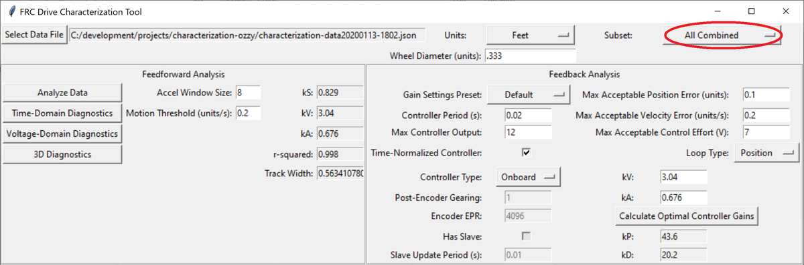
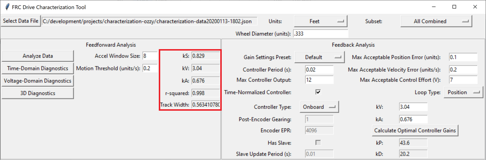

Analyzing Data
==============

Once we have data from a characterization run, we can analyze it. To launch the data analyzer, click on the ``Launch Data Analyzer`` button.

Loading your Data File
----------------------

Now it's time to load the data file we saved from the logger tool. Click on ``Select Data File``.

.. image:: images/selecting-data-file.png
   :alt: Selecting the existing data file

In the resulting file dialog, select the JSON file you want to analyze. If the file appears to be malformed, an error will be shown.

Running Feedforward Analysis
----------------------------

Once a data file has been selected, the ``Analyze Data`` button becomes available in the ``Feedforward Analysis`` frame. Click it.

By default, the analysis will be run by combining all the data in the test. For a finer-grained analysis, the analysis may be limited to a specific subset of data using the subset dropdown menu.

The computed coefficients of the mechanism characterization will then be filled in, along with a goodness-of-fit measure (r-squared).

The coefficients correspond to the characterization equation for each of the mechanism types:

.. todo:: Add coefficient equations

- Drive
- Arm
- Elevator

