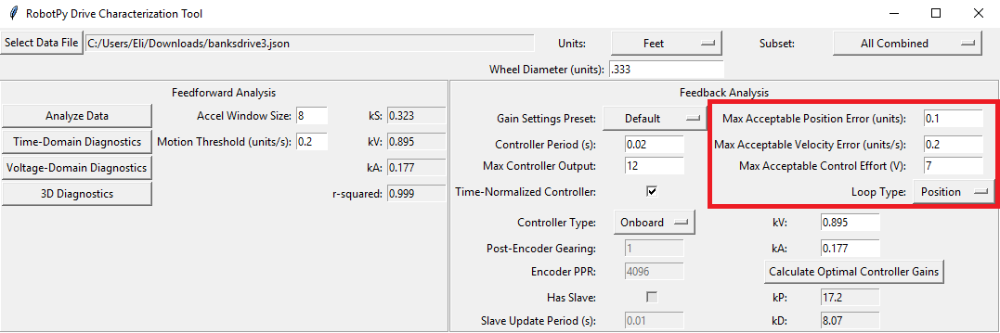

Feedback Analysis
=================

Once the feedforward coefficients have been computed, the controls on the ``Feedback Analysis`` pane become available.

.. image:: images/feedbackanalysis.png
   :alt: Picture of the feedback analysis pane

These can be used to calculate optimal gains for a PD or P controller for your mechanism.

.. important:: These gains are, in effect, "educated guesses" - they are not guaranteed to be perfect, and should be viewed as a "starting point" for further tuning.

Set Units
---------

Before using the ``Feedback Analysis`` pane, it is crucial that you set the ``Units`` settings to match the units of your data.

.. image:: images/selectingunits.png
   :alt: Picture of selecting units dropdown

Additionally, if your choice of units requires a physical measurement (i.e. it is non-rotational), it is also important to specify the relevant mechanism dimension used for conversion.

.. image:: images/wheeldiameter.png
   :alt: Setting wheel diameter in specified units

Enter Controller Parameters
---------------------------

The calculated feedforward gains are *dimensioned quantities*. Unfortunately, not much attention is often paid to the units of PID gains in FRC controls, and so the various typical options for PID controller implementations differ in their unit conventions (which are often not made clear to the user).

To specify the correct settings for your PID controller, use the following options.

.. image:: images/controllersettings.png
   :alt: Picture of the controller settings

- **Gain Settings Preset:** This drop-down menu will auto-populate the remaining fields with likely settings for one of a number of common FRC controller setups. Note that some settings, such as post-encoder gearing, PPR, and the presense of a slave motor must still be manually specified (as the analyzer has no way of knowing these without user input), and that others may vary from the given defaults depending on user setup.
- **Controller Period:** This is the execution period of the control loop, in seconds. The default RIO loop rate is 50Hz, corresponding to a period of .02s. The onboard controllers on most "smart controllers" run at 1Khz, or a period of .001s.
- **Max Controller Output:** This is the maximum value of the controller output, with respect to the PID calculation. Most controllers calculate outputs with a maximum value of 1, but early versions of the Talon firmware have a maximum output of 1023.
- **Time-Normalized Controller:** This specifies whether the PID calculation is normalized to the period of execution, which affects the scaling of the D gain.
- **Controller Type:** This specifies whether the controller is an onboard RIO loop, or is running on a smart motor controller such as a Talon or a SPARK Max.
- **Post-Encoder Gearing:** This specifies the gearing between the encoder and the mechanism itself. This is necessary for control loops that do not allow user-specified unit scaling in their PID computations (e.g. those running on Talons). This will be disabled if not relevant.
- **Encoder PPR:** This specifies the pulses-per-revolution (not cycles per revolution) of the encoder used, which is needed in the same caes as Post-Encoder Gearing.
- **Has Slave:** Whether there is a motor controller slaved to the controller running the control loop, if the control loop is being run on a peripheral device. This changes the effective loop period.
- **Slave Update Period:** The rate at which the slave (if present) is updated. By default, this is 100Hz (ever .01s) for Talons and Sparks, but can be changed.

Entering Optimal Constraints
----------------------------

Finally, the user must specify some constraints for what will be considered an "optimal" controller.

As a rule, smaller values for the ``Max Acceptable Error`` and larger values for the ``Max Acceptable Control Effort`` will result in larger gains - this will result in larger control efforts, which can grant better setpoint-tracking but may cause more violent behavior and greater wear on components.

The ``Max Acceptable Control Effort`` should never exceed 12V, as that corresponds to full battery voltage, and ideally should be somewhat lower than this.

Select Loop Type (Drive Only)
-----------------------------

It is typical to control drives with both position and velocity PIDs, depending on application. Either can be selected using the drop-down ``Loop Type`` menu.

.. image:: images/looptype.png
   :alt: Specifying characterization loop type

Enter Known Velocity/Acceleration
---------------------------------

If one wishes to use the ``Feedback Analysis`` pane without running a full analysis on a set of data, or otherwise view the effect of modifying the ``kV`` and ``kA`` values, this can be done here.

.. image:: images/known-acceleration-velocity.png
   :alt: Entering known acceleration and velocities

Calculate Gains
---------------

Finally, press the ``Calculate Optimal Controller Gains`` to run the LQR algorithm and determine the gains.

.. image:: images/calculategains.png
   :alt: Calculating the Optimal Controller Gains

