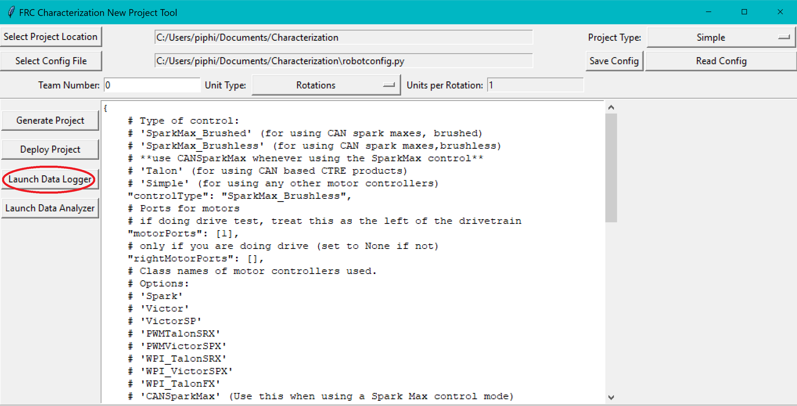
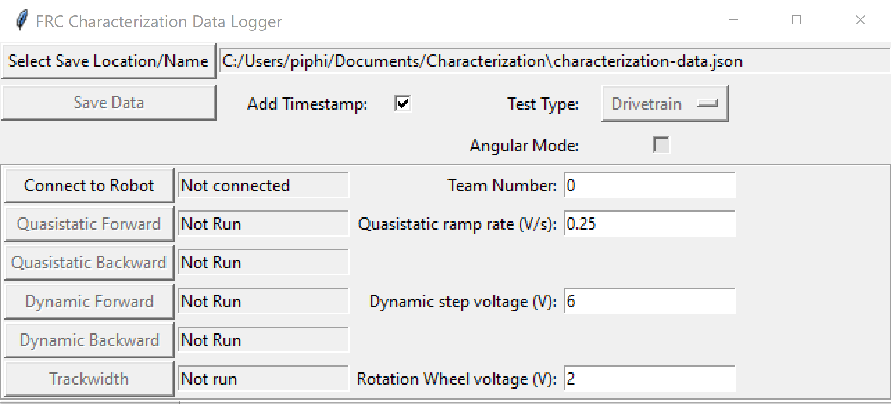
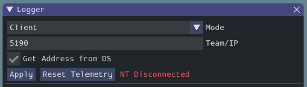
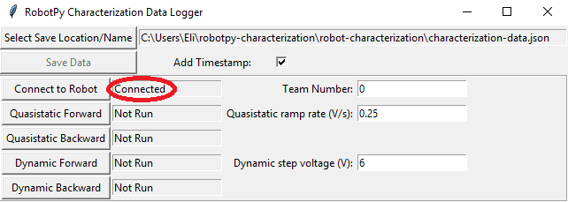
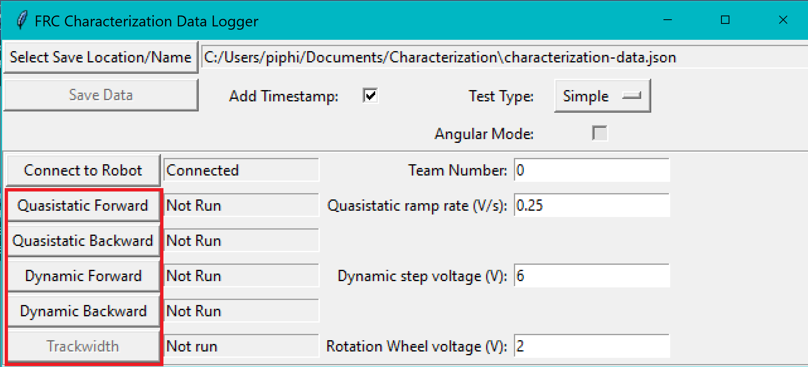
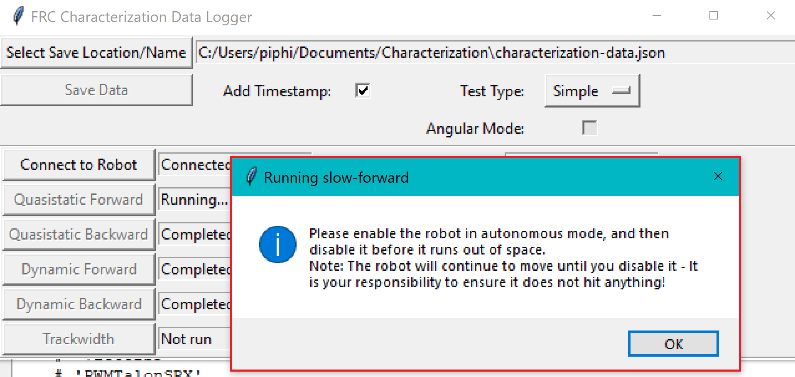
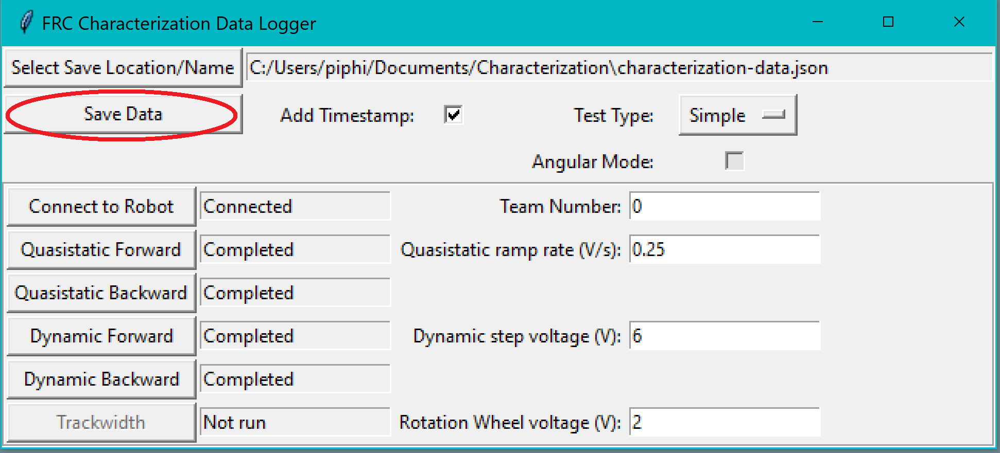

Running the Characterization Routine
====================================

Once the characterization code has been deployed, we can now run the characterization routine, and record the resulting data for analysis.

.. note:: Ensure you have sufficient space around the robot before running any characterization routine! The drive characterization requires at least 10' of space, ideally closer to 20'. The robot drive can not be accurately characterized while on blocks.

Launch the Data Logger
----------------------

To launch the data logger, press the :guilabel:`Launch Data Logger` button.

This should open the data logger GUI.

.. note:: The logger allows you to change the previously selected test type through the :guilabel:`Test Type` dropdown. Also, the ``Angular Mode``, ``Trackwidth``, and ``Rotation Wheel`` features will do nothing unless you have selected ``Drivetrain`` as your Test Type.

Connect to the Robot
--------------------

Next, we must connect to the robot. Press the :guilabel:`Connect to Robot` button. The status indicated next to the button should change to ``Connecting...`` while the tool attempts to connect to the robot's NetworkTables server.

If the tool does not seem to be successfully connecting, try rebooting the robot. Eventually, the status should change to ``Connected``, indicating the tool is successfully communicating with the robot.

Running Tests
-------------

A standard motor characterization routine consists of two types of tests:

- **Quasistatic:** In this test, the mechanism is gradually sped-up such that the voltage corresponding to acceleration is negligible (hence, "as if static").
- **Dynamic:** In this test, a constant 'step voltage' is given to the mechanism, so that the behavior while accelerating can be determined.

Each test type is run both forwards and backwards, for four tests in total, corresponding to the four buttons.

The tests can be run in any order, but running a "backwards" test directly after a "forwards" test is generally advisable (as it will more or less reset the mechanism to its original position).

Follow the instructions in the pop-up windows after pressing each test button.

Trackwidth
^^^^^^^^^^

The trackwidth test will spin your robot to determine an empirical trackwidth. It compares how far the wheel encoders drove against the reported rotation from the gyroscope.  To get the best results your wheels should maintain contact with the ground.

.. note:: If your robot is having trouble turning during the Trackwidth test you should increase the :guilabel:`Rotation Wheel voltage (V):` value until your robot is smoothly turning and run the test again.

.. note:: For high-friction wheels (like pneumatic tires), the empirical trackwidth calculated by frc-characterization may be significantly different from the real trackwidth (e.g., off by a factor of 2). The empirical value should be preferred over the real one in robot code.

The entire routine should look something like this:

.. raw:: html

  
 <iframe src="https://www.youtube-nocookie.com/embed/FN2xqoB1sfU" frameborder="0" allowfullscreen style="position: absolute; top: 0; left: 0; width: 100%; height: 100%;"></iframe> 

After all four tests have been completed, the :guilabel:`Save Data` button will become activated.

This will save the data as a JSON file with the specified location/name. A timestamp (``%Y%m%d-%H%M``) will be appended to the chosen filename if the :guilabel:`Add Timestamp` button is checked.

.. note:: You can run a preliminary check on the quality of the characterization data by enabling prints on Driver Station. After exiting autonmous in each test, the console should output ``Collected : n in t seconds`` where ``n`` should be ``200 * t`` (rounded). More information can be found :ref:`here <docs/software/wpilib-tools/robot-characterization/viewing-diagnostics:Template Lag>`
