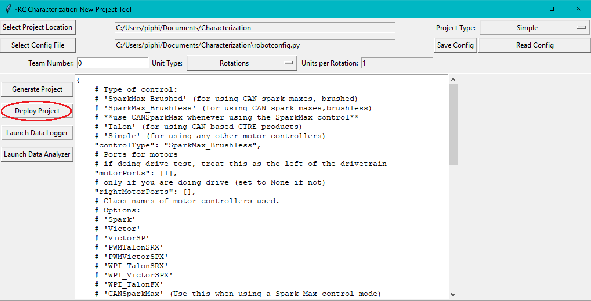
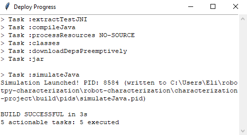

Deploying a Project
===================

Once a project has been generated, it is time to deploy it to the robot. This can be done in two ways.

Option 1: Using the ``Deploy Project`` Button
---------------------------------------------

Pressing the ``Deploy Project`` button on the GUI will attempt to use GradleRIO to deploy the project to your robot. The GUI will always *assume* that the project is located in the ``characterization-project`` subfolder of the chosen project location.

Assuming a valid robot project is present at that location, a window should pop up displaying the Gradle output as the project builds and deploys.

Option 2: Deploying Manually
----------------------------

Since the generated project is a standard GradleRIO Java project, it can be deployed like any other. Users may open the generated project in their editor of choice and deploy as they normally would any other robot project. This can be convenient if customization of the generated code is required.

Now that the characterization code has been deployed, you'll need to run the characterization routine.
