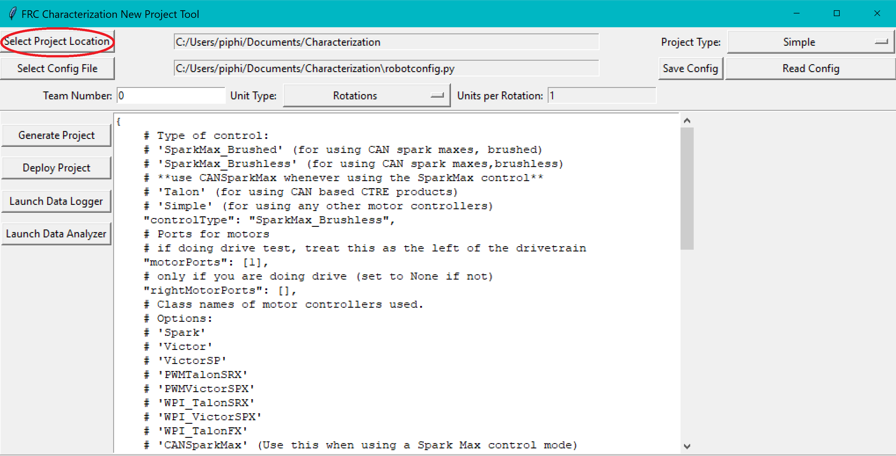
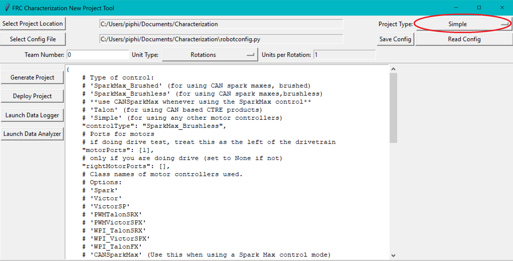
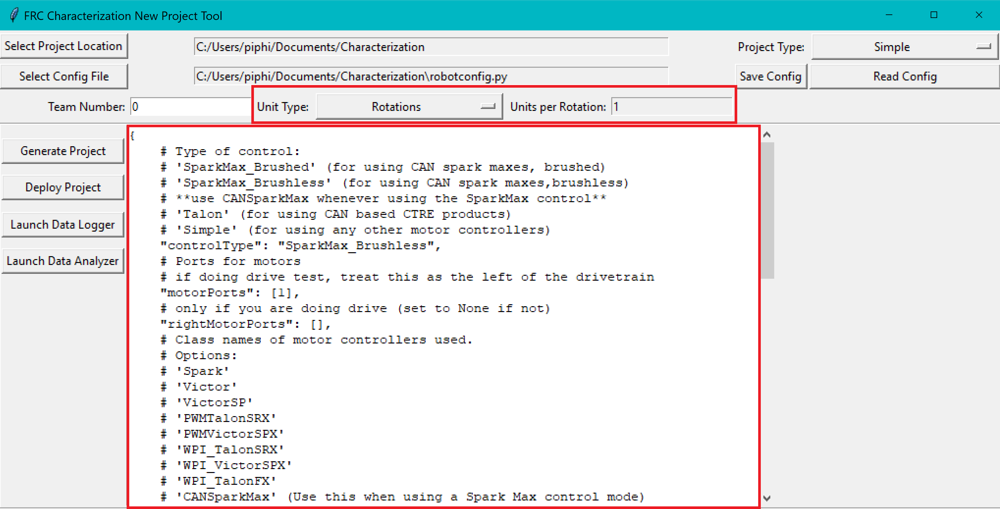
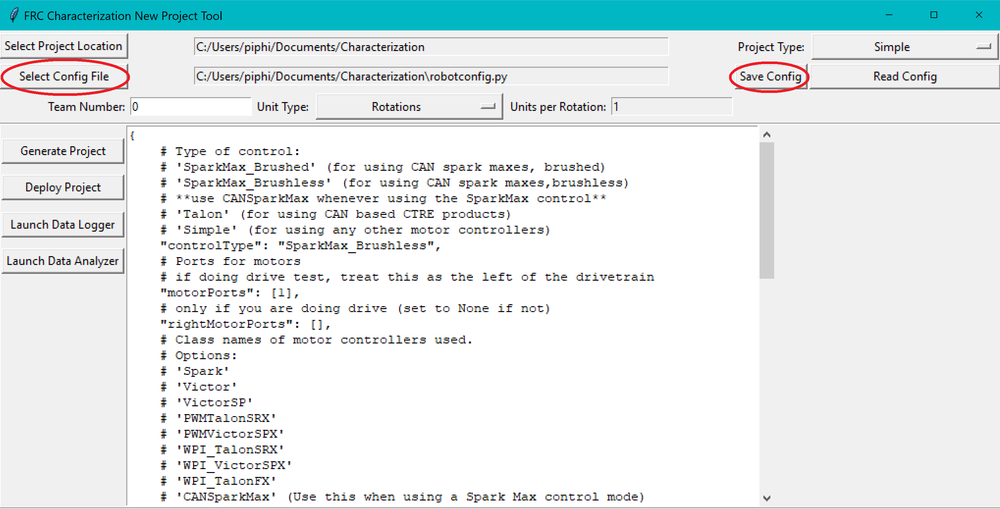
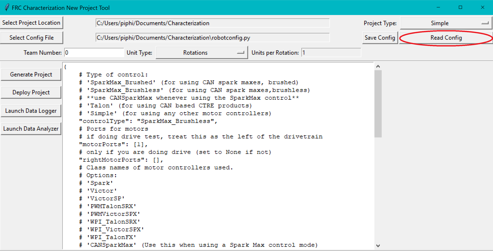
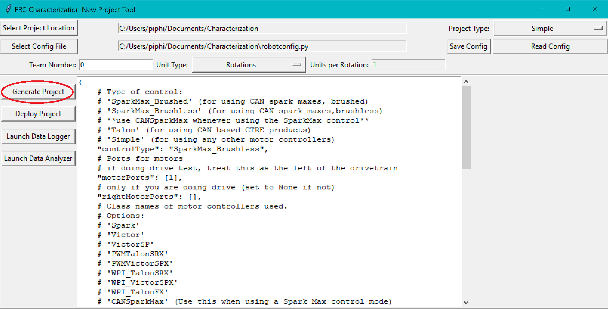

Generating a Project
====================

To use the toolsuite, we first need to generate a robot project.

Select Project Location
-----------------------

First, select the desired project location on the new project GUI:

Select Project Type
-------------------

Next, select your project type from the drop-down menu:

- **Simple** projects use encoders plugged into the RIO's DIO ports, and measure voltage with the PDP.
- **Talon** projects use encoders plugged into a Talon SRX, and measure voltage with the Talon.
- More project types may be added in the future.

Configure Project Parameters
----------------------------

In order to run on your robot, the tool must know some parameters about how your robot is set up. Project config settings are formatted as a `Python dictionary literal <https://docs.python.org/3/library/stdtypes.html#mapping-types-dict>`__. These can be modified via the in-window config editor:

Take care of the following caveats when entering your robot specifications:

- The key names must *not be changed*, as they are hard-coded for each project type. Only the values (i.e. the things on the right-hand side of the colons) should be modified.
- ``True`` and ``False`` *must* be capitalized, as they are evaluated as native Python.
- All string values (e.g. controller names and unit types) *must* be wrapped in quotes and *must* correspond exactly to one of the options described.
- All list values *must* be lists, even if they have only one element. Do not omit trailing commas (e.g. in ``(False,)``), as this will cause them not to be parsed as a list.

Once your robot configuration is set, you may save it to a location/name of your choice:

Accordingly, you can also load an existing config file (config files are project-type-specific):

Generate Project
----------------

Once your project has been configured, it's time to generate a deployable robot project to run the characterization:

A generated robot project will be placed in a subfolder (named characterization-project) of your specified project location.

The generated robot code will be in Java, and will reflect the settings specified in your config file. Advanced users are free to modify the generated code to their liking, if the existing configuration options do not suffice.
