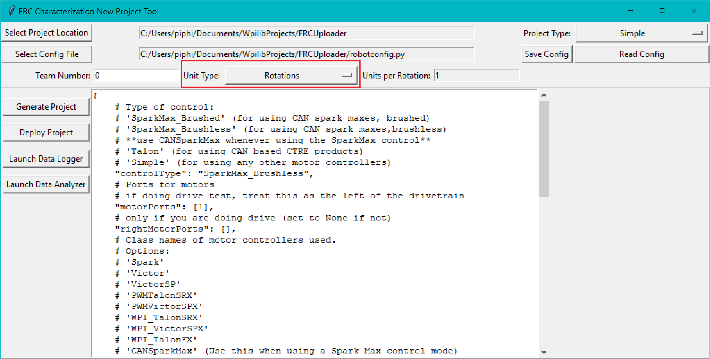
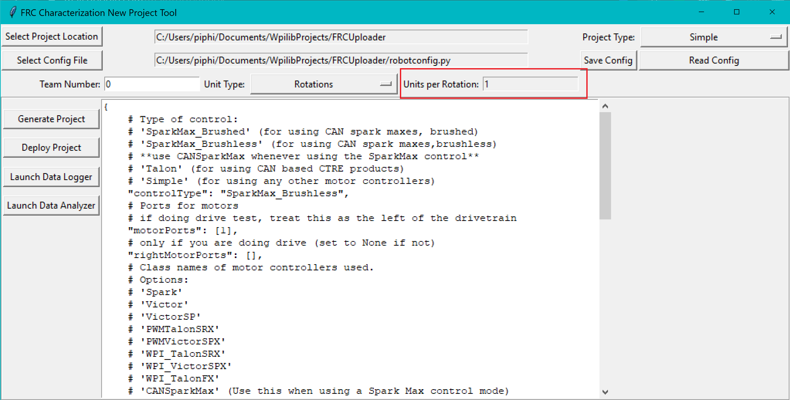

Generating a Project
====================

To use the toolsuite, we first need to generate a robot project.

Select Project Location
-----------------------

First, select the desired project location on the new project GUI:

.. image:: images/selecting-project-location.png
   :alt: Selecting the project location in the robot characterization GUI

.. note:: The project type dropdown now chooses between the different types of characterization tests as the previous motor setups have been integrated into the config file.

Configure Project Parameters
----------------------------

In order to run on your robot, the tool must know some parameters about how your robot is set up. Project config settings are formatted as a `Python dictionary literal <https://docs.python.org/3/library/stdtypes.html#mapping-types-dict>`__. These can be modified via the in-window config editor:

.. image:: images/config-editor.png
   :alt: Using the robot characterization configuration editor

Take care of the following caveats when entering your robot specifications:

- The key names must *not be changed*, as they are hard-coded for each project type. Only the values (i.e. the things on the right-hand side of the colons) should be modified.
- ``True`` and ``False`` *must* be capitalized, as they are evaluated as native Python.
- All string values (e.g. controller names and unit types) *must* be wrapped in quotes and *must* correspond exactly to one of the options described.

Once your robot configuration is set, you may save it to a location/name of your choice:

.. image:: images/saving-config-file.png
   :alt: Saving the configuration file

Accordingly, you can also load an existing config file (config files are project-type-specific):

.. image:: images/loading-config-file.png
   :alt: Loading a saved configuration file

Setting Units
-------------

Now is also a good time to set the Team Number box and modify the units and units per rotation if necessary (units per rotation is NOT equivalent to the wheel diameter from last year's tool).

The ``Unit Type`` field lets you choose between various rotational and translational units (rotations, radians, degrees, feet, meters, and inches). You should choose a unit that facilitates a rough validation of the recorded measurements.
For example, you could choose rotations when testing a flywheel to see if the tool's recorded rotations seem reasonable, or you could choose feet when testing a drive base to see if the recorded distance seems reasonable.

On the other hand, the ``Units per Rotation`` entry is how many of the previously specified units are recorded per rotation of the shaft. Do note that rotational units (rotations, radians, and degrees) have predefined/unmutable units per rotations.
In contrast, translational units (meters, feet, inches) require that you specify the conversion, such as a wheel with a 3-inch diameter can be converted to 9.42 inches per rotation (:math:`\pi * 3`).

Generate Project
----------------

Once your project has been configured, it's time to generate a deployable robot project to run the characterization:

.. image:: images/generate-project.png
   :alt: Generating the robot project button

A generated robot project will be placed in a subfolder (named characterization-project) of your specified project location.

The generated robot code will be in Java, and will reflect the settings specified in your config file. Advanced users are free to modify the generated code to their liking, if the existing configuration options do not suffice.
