Viewing Diagnostics
===================

The first diagnostic to look at is the r-squared - it should be somewhere north of ~.9. If it is significantly lower than this, there is likely a problem with your characterization data.

To investigate further, you can generate a number of diagnostic plots with the buttons on the left-hand side:

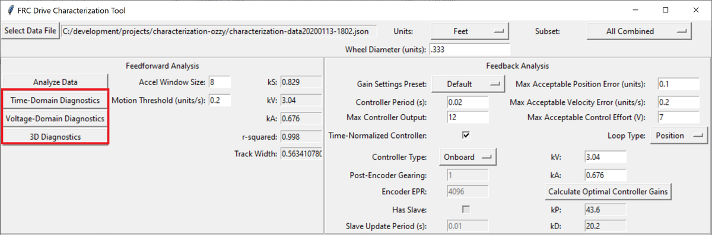

Time-Domain Diagnostics
-----------------------

The Time-Domain Diagnostics plots display velocity and acceleration versus time over the course of the analyzed tests. For a typical drive characterization, these should look something like this (other mechanisms will be highly similar):

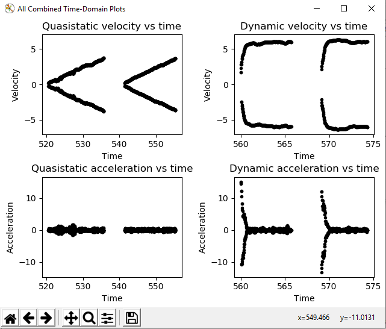

The vertical "mirroring" visible here is normal, and is simply the result of the left- and right-side encoders having different signs - this does not cause any trouble for the characterization tool.

The quasistatic test ought to have nearly linear velocity, and nearly-zero acceleration (hense "quasistatic"). The dynamic test ought to have velocity that asymptotically approaches a steady-state speed (the shape of the curve should be exponential, in fact), and acceleration that, accordingly, rapidly falls to zero (also exponentially, as the derivative of an exponential function is also an exponential function).

Deviation from this behavior is a sign of an :ref:`error <docs/software/wpilib-tools/robot-characterization/viewing-diagnostics:Common Failure Modes>`, either in your robot setup, analysis settings, or your test procedure.

Voltage-Domain Diagnostics
--------------------------

The :guilabel:`Voltage-Domain` Diagnostics button plots velocity and acceleration versus voltage. Velocity is ploted for the quasistatic test, and acceleration is plotted for the dynamic test. For a typical drive characterization, the plots should resemble this (again, other mechanisms will be similar)

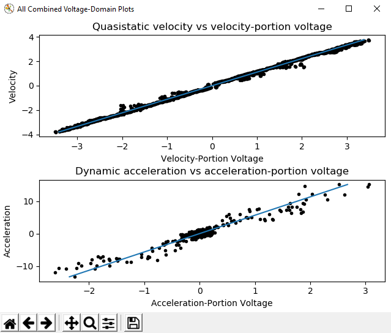

Both plots should be linear, however the dynamic plot will almost certainly have substantially-more noise. The noise on the dynamic plot may be reduced by increasing the ``Accel Window Size`` setting.

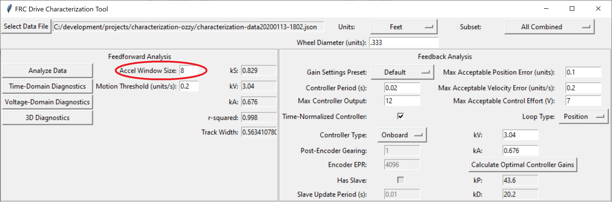

However, if your robot or mechanism has low mass compared to the motor power, this may "eat" what little meaningful acceleration data you have (however, in these cases ``kA`` will tend towards zero and can usually be ignored, anyway).

.. note:: The x-axis corresponds to ``velocity-portion voltage`` and ``acceleration-portion voltage``, respectively - as the governing voltage-balance equations are multi-dimensional, plots against raw voltage are not as useful as one might expect.

3D Diagnostics
--------------

The :guilabel:`3D Diagnostics` button will generate a 3d plot of voltage over the entire velocity-acceleration plane (this may be an adjusted voltage to remove the nonlinearity in mechanisms with nonlinear equations, such as arms).

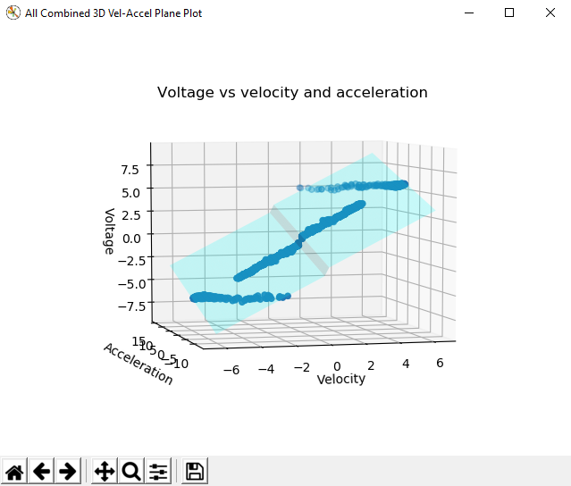

This plot is interactive, and may be rotated by clicking-and-dragging. The quasistatic and dynamic tests should both be clearly visible as streaks of data, and the best fit-plane should pass through all the data points. The data from both the quasistatic and dynamic tests should appear as straight lines (the reason for this is left as an exercise for the reader).

The discontinuity corresponds to ``kS``, which always opposes the direction of motion and thus changes direction as the plot crosses the 0 velocity mark.

Common Failure Modes
^^^^^^^^^^^^^^^^^^^^

When something has gone wrong with the characterization, diagnostic plots and console output provide crucial clues as to *what* has gone wrong.  This section describes some common failures encountered while running the characterization tool, the identifying features of their diagnostic plots, and the steps that can be taken to fix them.

Improperly Set Motion Threshold
^^^^^^^^^^^^^^^^^^^^^^^^^^^^^^^

One of the most-common errors is an inappropriate value for the motion threshold.

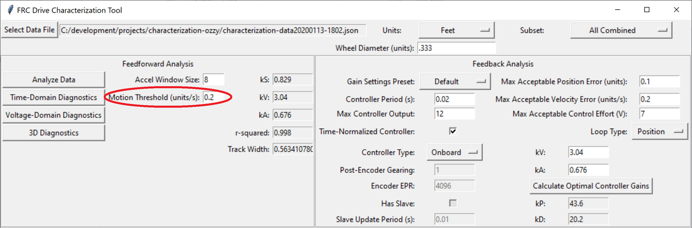

Motion Threshold Too Low
~~~~~~~~~~~~~~~~~~~~~~~~

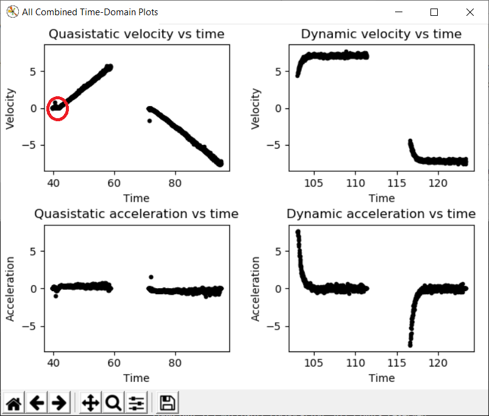

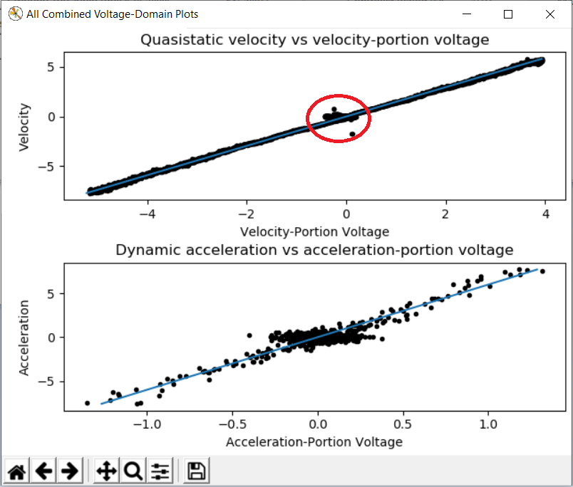

The presence of a "leading tail" (emphasized by added red circle) on the time-domain and voltage-domain plots indicates that the :guilabel:`Motion Threshold` setting is too low, and thus data points from before the robot begins to move are being included.

To solve this, increase the setting and re-analyze the data.

Motion Threshold Too High
~~~~~~~~~~~~~~~~~~~~~~~~~

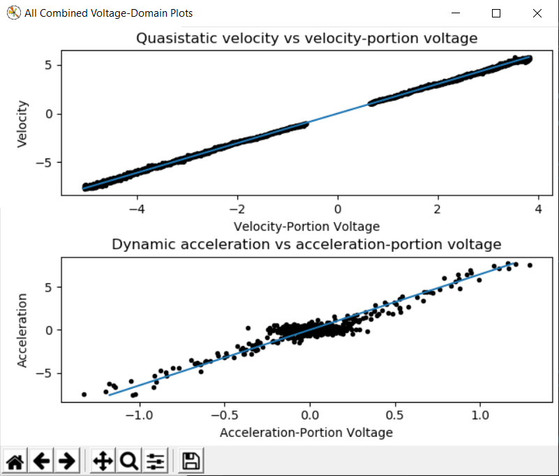

While not nearly as problematic as a too-low threshold, a motion threshold that is too high will result in a large "gap" in the voltage domain quasistatic plot.

To solve this, decrease the setting and re-analyze the data.

Magnetic Encoders Velocity Noise
^^^^^^^^^^^^^^^^^^^^^^^^^^^^^^^^

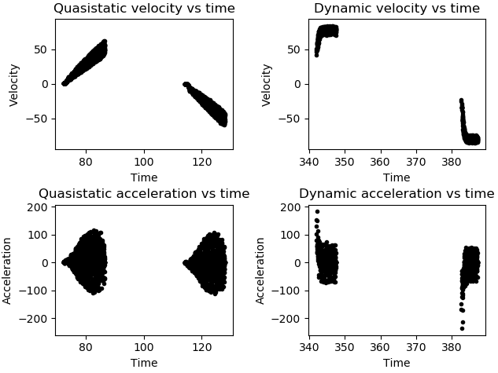

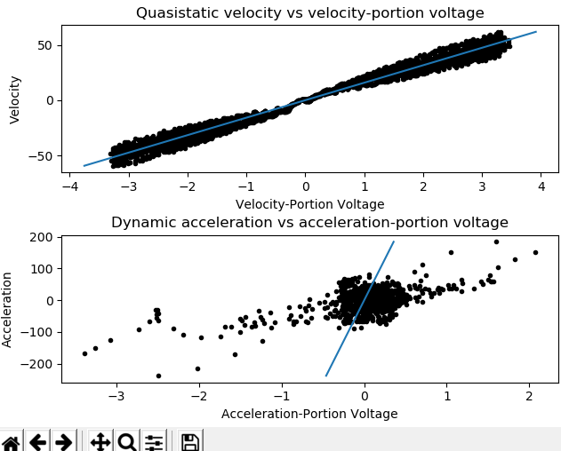

Magnetic encoders such as the `CTRE Mag Encoder <http://www.ctr-electronics.com/srx-magnetic-encoder.html>`__ and the `AndyMark magnetic encoder <https://www.andymark.com/products/am-mag-encoder>`__ are extremely popular in FRC.  However, a particular noise pattern has been observed when these encoders are used on robot drives, whose particular cause is not yet known.  This noise pattern is uniquely distinguished by significant velocity noise proportional to motor velocity, and is particularly common on the kit-of-parts `toughbox mini <https://www.andymark.com/products/toughbox-mini-options>`__ gearboxes.

Characterization constants can sometimes be accurately determined even from data polluted this noise by increasing the accel window size setting.  However, this sort of encoder noise is problematic for robot code much the same way it is problematic for the characterization tool.  As the root cause of the noise is not known, it is recommended to try a different encoder setup if this is observed, either by moving the encoders to a different shaft or replacing them with a different type of encoder.

Template Lag
^^^^^^^^^^^^

With the new characterization tool, the logging code might not be able to keep up with its 5 ms refresh rate thus causing faulty data to be collected.

To see if this is the case, enable print statements on the Driver Station whenever running the data logger. When Autonomous mode is exited, the console will output ``Collected : n in t seconds`` where ``n`` is the number of samples and ``t`` is the time elapsed. If the sampling was successful, ``n`` should equal ``200t`` (rounded).
