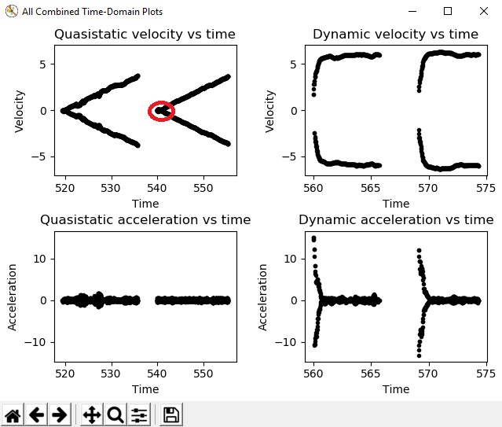

Viewing Diagnostics
===================

The first diagnostic to look at is the r-squared - it should be somewhere north of ~.9. If it is significantly lower than this, there is likely a problem with your characterization data.

To investigate further, you can generate a number of diagnostic plots with the buttons on the left-hand side:

.. image:: images/plotbuttons.png
   :alt: Picture of the diagnostic plot buttons

Time-Domain Diagnostics
-----------------------

The Time-Domain Diagnostics plots display velocity and acceleration versus time over the course of the analyzed tests. For a typical drive characterization, these should look something like this (other mechanisms will be highly similar):

.. image:: images/timedomainplots.png
   :alt: Picture of the time domain plots

The vertical "mirroring" visible here is normal, and is simply the result of the left- and right-side encoders having different signs - this does not cause any trouble for the characterization tool.

The quasistatic test ought to have nearly linear velocity, and nearly-zero acceleration (hense "quasistatic"). The dynamic test ought to have velocity that asymptotically approaches a steady-state speed (the shape of the curve should be exponential, in fact), and acceleration that, accordingly, rapidly falls to zero (also exponentially, as the derivative of an exponential function is also an exponential function).

Deviation from this behavior is a sign of an error, either in your analysis settings or your test procedure. In particular, a "flat" portion at the start of the the ``Quasistatic velocity vs time`` plot

indicates that the ``Motion Threshold`` setting is too low, and thus data points from before the robot begins to move are being included.

.. image:: images/motionthresholdselector.png
   :alt: Motion threshold selector

To solve this, increase the setting and re-analyze the data.

Voltage-Domain Diagnostics
--------------------------

The ``Voltage-Domain`` Diagnostics button plots velocity and acceleration versus voltage. Velocity is ploted for the quasistatic test, and acceleration is plotted for the dynamic test. For a typical drive characterization, the plots should resemble this (again, other mechanisms will be similar)

.. image:: images/voltagedomainplots.png
   :alt: Voltage domain plots picture

Both plots should be linear, however the dynamic plot will almost certainly have substantially-more noise. The noise on the dynamic plot may be reduced by increasing the ``Accel Window Size`` setting.

.. image:: images/accelwindow.png
   :alt: Picture of the accel window size selector

However, if your robot or mechanism has low mass compared to the motor power, this may "eat" what little meaningful acceleration data you have (however, in these cases ``kA`` will tend towards zero and can usually be ignored, anyway).

As before, an overly-small threshold setting may be seen as a flat "leading tail" on the quasistatic plot.

.. note:: The x-axes corresponds to ``velocity-portion voltage`` and ``acceleration-portion voltage``, respectively - as the governing voltage-balance equations are multi-dimensional, plots against raw voltage are not as useful as one might expect.

3D Diagnostics
--------------

The ``3D Diagnostics`` button will generate a 3d plot of voltage over the entire velocity-acceleration plane (this may be an adjusted voltage to remove the nonlinearity in mechanisms with nonlinear equations, such as arms).

.. image:: images/3ddiagnosticplot.png
   :alt: Picture of the 3D diagnostic plot

This plot is interactive, and may be rotated by clicking-and-dragging. The quasistatic and dynamic tests should both be clearly visible as streaks of data, and the best fit-plane should pass through all the data points. The data from both the quasistatic and dynamic tests should appear as straight lines (the reason for this is left as an exercise for the reader).

The discontinuity corresponds to ``kS``, which always opposes the direction of motion and thus changes direction as the plot crosses the 0 velocity mark.

