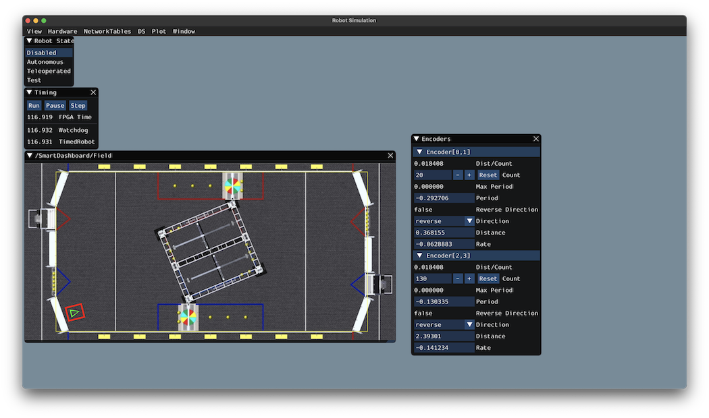

Drivetrain Simulation Overview
==============================

.. note:: The code in this tutorial does not use any specific framework (i.e. command-based vs. simple data flow); however, guidance will be provided in certain areas for how to best implement certain pieces of code in specific framework types.

The goal of this tutorial is to provide guidance on implementing simulation capabilities for a differential-drivetrain robot. By the end of this tutorial, you should be able to:

 1. Understand the basic underlying concepts behind the WPILib simulation framework.
 2. Create a drivetrain simulation model using your robot's physical parameters.
 3. Use the simulation model to predict how your real robot will move given specific voltage inputs.
 4. Tune feedback constants and squash common bugs (e.g. motor inversion) before having access to physical hardware.
 5. Use the Simulation GUI to visualize robot movement on a virtual field.

Why Simulate a Drivetrain?
--------------------------
The drivetrain of a robot is one of the most important mechanisms on the robot -- therefore, it is important to ensure that the software powering your drivetrain is as robust as possible. By being able to simulate how a physical drivetrain responds, you can get a head start on writing quality software before you have access to the physical hardware. With the simulation framework, you can verify not only basic functionality, like making sure that the inversions on motors and encoders are correct, but also advanced capabilities such as verifying accuracy of path following.
