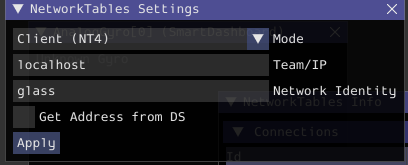
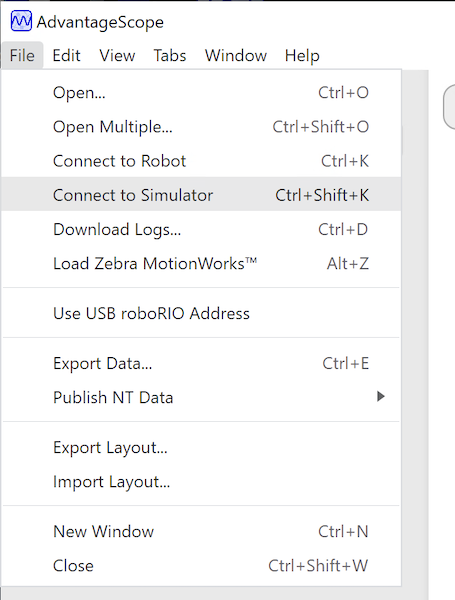

Introduction to Robot Simulation
================================

Often a team may want to test their code without having an actual robot available. WPILib provides teams with the ability to simulate various robot features using simple gradle commands.

.. tab-set::

   .. tab-item:: Java/C++

      Use of the Desktop Simulator requires Desktop Support to be enabled. This can be done by checking the "Enable Desktop Support Checkbox" when creating your robot project or by running "WPILib: Change Desktop Support Enabled Setting" from the Visual Studio Code command palette.

      .. image:: images/vscode-desktop-support.png
         :alt: Enabling desktop support through VS Code

      .. image:: images/vscode-desktop-support-manual.png
         :alt: Manually enabling desktop support through VS Code command-palette

      Desktop support can also be enabled by manually editing your ``build.gradle`` file located at the root of your robot project. Simply change ``includeDesktopSupport = false`` to ``includeDesktopSupport = true``

      .. important:: It is important to note that enabling desktop/simulation support can have unintended consequences. Not all vendors will support this option, and code that uses their libraries may even crash when attempting to run simulation!

      If at any point in time you want to disable Desktop Support, simply re-run the "WPILib: Change Desktop Support Enabled Setting" from the command palette or change ``includeDesktopSupport`` to false in build.gradle.

      .. _cpp_sim_additional_dependency:

      .. note:: C++ robot simulation requires that a native compiler to be installed. For Windows, this would be `Visual Studio 2022 version 17.9 or later <https://visualstudio.microsoft.com/vs/>`__ (**not** VS Code), macOS requires `Xcode 14 or later <https://apps.apple.com/us/app/xcode/id497799835>`__, and Linux (Ubuntu) requires the ``build-essential`` package.

                Ensure the :guilabel:`Desktop Development with C++` option is checked in the Visual Studio installer for simulation support.

                .. image:: images/vs-build-tools.png
                  :alt: Screenshot of the Visual Studio build tools option

      **Running Robot Simulation**

      Basic robot simulation can be run using VS Code. This can be done without using any commands by using VS Code's command palette.

      .. image:: images/vscode-run-simulation.png
         :alt: Running robot simulation through VS Code

      Your console output in Visual Studio Code should look like the below. However, teams probably will want to actually *test* their code versus just running the simulation. This can be done using :doc:`WPILib's Simulation GUI <simulation-gui>`.

      .. code-block:: console

         ********** Robot program starting **********
         Default disabledInit() method... Override me!
         Default disabledPeriodic() method... Override me!
         Default robotPeriodic() method... Override me!

      .. important:: Simulation can also be run outside of VS Code using ``./gradlew simulateJava`` for Java or ``./gradlew simulateNative`` for C++.

      .. note:: Some vendors support attaching hardware to your PC and using the hardware in desktop simulation (e.g. CANivore). See :doc:`vendor documentation </docs/software/vscode-overview/wpilib-commands-vscode>` for more information about the command `WPILib: Hardware Sim Robot Code`.

   .. tab-item:: Python

      GUI simulation support is installed by default when you install RobotPy.

      There is a ``robotpy`` subcommand that you can execute to run your code in simulation:

      .. tab-set::

         .. tab-item:: Windows
            :sync: windows

            .. code-block:: sh

               py -3 -m robotpy sim

         .. tab-item:: macOS
            :sync: macos

            .. code-block:: sh

               python3 -m robotpy sim

         .. tab-item:: Linux
            :sync: linux

            .. code-block:: sh

               python3 -m robotpy sim

Running Robot Dashboards
------------------------

Shuffleboard, SmartDashboard, Glass, and AdvantageScope can be used with WPILib simulation when they are configured to connect to the local computer (i.e. ``localhost``).

Shuffleboard
^^^^^^^^^^^^

Shuffleboard is automatically configured to look for a NetworkTables instance from the robotRIO but **not from other sources**. To connect to a simulation, open Shuffleboard preferences from the :guilabel:`File` menu and select :guilabel:`NetworkTables` under :guilabel:`Plugins` on the left navigation bar. In the :guilabel:`Server` field, type in the IP address or hostname of the NetworkTables host. For a standard simulation configuration, use ``localhost``.

.. image:: images/shuffleboard-networktables.png
   :alt: Shuffleboard connection settings set to localhost.

SmartDashboard
^^^^^^^^^^^^^^

SmartDashboard is automatically configured to look for a NetworkTables instance from the roboRIO, but **not from other sources**. To connect to a simulation, open SmartDashboard preferences under the :guilabel:`File` menu and in the :guilabel:`Team Number` field, enter the IP address or hostname of the NetworkTables host. For a standard simulation configuration, use ``localhost``.

.. image:: /docs/software/dashboards/smartdashboard/images/smartdashboard-intro/smartdashboard-networktables.png
   :alt: SmartDashboard team number set to localhost.

Glass
^^^^^

Glass is automatically configured to look for a NetworkTables instance from the roboRIO, but **not from other sources**. To connect to a simulation, open :guilabel:`NetworkTables Settings` under the :guilabel:`NetworkTables` menu and in the :guilabel:`Team/IP` field, enter the IP address or hostname of the NetworkTables host. For a standard simulation configuration, use ``localhost``.

AdvantageScope
^^^^^^^^^^^^^^

No configuration is required to connect to a NetworkTables instance running on the local computer. To connect to a simulation, click :guilabel:`Connect to Simulator` under the :guilabel:`File` menu or press :kbd:`Ctrl+Shift+K`.

