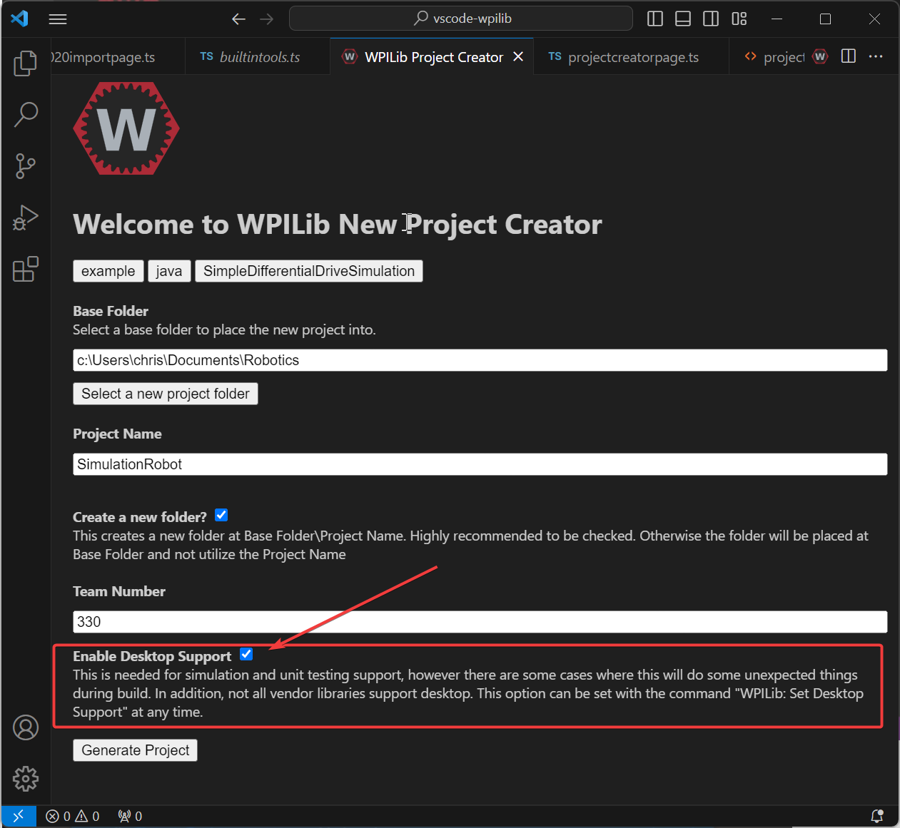
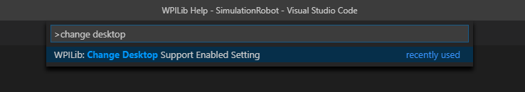
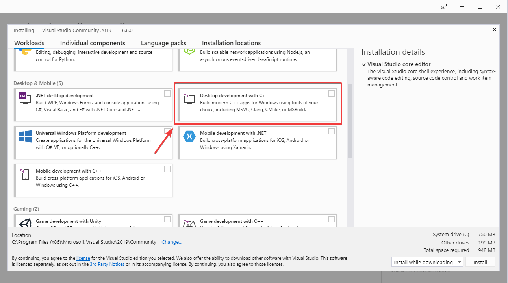
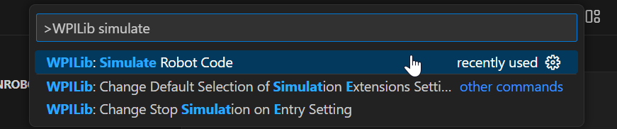
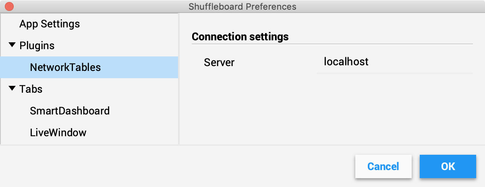

Introduction to Robot Simulation
================================

Often a team may want to test their code without having an actual robot available. WPILib provides teams with the ability to simulate various robot features using simple gradle commands.

Enabling Desktop Support
------------------------

Use of the Desktop Simulator requires Desktop Support to be enabled. This can be done by checking the "Enable Desktop Support Checkbox" when creating your robot project or by running "WPILib: Change Desktop Support Enabled Setting" from the Visual Studio Code command palette.

Desktop support can also be enabled by manually editing your ``build.gradle`` file located at the root of your robot project. Simply change ``includeDesktopSupport = false`` to ``includeDesktopSupport = true``

.. code-block:: text

   def includeDesktopSupport = true

.. important:: It is important to note that enabling desktop/simulation support can have unintended consequences. Not all vendors will support this option, and code that uses their libraries may even crash when attempting to run simulation!

If at any point in time you want to disable Desktop Support, simply re-run the "WPILib: Change Desktop Support Enabled Setting" from the command palette.

Additional C++ Dependency
^^^^^^^^^^^^^^^^^^^^^^^^^

C++ robot simulation requires that a native compiler to be installed. For Windows, this would be `Visual Studio 2022 <https://visualstudio.microsoft.com/vs/>`__ (**not** VS Code), macOS requires `Xcode <https://apps.apple.com/us/app/xcode/id497799835>`__, and Linux (Ubuntu) requires the ``build-essential`` package.

Ensure the :guilabel:`Desktop Development with C++` option is checked in the Visual Studio installer for simulation support.

Running Robot Simulation
------------------------

Basic robot simulation can be run using VS Code. This can be done without using any commands by using VS Code's command palette.

Your console output in Visual Studio Code should look like the below. However, teams probably will want to actually *test* their code versus just running the simulation. This can be done using :doc:`WPILib's Simulation GUI <simulation-gui>`.

.. code-block:: console

   ********** Robot program starting **********
   Default disabledInit() method... Override me!
   Default disabledPeriodic() method... Override me!
   Default robotPeriodic() method... Override me!

.. important:: Simulation can also be run outside of VS Code using ``./gradlew simulateJava`` for Java or ``./gradlew simulateNative`` for C++.

Running Robot Dashboards
------------------------

Both Shuffleboard and SmartDashboard can be used with WPILib simulation.

Shuffleboard
^^^^^^^^^^^^

Shuffleboard is automatically configured to look for a NetworkTables instance from the robotRIO but **not from other sources**. To connect to Shuffleboard, open Shuffleboard preferences from the File menu and select ``NetworkTables`` under ``Plugins`` on the left navigation bar. In the ``Server`` field, type in the IP address or hostname of the NetworkTables host. For a standard simulation configuration, use ``localhost``.

SmartDashboard
^^^^^^^^^^^^^^

SmartDashboard is automatically configured to look for a NetworkTables instance from the roboRIO, but **not from other sources**. To connect to SmartDashboard, open SmartDashboard preferences under the ``File`` menu and in the ``Team Number`` field, enter the IP address or hostname of the NetworkTables host. For a standard simulation configuration, use ``localhost``.

.. image:: /docs/software/dashboards/smartdashboard/images/smartdashboard-intro/smartdashboard-networktables.png
   :alt: SmartDashboard team number set to localhost.
