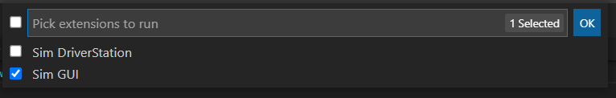
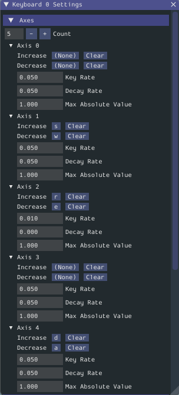

.. include:: <isonum.txt>

Simulation Specific User Interface Elements
===========================================

WPILib has extended robot simulation to introduce a graphical user interface (GUI) component. This allows teams to easily visualize their robot's inputs and outputs.

.. note:: The Simulation GUI is very similar in many ways to :ref:`Glass <docs/software/dashboards/glass/introduction:Introduction to Glass>`.  Some of the following pages will link to Glass sections that describe elements common to both GUIs.

Running the GUI
---------------

.. image:: images/vscode-run-simulation.png
   :alt: Running simulation via VS Code

You can simply launch the GUI via the **Run Simulation** command palette option.

And the ``Sim GUI`` option should popup in a new dialog and will be selected by default. Press :guilabel:`Ok`. This will now launch the Simulation GUI!

.. image:: images/sim-gui.png
   :alt: The simulation graphical user interface

Using the GUI
-------------

Learning the Layout
^^^^^^^^^^^^^^^^^^^

.. image:: images/sim-gui-with-labels.png
   :alt: Simulation graphical user interface but with labels

The following items are shown on the simulation GUI by default:

1. **Robot State** - This is the robot's current state or "mode". You can click on the labels to change mode as you would on the normal Driver Station.
2. **Timing** - Shows the values of the Robot's timers and allows the timing to be manipulated.
3. **System Joysticks** - This is a list of joysticks connected to your system currently.
4. **FMS** - This is used for simulating many of the common FMS systems.
5. **NetworkTables** - This shows the data that has been published to NetworkTables.
6. **Joysticks** - This is joysticks that the robot code can directly pull from.
7. **Other Devices** - This includes devices that do not fall into any of the other categories, such as the ADXRS450 gyro that is included in the Kit of Parts or third party devices that support simulation.

The following items can be added from the Hardware menu, but are not shown by default.

1. **Addressable LEDs** - This shows LEDs controlled by the ``AddressableLED`` Class.
2. **Analog Inputs** - This includes any devices that would normally use the **ANALOG IN** connector on the roboRIO, such as any Analog based gyros.
3. **DIO** - (Digital Input Output) This includes any devices that use the **DIO** connector on the roboRIO.
4. **Encoders** - This will show any instantiated devices that extend or use the ``Encoder`` class.
5. **PDPs** - This shows the Power Distribution Panel object.
6. **PWM Outputs** - This is a list of instantiated PWM devices. This will appear as many devices as you instantiate in robot code, as well as their outputs.
7. **Relays** - This includes any relay devices. This includes VEX Spike relays.
8. **Solenoids** - This is a list of "connected" solenoids. When you create a solenoid object and push outputs, these are shown here.

Adding a System Joystick to Joysticks
^^^^^^^^^^^^^^^^^^^^^^^^^^^^^^^^^^^^^

To add a joystick from the list of system joysticks, simply click and drag a shown joystick under the "System Joysticks" menu to the "Joysticks" menu".

.. image:: images/sim-gui-dragging-joysticks.png
   :alt: Dragging a joystick from System Joysticks to Joysticks

.. note:: The FRC\ |reg| Driver Station does special mapping to gamepads connected and the WPILib simulator does not "map" these by default. You can turn on this behavior by pressing the "Map gamepad" toggle underneath the "Joysticks" menu.

Using the Keyboard as a Joystick
^^^^^^^^^^^^^^^^^^^^^^^^^^^^^^^^

You add a keyboard to the list of system joysticks by clicking and dragging one of the keyboard items (e.g. Keyboard 0) just like a joystick above.  To edit the settings of the keyboard go to the :guilabel:`DS` item in the menu bar then choose :guilabel:`Keyboard 0 Settings`.  This allows you to control which keyboard buttons control which axis.  This is a common example of how to make the keyboard similar to a split sticks arcade drive on an Xbox controller (uses axis 1 & 4):

Modifying ADXRS450 Inputs
^^^^^^^^^^^^^^^^^^^^^^^^^

Using the ADXRS450 object is a fantastic way to test gyro based outputs. This will show up in the "Other Devices" menu. A drop down menu is then exposed that shows various options such as "Connected", "Angle", and "Rate". All of these values are values that you can change, and that your robot code and use on-the-fly.

.. image:: images/sim-gui-using-gyro.png

Determining Simulation from Robot Code
--------------------------------------

In cases where vendor libraries do not compile when running the robot simulation, you can wrap their content with ``RobotBase.isReal()`` which returns a ``boolean``.

.. tabs::

   .. code-tab:: java

      TalonSRX motorLeft;
      TalonSRX motorRight;

      public Robot() {
       if (RobotBase.isReal()) {
         motorLeft = new TalonSRX(0);
         motorRight = new TalonSRX(1);
       }
      }

.. note:: Reassigning value types in C++ requires move or copy assignment; vendors classes that both do not support the SIM and lack a move or copy assignment operator cannot be worked around with conditional allocation unless a pointer is used, instead of a value type.

Changing View Settings
----------------------

The :guilabel:`View` menu item contains :guilabel:`Zoom` and :guilabel:`Style` settings that can be customized. The :guilabel:`Zoom` option dictates the size of the text in the application whereas the :guilabel:`Style` option allows you to select between the ``Classic``, ``Light``, and ``Dark`` modes.

An example of the ``Dark`` style setting is below:

.. image:: /docs/software/dashboards/glass/images/glass-dark-mode.png

Clearing Application Data
-------------------------

Application data for the Simulation GUI, including widget sizes and positions as well as other custom information for widgets is stored in a ``imgui.ini`` file. This file is stored in the root of the project directory that the simulation is run from.

The ``imgui.ini`` configuration file can simply be deleted to restore the Simulation GUI to a "clean slate".
