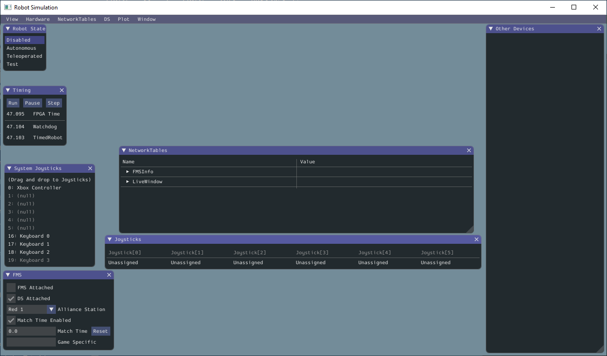
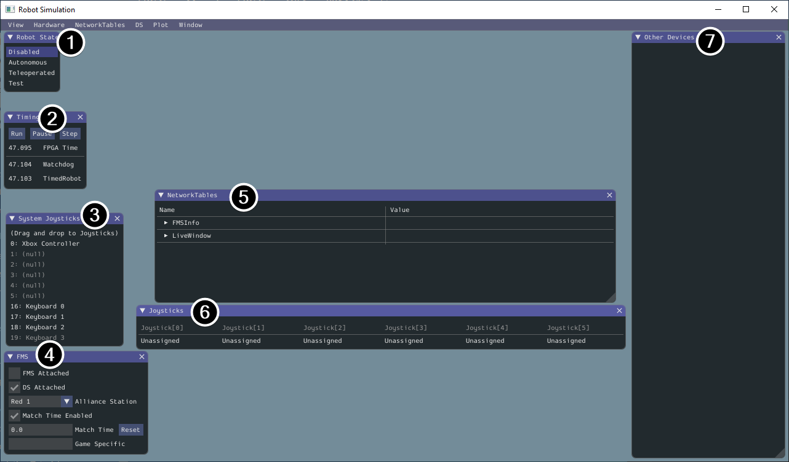
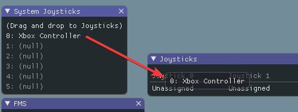
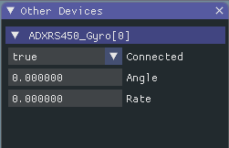

Simulation User Interface
=========================

WPILib has extended robot simulation to introduce a graphical user interface (GUI) component. This allows teams to easily visualize their robot's inputs and outputs.

Running the GUI
---------------

You can simply launch the GUI via the **Run Simulation** command palette option.

.. image:: images/vscode-run-simulation.png
   :alt: Running simulation via VS Code

And the ``halsim_gui.dll`` option should popup in a new dialog. Select this and press **Ok**. This will now launch the Simulation GUI!

Using the GUI
-------------

Learning the Layout
^^^^^^^^^^^^^^^^^^^

1. **Robot State** - This is the robot's current state or "mode". You can click on the labels to change mode as you would on the normal Driver Station.
2. **Relays** - This includes any relay devices. This includes VEX Spike relays.
3. **Solenoids** - This is a list of "connected" solenoids. When you create a solenoid object and push outputs, these are shown here.
4. **DIO** - (Digital Input Output) This includes any devices that use the **DIO** connector on the roboRIO.
5. **Analog Inputs** - This includes any devices that would normally use the **ANALOG IN** connector on the roboRIO, such as any Analog based gyros.
6. **PWM Outputs** - This is a list of instantiated PWM devices. This will appear as many devices as you instantiate in robot code, as well as their outputs.
7. **Encoders** - This will show any instantiated devices that extend or use the ``Encoder`` class.
8. **System Joysticks** - This is a list of joysticks connected to your system currently.
9. **FMS** - This is used for simulating many of the common FMS systems.
10. **Joysticks** - This is joysticks that the robot code can directly pull from.
11. **Other Devices** - This includes devices that do not fall into any of the other categories, such as the ADXRS450 gyro that is included in the Kit of Parts.

Adding a System Joystick to Joysticks
^^^^^^^^^^^^^^^^^^^^^^^^^^^^^^^^^^^^^

To add a joystick from the list of system joysticks, simply click and drag a shown joystick under the "System Joysticks" menu to the "Joysticks" menu".

Modifying ADXRS450 Inputs
^^^^^^^^^^^^^^^^^^^^^^^^^

Using the ADXRS450 object is a fantastic way to test gyro based outputs. This will show up in the "Other Devices" menu. A drop down menu is then exposed that shows various options such as "Connected", "Angle", and "Rate". All of these values are values that you can change, and that your robot code and use on-the-fly.

Determining Simulation from Robot Code
--------------------------------------

In cases where vendor libraries do not compile when running the robot simulation, you can wrap their content with ``RobotBase.isReal()`` which returns a ``boolean``.

.. tabs::

   .. code-tab:: java

      TalonSRX motorLeft;
      TalonSRX motorRight;

      public Robot() {
       if (RobotBase.isReal()) {
         motorLeft = new TalonSRX(0);
         motorRight = new TalonSRX(1);
       }
      }

.. note:: Reassigning value types in C++ requires move or copy assignment; vendors classes that both do not support the SIM and lack a move or copy assignment operator cannot be worked around with conditional allocation unless a pointer is used, instead of a value type.
