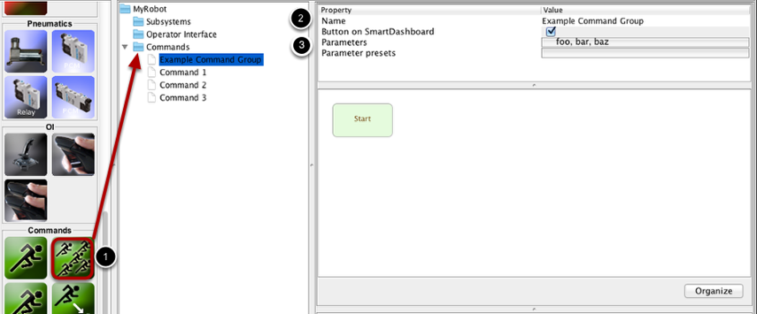
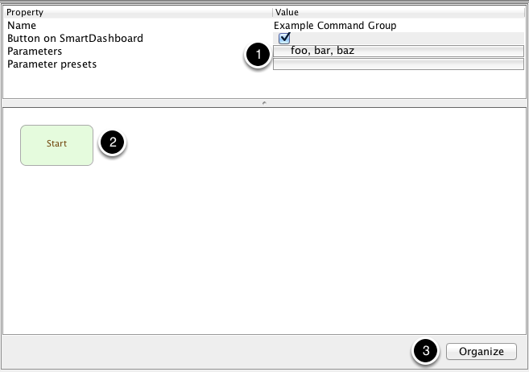
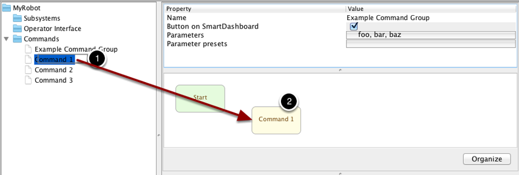
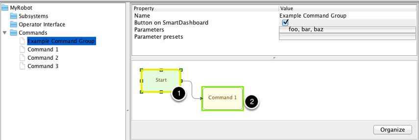
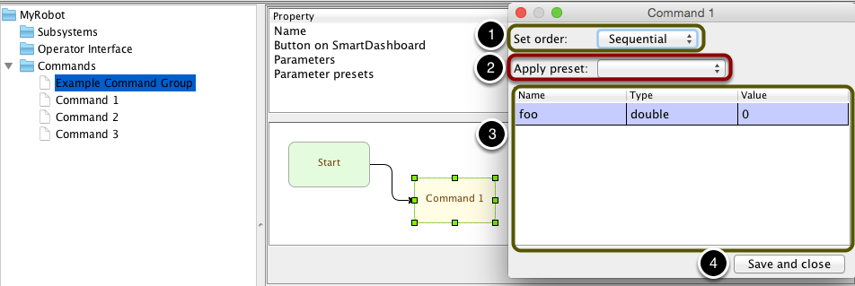

Creating a Command that Runs Other Commands
===========================================

Often you will want to run multiple commands one after another or simultaneously to enable more complex behaviors in your program. Once each of the individual commands have been debugged, you can create a CommandGroup. A CommandGroup is a named set of commands that may be executed sequentially or in parallel.

Creating a Command Group
------------------------

To create a CommandGroup:

1. Drag the command group from the palette to Commands folder in the robot description
2. Name the command group so that is has a meaningful name
3. Give the group any parameters it needs and presets for those parameters, just like with a normal command. These can be changed later at any time

Overview of the Editor
----------------------

The elements of the command group editor are:

1. The properties of the command group.
2. The editor where commands are placed and connected.
3. The organize button will automatically organize all the commands in the editor

There are also a few differences between sequential and parallel commands in the editor.

- A command running sequentially can have only one command run sequentially after it
- A command running in parallel cannot have any commands run after it
- Sequential commands are colored light green and are placed at the top of the editor when it's organized
- Parallel commands are colored light blue and prefer to be placed below sequential commands

Adding Commands
---------------

An empty command group isn't very useful, so to add commands to it:

1. Click a command in the palette ("Command 1" in this example)
2. Drag it somewhere into the graph editor

Alternatively, you can right-click anywhere on the editor and choose the command from the dropdown, or right-click a command and choose a command to automatically be placed after the command you click.

Now you have a command in the group! But it's not connected to anything, so RobotBuilder doesn't know how it's supposed to behave.

Connecting Commands
-------------------

To connect commands and control when commands run in the group;

1. Click the center of the box for the previous command (or "Start" if you want it to run at the beginning). In this example, "Command 1" is the first command to run "Start" is clicked.
2. When a yellow box appears around the first box, drag your mouse to the command to run after it. This will create an arrow from the first box to your mouse.
3. When a yellow box appears around the second box, you can release your mouse. The arrow will connect the two boxes and RobotBuilder will set the sequence of commands.

You can skip this step if you right-click a box and add a command through the menu -- Robotbuilder will automatically connect them.

Editing Commands
----------------

Double click a command to bring up the editor window.

1. Commands you drag in are automatically sequential. To change a command between running sequentially and in parallel, simply double-click on the command you want to edit and choose the order you want from the dropdown. You can also right-click on the command and choose "Set Parallel" or "Set Sequential" from the popup menu.
2. If the command has been configured to have presets, you can select one from this dropdown and Robotbuilder will fill out the values of the parameters.
3. The editor also allows you to edit the values of parameters that have been added to the command. Double-click the cell in the "Value" column to change it. The values of parameters can either be passed literally (e.g. the value for "foo" has been hardcoded to 0), or as a reference to a variable, method, or expression in the code. A reference starts with a dollar sign ('$'); everything after the dollar sign will be inserted into the code generated by RobotBuilder *exactly how it's typed*, so it's easy to misstype something and have the code not compile. The user is responsible for creating proper imports/include statements and declaring variables and methods.
4. When you are done with editing, press the "Save and close" button to exit the editor and save the changes you've made to the command. If you don't want to save, press the close window button on the top of the window.
