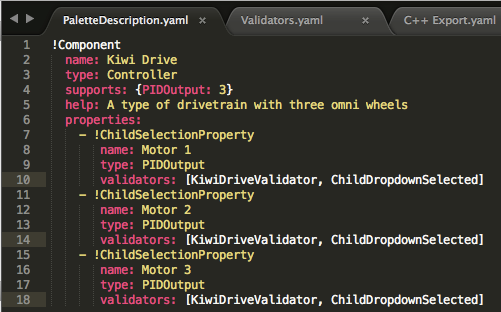
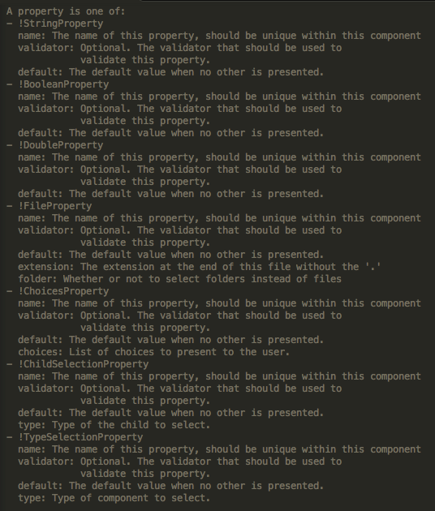
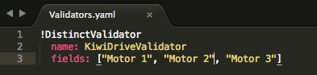
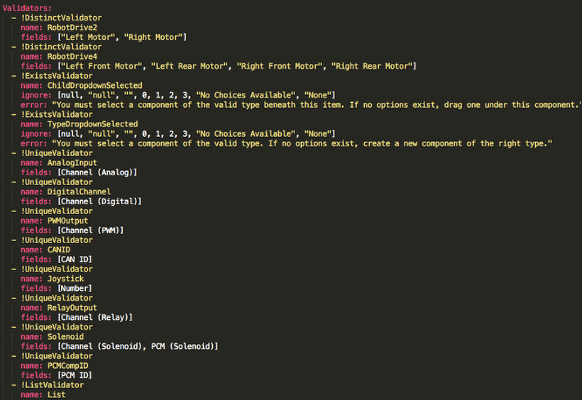
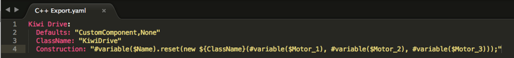
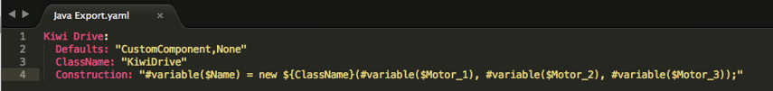
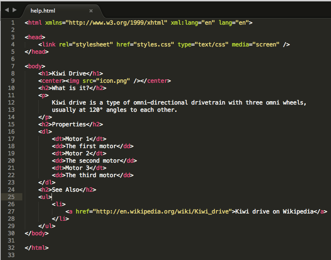
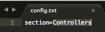

.. include:: <isonum.txt>

Adding Custom Components
========================

RobotBuilder works very well for creating robot programs that just use WPILib for motors, controllers, and sensors. But for teams that use custom classes, RobotBuilder doesn't have any support for those classes, so a few steps need to be taken to use them in RobotBuilder

Custom Component Structure
--------------------------

.. image:: images/custom-components-1.png

Custom components all go in ``~/wpilib/YYYY/Robotbuilder/extensions`` where ~ is ``C:\Users\Public`` on Windows and YYYY is the FRC\ |reg| year.

There are seven files and one folder that are needed for a custom component. The folder contains the files describing the component and how to export it. It should have the same name as the component (e.g."Kiwi Drive" for a kiwi drive controller, "Robot Drive 6" for a six-motor drive controller, etc.). The files should have the same names and extensions as the ones shown here. Other files can be in the folder along with these seven, but the seven must be present for RobotBuilder to recognize the custom component.

PaletteDescription.yaml
-----------------------

Line-by-line:

- !Component: Declares the beginning of a new component
- name: The name of the component. This is what will show up in the palette/tree -- this should also be the same as the name of the containing folder
- type: the type of the component (these will be explained in depth later on)
- supports: a map of the amount of each type of component this can support. Motor controllers in RobotBuilder are all PIDOutputs, so a kiwi drive can support three PIDOutputs. If a component doesn't support anything (such as sensors or motor controllers), just leave this line out
- help: a short string that gives a helpful message when one of these components is hovered over
- properties: a list of the properties of this component. In this kiwi drive example, there are three very similar properties, one for each motor. A ChildSelectionProperty allows the user to choose a component of the given type from the subcomponents of the one being edited (so here, they would show a dropdown asking for a PIDOutput - i.e. a motor controller - that has been added to the kiwi drive)

The types of component RobotBuilder supports (these are case-sensitive):

- Command
- Subsystem
- PIDOutput (motor controller)
- PIDSource (sensor that implements PIDSource e.g. analog potentiometer, encoder)
- Sensor (sensor that does not implement PIDSource e.g. limit switch)
- Controller (robot drive, PID controller, etc.)
- Actuator (an output that is not a motor, e.g. solenoid, servo)
- Joystick
- Joystick Button

Properties
^^^^^^^^^^

The properties relevant for a custom component:

- StringProperty: used when a component needs a string e.g. the name of the component
- BooleanProperty: used when a component needs a boolean value e.g. putting a button on the SmartDashboard
- DoubleProperty: used when a component needs a number value e.g. PID constantsChoicesProperty
- ChildSelectionProperty: used when you need to choose a child component e.g. motor controllers in a RobotDrive
- TypeSelectionProperty: used when you need to choose any component of the given type from anywhere in the program e.g. input and output for a PID command

The fields for each property are described below:

Validators.yaml
---------------

You may have noticed "KiwiDriveValidator" in the validators entry of each of the motor properties in PaletteDescription.yaml. It's not a built-in validator, so it had to be defined in Validators.yaml. This example validator is very simple - it just makes sure that each of the named fields has a different value than the others.

Built-in Validators and Validator Types
^^^^^^^^^^^^^^^^^^^^^^^^^^^^^^^^^^^^^^^

The built-in validators are very useful (especially the UniqueValidators for port/channel use), but sometimes a custom validator is needed, like in the previous step

- DistinctValidator: Makes sure the values of each of the given fields are unique
- ExistsValidator: Makes sure that a value has been set for the property using this validator
- UniqueValidator: Makes sure that the value for the property is unique globally for the given fields
- ListValidator: Makes sure that all the values in a list property are valid

C++ Export.yaml
---------------

A line-by-line breakdown of the file:

- Kiwi Drive: the name of the component being exported. This is the same as the name set in PaletteDescription.yaml, and the name of the folder containing this file
- Defaults: provides some default values for includes needed by this component, the name of the class, a construction template, and more. The CustomComponent default adds an include for ``Custom/${ClassName}.h`` to every generated file that uses the component (e.g. ``RobotDrive.h`` would have ``#include "Custom/KiwiDrive.h`` the top of the file)
- ClassName: the name of the custom class you're adding.
- Construction: an instruction for how the component should be constructed. Variables will be replaced with their values ("${ClassName}" will be replaced with "KiwiDrive"), then macros will be evaluated (for example, ``#variable($Name)`` may be replaced with ``drivebaseKiwiDrive``).

This example expects a KiwiDrive class with the constructor

.. code-block:: cpp

   KiwiDrive(SpeedController, SpeedController, SpeedController)

If your team uses Java, this file can be empty.

Java Export.yaml
----------------

Very similar to the C++ export file; the only difference should be the Construction line. This example expects a KiwiDrive class with the constructor

.. code-block:: java

   KiwiDrive(SpeedController, SpeedController, SpeedController)

If your team uses C++, this file can be empty.

Using Macros and Variables
--------------------------

Macros are simple functions that RobotBuilder uses to turn variables into text that will be inserted into generated code. They always start with the "#" symbol, and have a syntax similar to functions: ``<macro_name>( arg0, arg1, arg2, ...)``. The only macro you'll probably need to use is ``#variable( component_name )``

``#variable`` takes a string, usually the a variable defined somewhere (i.e. "Name" is the name given to the component in RobotBuilder, such as "Arm Motor"), and turns it into the name of a variable defined in the generated code. For example, ``#variable("Arm Motor")`` results in the string ``ArmMotor``

Variables are referenced by placing a dollar sign ("$") in front of the variable name, which an optionally be placed inside curly braces to easily distinguish the variable from other text in the file. When the file is parsed, the dollar sign, variable name, and curly braces are replaced with the value of the variable (e.g. ``${ClassName}`` is replaced with ``KiwiDrive``).

Variables are either component properties (e.g. "Motor 1", "Motor 2", "Motor 3" in the kiwi drive example), or one of the following:

1. Short_Name: the name given to the component in the editor panel in RobotBuilder
2. Name: the full name of the component. If the component is in a subsystem, this will be the short name appended to the name of the subsystem
3. Export: The name of the file this component should be created in, if any. This should be "RobotMap" for components like actuators, controllers, and sensors; or "OI" for things like gamepads or other custom OI components. Note that the "CustomComponent" default will export to the RobotMap.
4. Import: Files that need to be included or imported for this component to be able to be used.
5. Declaration: an instruction, similar to Construction, for how to declare a variable of this component type. This is taken care of by the default "None"
6. Construction: an instruction for how to create a new instance of this component
7. LiveWindow: an instruction for how to add this component to the LiveWindow
8. Extra: instructions for any extra functions or method calls for this component to behave correctly, such as encoders needing to set the encoding type.
9. Prototype (C++ only): The prototype for a function to be created in the file the component is declared in, typically a getter in the OI class
10. Function: A function to be created in the file the component is declared in, typically a getter in the OI class
11. PID: An instruction for how to get the PID output of the component, if it has one (e.g. ``#variable($Short_Name)->PIDGet()``)
12. ClassName: The name of the class that the component represents (e.g. ``KiwiDrive`` or ``Joystick``)

If you have variables with spaces in the name (such as "Motor 1", "Right Front Motor", etc.), the spaces need to be replaced with underscores when using them in the export files.

help.html
---------

A HTML file giving information on the component. It is better to have this be as detailed as possible, though it certainly isn't necessary if the programmer(s) are familiar enough with the component, or if it's so simple that there's little point in a detailed description.

config.txt
----------

A configuration file to hold miscellaneous information about the component. Currently, this only has the section of the palette to put the component in.

The sections of the palette (these are case sensitive):

- Subsystems
- Controllers
- Sensors
- Actuators
- Pneumatics
- OI
- Commands

icon.png
--------

The icon that shows up in the palette and the help page. This should be a 64x64 ``.png`` file.

It should use the color scheme and general style of the section it's in to avoid visual clutter, but this is entirely optional. Photoshop ``.psd`` files of the icons and backgrounds are in `src/main/icons/icons <https://github.com/wpilibsuite/RobotBuilder/tree/main/src/main/icons/icons>`_ and png files of the icons and backgrounds are in `src/main/resources/icons <https://github.com/wpilibsuite/RobotBuilder/tree/main/src/main/resources/icons>`_.
