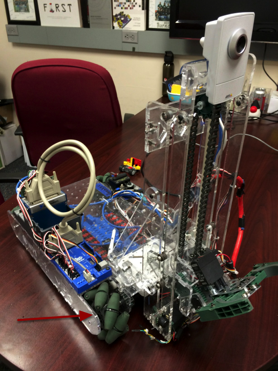

Driving a Robot using Mecanum Drive
===================================

Mecanum drive is a method of driving using specially designed wheels that allow the robot to drive in any direction without changing the orientation of the robot. A robot with a conventional drivetrain (4 or six wheels) must turn in the direction it needs to drive. A mecanum robot can move in any direction without first turning and is called a holonomic drive.

Mecanum Wheels
--------------

The wheels shown in this robot have rollers that cause the forces from driving to be applied at a 45 degree angle rather than straight forward as in the case of a conventional drive. You might guess that varying the speed of the wheels results in travel in any direction. You can look up how mecanum wheels work on various web sites on the internet.

Code for Driving with Mecanum Wheels
------------------------------------

.. tabs::

   .. code-tab:: cpp

      #include "frc/Joystick.h"
      #include "frc/RobotDrive.h"
      /**
       * Simplest program to drive a robot with mecanum drive using a single Logitech
       * Extreme 3D Pro joystick and 4 drive motors connected as follows:
       *   - PWM 1 - Connected to front left drive motor
       *   - PWM 2 - Connected to rear left drive motor
       *   - PWM 3 - Connected to front right drive motor
       *   - PWM 4 - Connected to rear right drive motor
       */
      class MecanumDefaultCode : public TimedRobot
      {
         RobotDrive *m_robotDrive;     // RobotDrive object using PWM 1-4 for drive motors
         Joystick *m_driveStick;       // Joystick object on USB port 1 (mecanum drive)
      public:
         /**
          * Constructor for this "MecanumDefaultCode" Class.
          */
         MecanumDefaultCode(void)
         {
            // Create a RobotDrive object using PWMS 1, 2, 3, and 4
            m_robotDrive = new RobotDrive(1, 2, 3, 4);
            // Define joystick being used at USB port #1 on the Drivers Station
            m_driveStick = new Joystick(1);
            // Twist is on Axis 3 for the Extreme 3D Pro
            m_driveStick->SetAxisChannel(Joystick::kTwistAxis, 3);
         }
         /**
          * Gets called once for each new packet from the DS.
          */
         void TeleopPeriodic(void)
         {
            m_robotDrive->MecanumDrive_Cartesian(m_driveStick->GetX(), m_driveStick->GetY(), m_driveStick->GetTwist());
         }
      };
      START_ROBOT_CLASS(MecanumDefaultCode);

Here's a sample program that shows the minimum code to drive using a single joystick and mecanum wheels. It uses the RobotDrive object that is available in both C++ and Java so even though this example is in C++ similar code will work in Java. The idea is to create the RobotDrive object with 4 PWM ports for the 4 speed controllers on the robot. The joystick XY position represents a direction vector that the robot should follow regardless of its orientation. The twist axis on the joystick represents the rate of rotation for the robot while it's driving.

Thanks to **FRC Team 2468** in Austin, TX for developing this example.

Field-Oriented Driving
----------------------

I would be remiss in not mentioning that is a 4th parameter to the ``MecanumDrive_Cartesian()`` method that is the angle returned from a Gyro sensor. This will adjust the rotation value supplied, in this case, from the twist axis of the joystick to be relative to the field rather than relative to the robot. This is particularly useful with mecanum drive since, for the purposes of steering, the robot really has no front, back or sides. It can go in any direction. Adding the angle in degrees from a gyro object will cause the robot to move away from the drivers when the joystick is pushed forwards, and towards the drivers when it is pulled towards them - regardless of what direction the robot is facing!

The use of field-oriented driving makes often makes the robot much easier to drive, especially compared to a "robot-oriented" drive system where the controls are reversed when the robot is facing the drivers.

Just remember to get the gyro angle each time ``MecanumDrive_Cartesian()`` is called.
