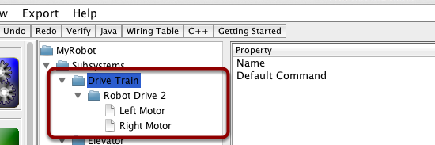
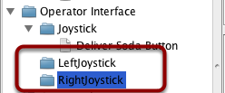
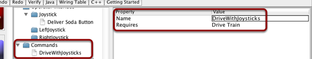
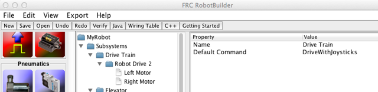

Driving the Robot with Tank Drive and Joysticks
===============================================

A common use case is to have a joystick that should drive some actuators that are part of a subsystem. The problem is that the joystick is created in the OI class and the motors to be controlled are in the subsystem. The idea is to create a command that, when scheduled, reads input from the joystick and calls a method that is created on the subsystem that drives the motors.

In this example a drive base subsystem is shown that is operated in tank drive using a pair of joysticks.

Create a Drive Train Subsystem
------------------------------

Create a subsystem called Drive Train. Its responsibility will be to handle the driving for the robot base. Inside the Drive Train is a Robot Drive object for a two motor drive robot (in this case). There is a left motor and right motor as part of the Robot Drive 2 class.

Add the Joysticks to the Operator Interface
-------------------------------------------

Add two joysticks to the Operator Interface, one is the left stick and the other is the right stick. The y-axis on the two joysticks are used to drive the robots left and right sides.

.. note:: Be sure to export your program to C++ or Java before continuing to the next step.

Create a Method to Write the Motors on the Subsystem
----------------------------------------------------

.. tabs::

   .. code-tab:: java

      public class DriveTrain extends Subsystem {
         RobotDrive robotDrive2 = RobotMap.DRIVE_TRAIN_ROBOT_DRIVE_2;
         Jaguar rightMotor = RobotMap.DRIVE_TRAIN_RIGHT_MOTOR;
         Jaguar leftMotor = RobotMap.DRIVE_TRAIN_LEFT_MOTOR;

         public void initDefaultCommand() {

         }

         public void takeJoystickInputs(Joystick left, Joystick right) {
            robotDrive2.tankDrive(left, right);
         }

         public void stop() {
            robotDrive2.drive(0, 0);
         }
      }

Create a method that takes the joystick inputs, in this case the the left and right driver joystick. The values are passed to the RobotDrive object that in turn does tank steering using the joystick values. Also create a method called stop() that stops the robot from driving, this might come in handy later.

.. note:: The extra RobotBuilder comments have been removed to format the example for the documentation.

Read Joystick Values and Call the Subsystem Methods
---------------------------------------------------

Create a command, in this case called DriveWithJoysticks. Its purpose will be to read the joystick values and send them to the Drive Base subsystem. Notice that this command Requires the Drive Train subsystem. This will cause it to stop running whenever anything else tries to use the Drive Train.

.. note:: Be sure to export your program to C++ or Java before continuing to the next step.

Add the Code to do the Driving
------------------------------

.. tabs::

   .. code-tab:: java

      public class DriveWithJoysticks extends Command {
         public DriveWithJoysticks() {
            // BEGIN AUTOGENERATED CODE, SOURCE=ROBOTBUILDER ID=REQUIRES
            requires(Robot.driveTrain);
            // END AUTOGENERATED CODE, SOURCE=ROBOTBUILDER ID=REQUIRES
         }

         protected void initialize() {

         }

         protected void execute() {
            Robot.driveTrain.takeJoystickInputs(Robot.oi.getLeftJoystick(), Robot.oi.getRightJoystick());
         }

         protected boolean isFinished() {
            return false;
         }

         protected void end() {
            Robot.driveTrain.stop();
         }

         protected void interrupted() {
            end();
         }
      }

Add code to the execute method to do the actual driving. All that is needed is to get the Joystick objects for the left and right drive joysticks and pass them to the Drive Train subsystem. The subsystem just uses them for the tank steering method on its RobotDrive object. And we get tank steering.

We also filled in the ``end()`` and ``interrupted()`` methods so that when this command is interrupted or stopped, the motors will be stopped as a safety precaution.

Make Default Command
--------------------

The last step is to make the DriveWIthJoysticks command be the "Default Command" for the Drive Train subsystem. This means that whenever no other command is using the Drive Train, the Joysticks will be in control. This is probably the desirable behavior. When the autonomous code is running, it will also require the drive train and interrupt the "DriveWithJoystick" command. When the autonomous code is finished, the DriveWithJoysticks command will restart automatically (because it is the default command), and the operators will be back in control. If you write any code that does teleop automatic driving, those commands should also "require" the DriveTrain so that they too will interrupt the DriveWithJoysticks command and have full control.

.. note:: Be sure to export your program to C++ or Java before continuing.
