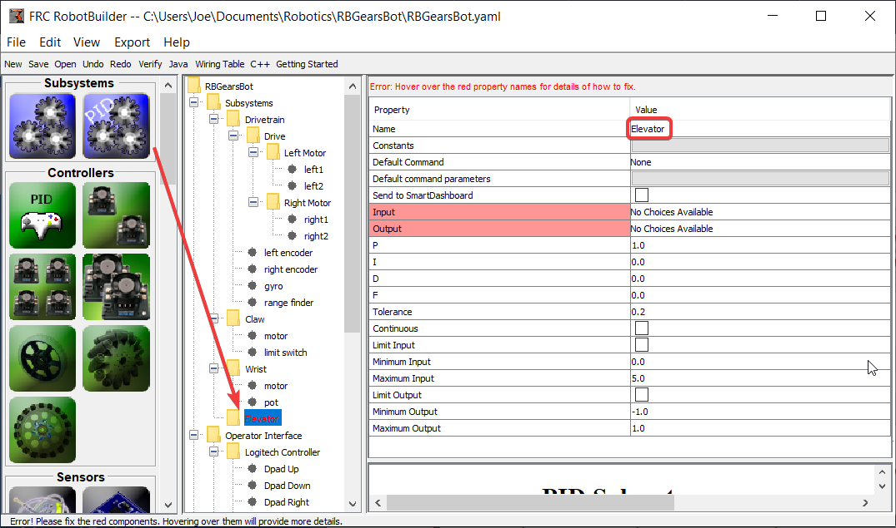
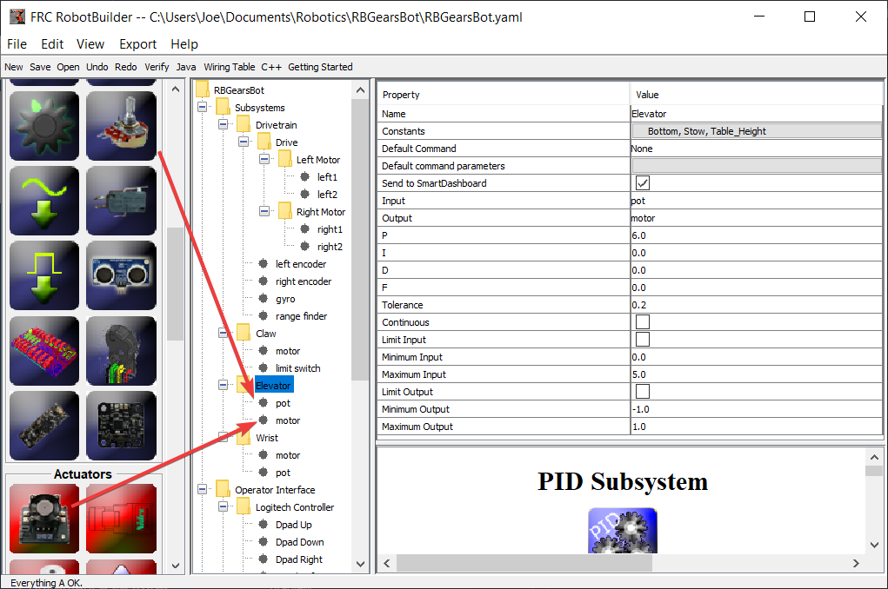
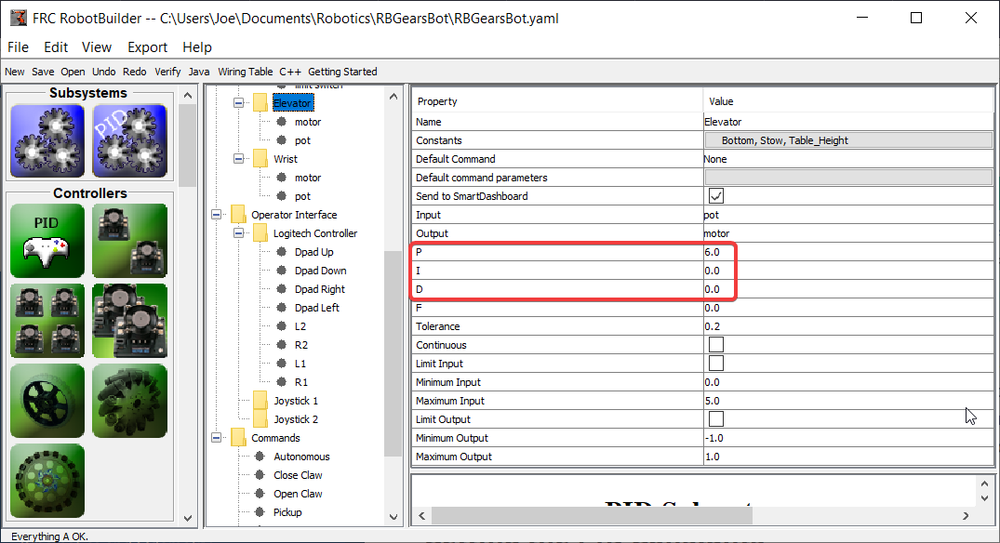
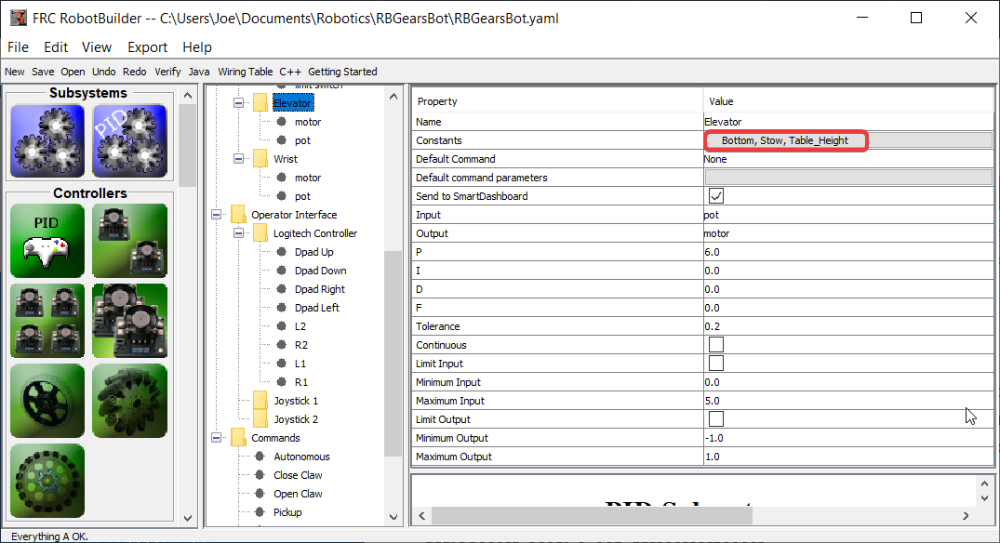
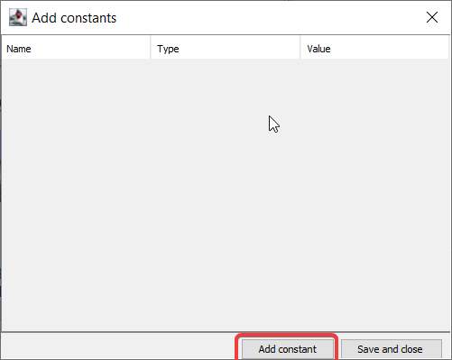
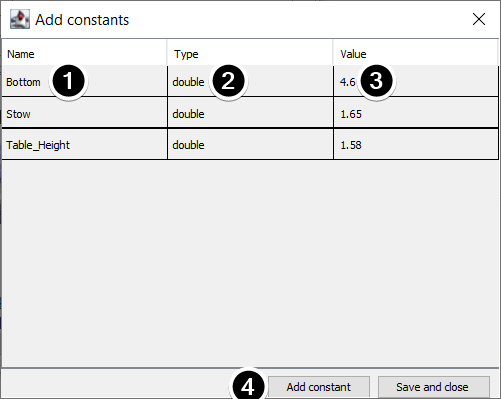

Using PIDSubsystem to Control Actuators
=======================================

More advanced subsystems will use sensors for feedback to get guaranteed results for operations like setting elevator heights or wrist angles.  PIDSubsystems use feedback to control the actuator and drive it to a particular position. In this example we use an elevator with a 10-turn potentiometer connected to it to give feedback on the height. The PIDSubsystem has a built-in PIDController to automatically control the mechanism to the correct setpoints.

Create a PIDSubsystem
---------------------

Creating a subsystem that uses feedback to control the position or speed of a mechanism is very easy.

1. Drag a PIDSubsystem from the palette to the Subsystems folder in the robot description
2. Rename the PID Subsystem to a more meaningful name for the subsystem, in this case Elevator

Notice that some of the parts of the robot description have turned red. This indicates that these components (the PIDSubsystem) haven't been completed and need to be filled in. The properties that are either missing or incorrect are shown in red.

Adding Sensors and Actuators to the PIDSubsystem
------------------------------------------------

Add the missing components for the PIDSubsystem

1. Drag in the actuator (a motor controller) to the particular subsystem - in this case the Elevator
2. Drag the sensor that will be used for feedback to the subsystem, in this case the sensor is a potentiometer that might give elevator height feedback.

Fill in the PID Parameters
--------------------------

The P, I, and D values need to be filled in to get the desired sensitivity and stability of the component. In the case of our elevator we use a proportional constant of 6.0 and 0 for the I and D terms.

Create Setpoint Constants
-------------------------

In order to make it easier to manage elevator setpoints, we will create constants to manage the setpoints. Click on the constants box to bring up the constants dialog.

Click on the :guilabel:`add constant` button

1. Fill in a name for the constant, in this case: Bottom
2. Select a type for the constant from the drop-down menu, in this case: double
3. Select a value for the constant, in this case: 4.65
4. Click :guilabel:`add constant` to continue adding constants
5. After entering all constants, Click :guilabel:`Save and close`
