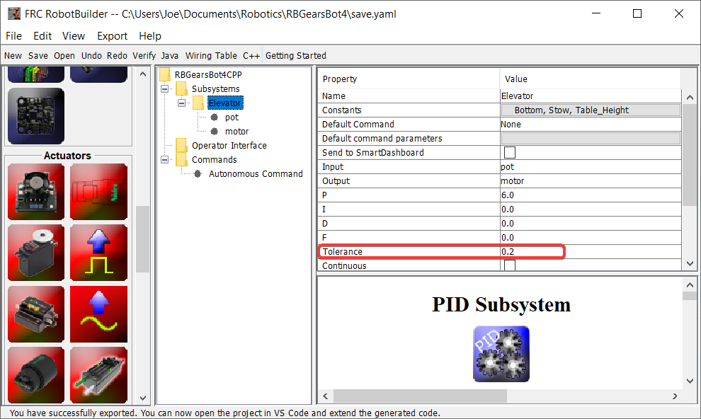
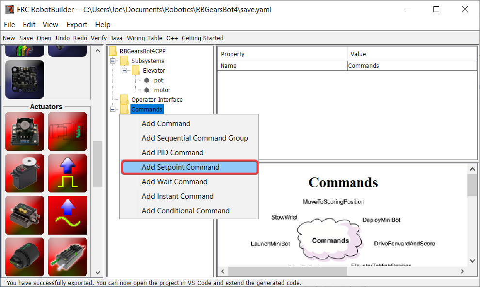
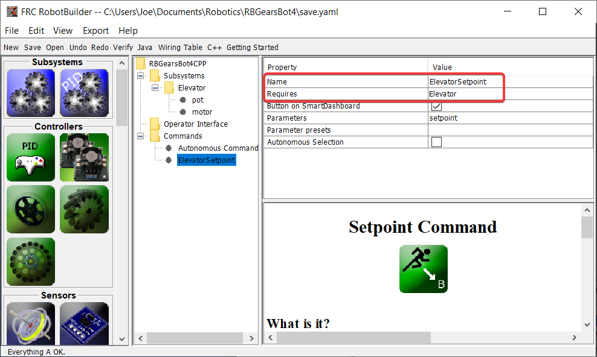
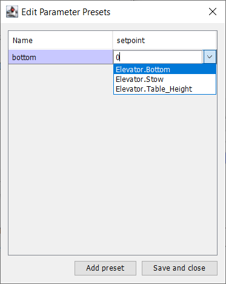

Setpoint Command
================

A Setpoint Command works in conjunction with a PIDSubsystem to drive an actuator to a particular angle or position that is measured using a potentiometer or encoder. This happens so often that there is a shortcut in RobotBuilder to do this task.

Start with a PIDSubsystem
-------------------------

Suppose in a robot there is a wrist joint with a potentiometer that measures the angle. First :doc:`create a PIDSubsystem <robotbuilder-writing-pidsubsystem-code>` that include the motor that moves the wrist joint and the potentiometer that measures the angle. The PIDSubsystem should have all the PID constants filled in and working properly.

It is important to set the **Tolerance** parameter. This controls how far off the current value can be from the setpoint and be considered on target. This is the criteria that the SetpointCommand uses to move onto the next command.

Creating the Setpoint Command
-----------------------------

Right-click on the Commands folder in the palette and select "Add Setpoint command".

Setpoint Command Parameters
---------------------------

Fill in the name of the new command. The Requires field is the PIDSubsystem that is being driven to a setpoint, in this case the Elevator subsystem.

1. Click on the Parameter Presets to set up the setpoints.
2. Select :guilabel:`Add Preset`
3. Enter a preset name (in this case 'bottom'
4. Click the dropdown next to the setpoint entry box
5. Select the Elevator.Bottom constant, that was created in the Elevator subystem previously
6. Repeat steps 2-5 for the other setpoints.
7. Click :guilabel:`Save and close`

There is no need to fill in any code for this command, it is automatically created by RobotBuilder.

Whenever this command is scheduled, it will automatically drive the subsystem to the specified setpoint. When the setpoint is reached within the tolerance specified in the PIDSubsystem, the command ends and the next command starts. It is important to specify a tolerance in the PIDSubsystem or this command might never end because the tolerance is not achieved.

.. note:: For more information about PID Control, please see the :ref:`Advanced Controls Introduction <docs/software/advanced-controls/introduction/index:Advanced Controls Introduction>`.
