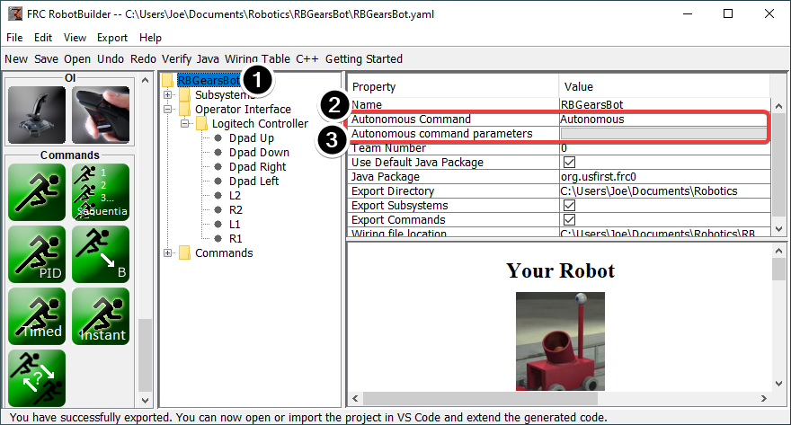
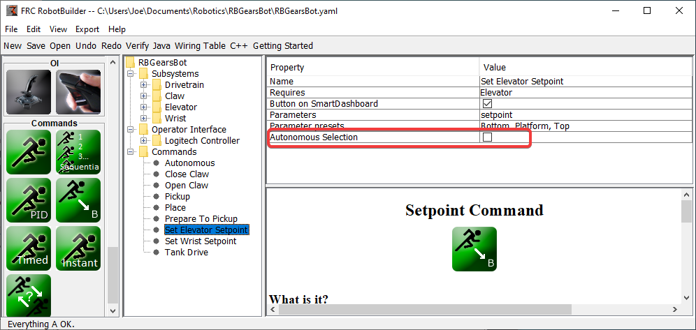

Setting the Autonomous Commands
===============================

Since a command is simply one or more actions (behaviors) that the robot performs, it makes sense to describe the autonomous operation of a robot as a command. While it could be a single command, it is more likely going to be a command group (a group of commands that happen together).

RobotBuilder generates code for a :ref:`Sendable Chooser <docs/software/dashboards/smartdashboard/choosing-an-autonomous-program-from-smartdashboard:Choosing an Autonomous Program>` which allows the autonomous command to run to be chosen from the dashboard.

To designate the default autonomous command that runs if another command is not selected on the dashboard:

- Select the robot in the robot program description
- Fill in the Autonomous command field with the command that should run when the robot is placed in autonomous mode. This is a drop-down field and will give you the option to select any command that has been defined.
- Set the parameters the command takes, if any.

To select commands to add as options to the Sendable Chooser, select the Autonomous Selection check box.

When the robot is put into autonomous mode, the chosen Autonomous command will be scheduled.
