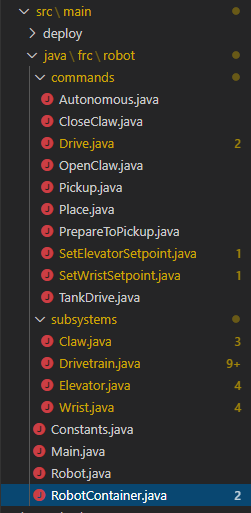
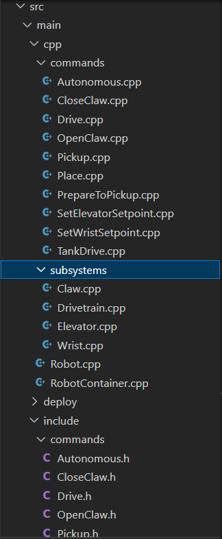

RobotBuilder Created Code
=========================

The Layout of a RobotBuilder Generated Project
----------------------------------------------

A RobotBuilder generated project consists of a package (in Java) or a folder (in C++) for Commands and another for Subsystems. Each command or subsystem object is stored under those containers. At the top level of the project you'll find the robot main program (RobotContainer.java/C++).

For more information on the organization of a Command Based robot, see :doc:`/docs/software/commandbased/structuring-command-based-project`

Autogenerated Code
------------------
.. tabs::

    .. code-tab:: java

        // BEGIN AUTOGENERATED CODE, SOURCE=ROBOTBUILDER ID=AUTONOMOUS
        m_chooser.setDefaultOption("Autonomous", new Autonomous());
        // END AUTOGENERATED CODE, SOURCE=ROBOTBUILDER ID=AUTONOMOUS

        SmartDashboard.putData("Auto Mode", m_chooser);

    .. code-tab:: cpp

        // BEGIN AUTOGENERATED CODE, SOURCE=ROBOTBUILDER ID=AUTONOMOUS
        m_chooser.SetDefaultOption("Autonomous", new Autonomous());
        // END AUTOGENERATED CODE, SOURCE=ROBOTBUILDER ID=AUTONOMOUS

        frc::SmartDashboard::PutData("Auto Mode", &m_chooser);

When the robot description is modified and code is re-exported RobotBuilder is designed to not modify any changes you made to the file, thus preserving your code. This makes RobotBuilder a full-lifecycle tool. To know what code is OK to be modified by RobotBuilder, it generates sections that will potentially have to be rewritten delimited with some special comments. These comments are shown in the example above. Don't add any code within these comment blocks, it will be rewritten next time the project is exported from RobotBuilder.

If code inside one of these blocks must be modified, the comments can be removed, but this will prevent further updates from happening later. In the above example, if the //BEGIN and //END comments were removed, then later another required subsystem was added in RobotBuilder, it would not be generated on that next export.

.. tabs::

    .. code-tab:: java

        // ROBOTBUILDER TYPE: Robot.

    .. code-tab:: cpp

        // ROBOTBUILDER TYPE: Robot.

Additionally, each file has a comment defining the type of file. If this is modified or deleted, RobotBuilder will completely regenerate the file deleting any code added both inside and outside the AUTOGENERATED CODE blocks.

Main Robot Program
------------------
.. tabs::

    .. tab:: Java

        .. code-block:: java
            :linenos:
            :lineno-start: 11
            :emphasize-lines: 19,50,70-75

            // ROBOTBUILDER TYPE: Robot.

            package frc.robot;

            import edu.wpi.first.hal.FRCNetComm.tInstances;
            import edu.wpi.first.hal.FRCNetComm.tResourceType;
            import edu.wpi.first.hal.HAL;
            import edu.wpi.first.wpilibj.TimedRobot;
            import edu.wpi.first.wpilibj2.command.Command;
            import edu.wpi.first.wpilibj2.command.CommandScheduler;

            /**
             * The VM is configured to automatically run this class, and to call the
             * functions corresponding to each mode, as described in the TimedRobot
             * documentation. If you change the name of this class or the package after
             * creating this project, you must also update the build.properties file in
             * the project.
             */
            public class Robot extends TimedRobot { // (1)

                private Command m_autonomousCommand;

                private RobotContainer m_robotContainer;

                /**
                 * This function is run when the robot is first started up and should be
                 * used for any initialization code.
                 */
                @Override
                public void robotInit() {
                    // Instantiate our RobotContainer.  This will perform all our button bindings, and put our
                    // autonomous chooser on the dashboard.
                    m_robotContainer = RobotContainer.getInstance();
                    HAL.report(tResourceType.kResourceType_Framework, tInstances.kFramework_RobotBuilder);
                }

                /**
                * This function is called every robot packet, no matter the mode. Use this for items like
                * diagnostics that you want ran during disabled, autonomous, teleoperated and test.
                *
                * 
This runs after the mode specific periodic functions, but before
                * LiveWindow and SmartDashboard integrated updating.
                */
                @Override
                public void robotPeriodic() {
                    // Runs the Scheduler.  This is responsible for polling buttons, adding newly-scheduled
                    // commands, running already-scheduled commands, removing finished or interrupted commands,
                    // and running subsystem periodic() methods.  This must be called from the robot's periodic
                    // block in order for anything in the Command-based framework to work.
                    CommandScheduler.getInstance().run();  // (2)
                }

                /**
                * This function is called once each time the robot enters Disabled mode.
                */
                @Override
                public void disabledInit() {
                }

                @Override
                public void disabledPeriodic() {
                }

                /**
                * This autonomous runs the autonomous command selected by your {@link RobotContainer} class.
                */
                @Override
                public void autonomousInit() {
                    m_autonomousCommand = m_robotContainer.getAutonomousCommand();  // (3)

                    // schedule the autonomous command (example)
                    if (m_autonomousCommand != null) {
                        m_autonomousCommand.schedule();
                    }
                }

                /**
                * This function is called periodically during autonomous.
                */
                @Override
                public void autonomousPeriodic() {
                }

                @Override
                public void teleopInit() {
                    // This makes sure that the autonomous stops running when
                    // teleop starts running. If you want the autonomous to
                    // continue until interrupted by another command, remove
                    // this line or comment it out.
                    if (m_autonomousCommand != null) {
                        m_autonomousCommand.cancel();
                    }
                }

                /**
                 * This function is called periodically during operator control.
                 */
                @Override
                public void teleopPeriodic() {
                }

                @Override
                public void testInit() {
                    // Cancels all running commands at the start of test mode.
                    CommandScheduler.getInstance().cancelAll();
                }

                /**
                * This function is called periodically during test mode.
                */
                @Override
                public void testPeriodic() {
                }

            }

    .. tab:: C++ (Header)

        .. code-block:: C++
            :linenos:
            :lineno-start: 11
            :emphasize-lines: 9

            // ROBOTBUILDER TYPE: Robot.
            #pragma once

            #include <frc/TimedRobot.h>
            #include <frc2/command/Command.h>

            #include "RobotContainer.h"

            class Robot : public frc::TimedRobot { // {1}
             public:
              void RobotInit() override;
              void RobotPeriodic() override;
              void DisabledInit() override;
              void DisabledPeriodic() override;
              void AutonomousInit() override;
              void AutonomousPeriodic() override;
              void TeleopInit() override;
              void TeleopPeriodic() override;
              void TestPeriodic() override;

             private:
              // Have it null by default so that if testing teleop it
              // doesn't have undefined behavior and potentially crash.
              frc2::Command* m_autonomousCommand = nullptr;

              RobotContainer* m_container = RobotContainer::GetInstance();
            };

    .. tab:: C++ (Source)

        .. code-block:: C++
            :linenos:
            :lineno-start: 11
            :emphasize-lines: 18,34-38

            // ROBOTBUILDER TYPE: Robot.

            #include "Robot.h"

            #include <frc/smartdashboard/SmartDashboard.h>
            #include <frc2/command/CommandScheduler.h>

            void Robot::RobotInit() {}

            /**
             * This function is called every robot packet, no matter the mode. Use
             * this for items like diagnostics that you want to run during disabled,
             * autonomous, teleoperated and test.
             *
             * 
 This runs after the mode specific periodic functions, but before
             * LiveWindow and SmartDashboard integrated updating.
             */
            void Robot::RobotPeriodic() { frc2::CommandScheduler::GetInstance().Run(); } // (2)

            /**
             * This function is called once each time the robot enters Disabled mode. You
             * can use it to reset any subsystem information you want to clear when the
             * robot is disabled.
             */
            void Robot::DisabledInit() {}

            void Robot::DisabledPeriodic() {}

            /**
             * This autonomous runs the autonomous command selected by your {@link
             * RobotContainer} class.
             */
            void Robot::AutonomousInit() {
              m_autonomousCommand = m_container->GetAutonomousCommand(); // {3}

              if (m_autonomousCommand != nullptr) {
                m_autonomousCommand->Schedule();
              }
            }

            void Robot::AutonomousPeriodic() {}

            void Robot::TeleopInit() {
              // This makes sure that the autonomous stops running when
              // teleop starts running. If you want the autonomous to
              // continue until interrupted by another command, remove
              // this line or comment it out.
              if (m_autonomousCommand != nullptr) {
                m_autonomousCommand->Cancel();
                m_autonomousCommand = nullptr;
              }
            }

            /**
             * This function is called periodically during operator control.
             */
            void Robot::TeleopPeriodic() {}

            /**
             * This function is called periodically during test mode.
             */
            void Robot::TestPeriodic() {}

            #ifndef RUNNING_FRC_TESTS
            int main() { return frc::StartRobot<Robot>(); }
            #endif

This is the main program generated by RobotBuilder. There are a number of parts to this program (highlighted sections):

1. This class extends TimedRobot. TimedRobot will call your ``autonomousPeriodic()`` and ``teleopPeriodic()`` methods every 20ms.
2. In the robotPeriodic method which is called every 20ms, make one scheduling pass.
3. The autonomous command provided is scheduled at the start of autonomous in the ``autonomousInit()`` method and canceled at the end of the autonomous period in ``teleopInit()``.

RobotContainer
--------------
.. tabs::

    .. tab:: Java

        .. code-block:: java
            :linenos:
            :lineno-start: 11
            :emphasize-lines: 33-36, 39, 62, 81, 92, 112

            // ROBOTBUILDER TYPE: RobotContainer.

            package frc.robot;

            import frc.robot.commands.*;
            import frc.robot.subsystems.*;
            import edu.wpi.first.wpilibj.smartdashboard.SendableChooser;
            import edu.wpi.first.wpilibj.smartdashboard.SmartDashboard;
            import edu.wpi.first.wpilibj2.command.Command.InterruptionBehavior;

            // BEGIN AUTOGENERATED CODE, SOURCE=ROBOTBUILDER ID=IMPORTS
            import edu.wpi.first.wpilibj2.command.Command;
            import edu.wpi.first.wpilibj2.command.InstantCommand;
            import edu.wpi.first.wpilibj.Joystick;
            import edu.wpi.first.wpilibj2.command.button.JoystickButton;
            import frc.robot.subsystems.*;

                // END AUTOGENERATED CODE, SOURCE=ROBOTBUILDER ID=IMPORTS

            /**
             * This class is where the bulk of the robot should be declared.  Since Command-based is a
             * "declarative" paradigm, very little robot logic should actually be handled in the {@link Robot}
             * periodic methods (other than the scheduler calls).  Instead, the structure of the robot
             * (including subsystems, commands, and button mappings) should be declared here.
             */
            public class RobotContainer {

              private static RobotContainer m_robotContainer = new RobotContainer();

                // BEGIN AUTOGENERATED CODE, SOURCE=ROBOTBUILDER ID=DECLARATIONS
            // The robot's subsystems
                public final Wrist m_wrist = new Wrist(); // (1)
                public final Elevator m_elevator = new Elevator();
                public final Claw m_claw = new Claw();
                public final Drivetrain m_drivetrain = new Drivetrain();

            // Joysticks
            private final Joystick joystick2 = new Joystick(2); // (3)
            private final Joystick joystick1 = new Joystick(1);
            private final Joystick logitechController = new Joystick(0);

                // END AUTOGENERATED CODE, SOURCE=ROBOTBUILDER ID=DECLARATIONS

              // A chooser for autonomous commands
              SendableChooser<Command> m_chooser = new SendableChooser<>();

              /**
              * The container for the robot.  Contains subsystems, OI devices, and commands.
              */
              private RobotContainer() {
                    // BEGIN AUTOGENERATED CODE, SOURCE=ROBOTBUILDER ID=SMARTDASHBOARD
                // Smartdashboard Subsystems
                SmartDashboard.putData(m_wrist); // (6)
                SmartDashboard.putData(m_elevator);
                SmartDashboard.putData(m_claw);
                SmartDashboard.putData(m_drivetrain);

                // SmartDashboard Buttons
                SmartDashboard.putData("Close Claw", new CloseClaw( m_claw )); // (6)
                SmartDashboard.putData("Open Claw: OpenTime", new OpenClaw(1.0, m_claw));
                SmartDashboard.putData("Pickup", new Pickup());
                SmartDashboard.putData("Place", new Place());
                SmartDashboard.putData("Prepare To Pickup", new PrepareToPickup());
                SmartDashboard.putData("Set Elevator Setpoint: Bottom", new SetElevatorSetpoint(0, m_elevator));
                SmartDashboard.putData("Set Elevator Setpoint: Platform", new SetElevatorSetpoint(0.2, m_elevator));
                SmartDashboard.putData("Set Elevator Setpoint: Top", new SetElevatorSetpoint(0.3, m_elevator));
                SmartDashboard.putData("Set Wrist Setpoint: Horizontal", new SetWristSetpoint(0, m_wrist));
                SmartDashboard.putData("Set Wrist Setpoint: Raise Wrist", new SetWristSetpoint(-45, m_wrist));
                SmartDashboard.putData("Drive: Straight3Meters", new Drive(3, 0, m_drivetrain));
                SmartDashboard.putData("Drive: Place", new Drive(Drivetrain.PlaceDistance, Drivetrain.BackAwayDistance, m_drivetrain));

                // END AUTOGENERATED CODE, SOURCE=ROBOTBUILDER ID=SMARTDASHBOARD
                // Configure the button bindings
                configureButtonBindings();

                // Configure default commands
                    // BEGIN AUTOGENERATED CODE, SOURCE=ROBOTBUILDER ID=SUBSYSTEM_DEFAULT_COMMAND
                m_drivetrain.setDefaultCommand(new TankDrive(() -> getJoystick1().getY(), () -> getJoystick2().getY(), m_drivetrain)); // (5)

                // END AUTOGENERATED CODE, SOURCE=ROBOTBUILDER ID=SUBSYSTEM_DEFAULT_COMMAND

                // Configure autonomous sendable chooser
                    // BEGIN AUTOGENERATED CODE, SOURCE=ROBOTBUILDER ID=AUTONOMOUS

                m_chooser.addOption("Set Elevator Setpoint: Bottom", new SetElevatorSetpoint(0, m_elevator));
                m_chooser.addOption("Set Elevator Setpoint: Platform", new SetElevatorSetpoint(0.2, m_elevator));
                m_chooser.addOption("Set Elevator Setpoint: Top", new SetElevatorSetpoint(0.3, m_elevator));
                m_chooser.setDefaultOption("Autonomous", new Autonomous()); // (2)

                // END AUTOGENERATED CODE, SOURCE=ROBOTBUILDER ID=AUTONOMOUS

                SmartDashboard.putData("Auto Mode", m_chooser);
              }

              public static RobotContainer getInstance() {
                return m_robotContainer;
              }

              /**
               * Use this method to define your button->command mappings.  Buttons can be created by
               * instantiating a {@link GenericHID} or one of its subclasses ({@link
               * edu.wpi.first.wpilibj.Joystick} or {@link XboxController}), and then passing it to a
               * {@link edu.wpi.first.wpilibj2.command.button.JoystickButton}.
               */
              private void configureButtonBindings() {
                    // BEGIN AUTOGENERATED CODE, SOURCE=ROBOTBUILDER ID=BUTTONS
            // Create some buttons
            final JoystickButton r1 = new JoystickButton(logitechController, 12);        // (4)
            r1.onTrue(new Autonomous().withInterruptBehavior(InterruptionBehavior.kCancelSelf));

            final JoystickButton l1 = new JoystickButton(logitechController, 11);
            l1.onTrue(new Place().withInterruptBehavior(InterruptionBehavior.kCancelSelf));

            final JoystickButton r2 = new JoystickButton(logitechController, 10);
            r2.onTrue(new Pickup().withInterruptBehavior(InterruptionBehavior.kCancelSelf));

            final JoystickButton l2 = new JoystickButton(logitechController, 9);
            l2.onTrue(new PrepareToPickup().withInterruptBehavior(InterruptionBehavior.kCancelSelf));

            final JoystickButton dpadLeft = new JoystickButton(logitechController, 8);
            dpadLeft.onTrue(new OpenClaw(1.0, m_claw).withInterruptBehavior(InterruptionBehavior.kCancelSelf));

            final JoystickButton dpadRight = new JoystickButton(logitechController, 6);
            dpadRight.onTrue(new CloseClaw( m_claw ).withInterruptBehavior(InterruptionBehavior.kCancelSelf));

            final JoystickButton dpadDown = new JoystickButton(logitechController, 7);
            dpadDown.onTrue(new SetElevatorSetpoint(0, m_elevator).withInterruptBehavior(InterruptionBehavior.kCancelSelf));

            final JoystickButton dpadUp = new JoystickButton(logitechController, 5);
            dpadUp.onTrue(new SetElevatorSetpoint(0.3, m_elevator).withInterruptBehavior(InterruptionBehavior.kCancelSelf));

                // END AUTOGENERATED CODE, SOURCE=ROBOTBUILDER ID=BUTTONS
              }

                // BEGIN AUTOGENERATED CODE, SOURCE=ROBOTBUILDER ID=FUNCTIONS
            public Joystick getLogitechController() {
                    return logitechController;
                }

            public Joystick getJoystick1() {
                    return joystick1;
                }

            public Joystick getJoystick2() {
                    return joystick2;
                }

                // END AUTOGENERATED CODE, SOURCE=ROBOTBUILDER ID=FUNCTIONS

              /**
               * Use this to pass the autonomous command to the main {@link Robot} class.
               *
               * @return the command to run in autonomous
              */
              public Command getAutonomousCommand() {
                // The selected command will be run in autonomous
                return m_chooser.getSelected();
              }

            }

    .. tab:: C++ (Header)

        .. code-block:: C++
            :linenos:
            :lineno-start: 11
            :emphasize-lines: 38, 56

            // ROBOTBUILDER TYPE: RobotContainer.

            #pragma once

            // BEGIN AUTOGENERATED CODE, SOURCE=ROBOTBUILDER ID=INCLUDES
            #include <frc/smartdashboard/SendableChooser.h>
            #include <frc2/command/Command.h>

            #include "subsystems/Claw.h"
            #include "subsystems/Drivetrain.h"
            #include "subsystems/Elevator.h"
            #include "subsystems/Wrist.h"

            #include "commands/Autonomous.h"
            #include "commands/CloseClaw.h"
            #include "commands/Drive.h"
            #include "commands/OpenClaw.h"
            #include "commands/Pickup.h"
            #include "commands/Place.h"
            #include "commands/PrepareToPickup.h"
            #include "commands/SetElevatorSetpoint.h"
            #include "commands/SetWristSetpoint.h"
            #include "commands/TankDrive.h"
            #include <frc/Joystick.h>
            #include <frc2/command/button/JoystickButton.h>

                // END AUTOGENERATED CODE, SOURCE=ROBOTBUILDER ID=INCLUDES

            class RobotContainer {

            public:

                frc2::Command* GetAutonomousCommand();
                static RobotContainer* GetInstance();

                // BEGIN AUTOGENERATED CODE, SOURCE=ROBOTBUILDER ID=PROTOTYPES
            // The robot's subsystems
            Drivetrain m_drivetrain; // (1)
            Claw m_claw;
            Elevator m_elevator;
            Wrist m_wrist;

            frc::Joystick* getJoystick2();
            frc::Joystick* getJoystick1();
            frc::Joystick* getLogitechController();

                // END AUTOGENERATED CODE, SOURCE=ROBOTBUILDER ID=PROTOTYPES

            private:

                RobotContainer();

                // BEGIN AUTOGENERATED CODE, SOURCE=ROBOTBUILDER ID=DECLARATIONS
            // Joysticks
            frc::Joystick m_logitechController{0}; // (3)
            frc::Joystick m_joystick1{1};
            frc::Joystick m_joystick2{2};

            frc::SendableChooser<frc2::Command*> m_chooser;

                // END AUTOGENERATED CODE, SOURCE=ROBOTBUILDER ID=DECLARATIONS

            Autonomous m_autonomousCommand;
                static RobotContainer* m_robotContainer;

                void ConfigureButtonBindings();
            };

    .. tab:: C++ (Source)

        .. code-block:: cpp
            :linenos:
            :lineno-start: 11
            :emphasize-lines: 28, 46, 56, 74

            // ROBOTBUILDER TYPE: RobotContainer.

            #include "RobotContainer.h"
            #include <frc2/command/ParallelRaceGroup.h>
            #include <frc/smartdashboard/SmartDashboard.h>

            RobotContainer* RobotContainer::m_robotContainer = NULL;

            RobotContainer::RobotContainer() : m_autonomousCommand(
                // BEGIN AUTOGENERATED CODE, SOURCE=ROBOTBUILDER ID=CONSTRUCTOR
            ){

                // END AUTOGENERATED CODE, SOURCE=ROBOTBUILDER ID=CONSTRUCTOR

                // BEGIN AUTOGENERATED CODE, SOURCE=ROBOTBUILDER ID=SMARTDASHBOARD
                // Smartdashboard Subsystems
                frc::SmartDashboard::PutData(&m_drivetrain);
                frc::SmartDashboard::PutData(&m_claw);
                frc::SmartDashboard::PutData(&m_elevator);
                frc::SmartDashboard::PutData(&m_wrist);

                // SmartDashboard Buttons
                frc::SmartDashboard::PutData("Drive: Straight3Meters", new Drive(3, 0, &m_drivetrain)); // (6)
                frc::SmartDashboard::PutData("Drive: Place", new Drive(Drivetrain::PlaceDistance, Drivetrain::BackAwayDistance, &m_drivetrain));
                frc::SmartDashboard::PutData("Set Wrist Setpoint: Horizontal", new SetWristSetpoint(0, &m_wrist));
                frc::SmartDashboard::PutData("Set Wrist Setpoint: Raise Wrist", new SetWristSetpoint(-45, &m_wrist));
                frc::SmartDashboard::PutData("Set Elevator Setpoint: Bottom", new SetElevatorSetpoint(0, &m_elevator));
                frc::SmartDashboard::PutData("Set Elevator Setpoint: Platform", new SetElevatorSetpoint(0.2, &m_elevator));
                frc::SmartDashboard::PutData("Set Elevator Setpoint: Top", new SetElevatorSetpoint(0.3, &m_elevator));
                frc::SmartDashboard::PutData("Prepare To Pickup", new PrepareToPickup());
                frc::SmartDashboard::PutData("Place", new Place());
                frc::SmartDashboard::PutData("Pickup", new Pickup());
                frc::SmartDashboard::PutData("Open Claw: OpenTime", new OpenClaw(1.0_s, &m_claw));
                frc::SmartDashboard::PutData("Close Claw", new CloseClaw( &m_claw ));

                // END AUTOGENERATED CODE, SOURCE=ROBOTBUILDER ID=SMARTDASHBOARD

                ConfigureButtonBindings();

                // BEGIN AUTOGENERATED CODE, SOURCE=ROBOTBUILDER ID=DEFAULT-COMMANDS
            m_drivetrain.SetDefaultCommand(TankDrive([this] {return getJoystick1()->GetY();}, [this] {return getJoystick2()->GetY();}, &m_drivetrain)); // (5)

                // END AUTOGENERATED CODE, SOURCE=ROBOTBUILDER ID=DEFAULT-COMMANDS

                // BEGIN AUTOGENERATED CODE, SOURCE=ROBOTBUILDER ID=AUTONOMOUS

                m_chooser.AddOption("Set Elevator Setpoint: Bottom", new SetElevatorSetpoint(0, &m_elevator));
                m_chooser.AddOption("Set Elevator Setpoint: Platform", new SetElevatorSetpoint(0.2, &m_elevator));
                m_chooser.AddOption("Set Elevator Setpoint: Top", new SetElevatorSetpoint(0.3, &m_elevator));

                m_chooser.SetDefaultOption("Autonomous", new Autonomous()); // (2)

                // END AUTOGENERATED CODE, SOURCE=ROBOTBUILDER ID=AUTONOMOUS

                frc::SmartDashboard::PutData("Auto Mode", &m_chooser);

            }

            RobotContainer* RobotContainer::GetInstance() {
                if (m_robotContainer == NULL) {
                    m_robotContainer = new RobotContainer();
                }
                return(m_robotContainer);
            }

            void RobotContainer::ConfigureButtonBindings() {
                // BEGIN AUTOGENERATED CODE, SOURCE=ROBOTBUILDER ID=BUTTONS

            frc2::JoystickButton m_dpadUp{&m_logitechController, 5}; // (4)
            frc2::JoystickButton m_dpadDown{&m_logitechController, 7};
            frc2::JoystickButton m_dpadRight{&m_logitechController, 6};
            frc2::JoystickButton m_dpadLeft{&m_logitechController, 8};
            frc2::JoystickButton m_l2{&m_logitechController, 9};
            frc2::JoystickButton m_r2{&m_logitechController, 10};
            frc2::JoystickButton m_l1{&m_logitechController, 11};
            frc2::JoystickButton m_r1{&m_logitechController, 12};

            m_dpadUp.OnTrue(SetElevatorSetpoint(0.3, &m_elevator).WithInterruptBehavior(frc2::Command::InterruptionBehavior::kCancelSelf));

            m_dpadDown.OnTrue(SetElevatorSetpoint(0, &m_elevator).WithInterruptBehavior(frc2::Command::InterruptionBehavior::kCancelSelf));

            m_dpadRight.OnTrue(CloseClaw( &m_claw ).WithInterruptBehavior(frc2::Command::InterruptionBehavior::kCancelSelf));

            m_dpadLeft.OnTrue(OpenClaw(1.0_s, &m_claw).WithInterruptBehavior(frc2::Command::InterruptionBehavior::kCancelSelf));

            m_l2.OnTrue(PrepareToPickup().WithInterruptBehavior(frc2::Command::InterruptionBehavior::kCancelSelf));

            m_r2.OnTrue(Pickup().WithInterruptBehavior(frc2::Command::InterruptionBehavior::kCancelSelf));

            m_l1.OnTrue(Place().WithInterruptBehavior(frc2::Command::InterruptionBehavior::kCancelSelf));

            m_r1.OnTrue(Autonomous().WithInterruptBehavior(frc2::Command::InterruptionBehavior::kCancelSelf));

                // END AUTOGENERATED CODE, SOURCE=ROBOTBUILDER ID=BUTTONS
            }

            // BEGIN AUTOGENERATED CODE, SOURCE=ROBOTBUILDER ID=FUNCTIONS

            frc::Joystick* RobotContainer::getLogitechController() {
               return &m_logitechController;
            }
            frc::Joystick* RobotContainer::getJoystick1() {
               return &m_joystick1;
            }
            frc::Joystick* RobotContainer::getJoystick2() {
               return &m_joystick2;
            }

                // END AUTOGENERATED CODE, SOURCE=ROBOTBUILDER ID=FUNCTIONS

            frc2::Command* RobotContainer::GetAutonomousCommand() {
              // The selected command will be run in autonomous
              return m_chooser.GetSelected();
            }

This is the RobotContainer generated by RobotBuilder which is where the subsystems and operator interface are defined. There are a number of parts to this program (highlighted sections):

1. Each of the subsystems is declared here. They can be passed as parameters to any commands that require them.
2. If there is an autonomous command provided in RobotBuilder robot properties, it is added to the Sendable Chooser to be selected on the dashboard.
3. The code for all the operator interface components is generated here.
4. In addition the code to link the OI buttons to commands that should run is also generated here.
5. Commands to be run on a subystem when no other commands are running are defined here.
6. Commands to be run via a dashboard are defined here.

