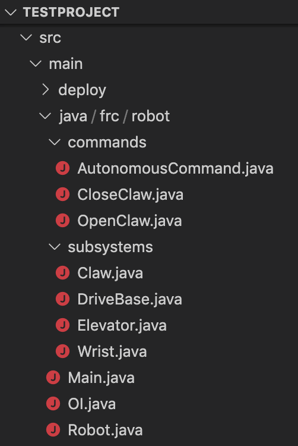
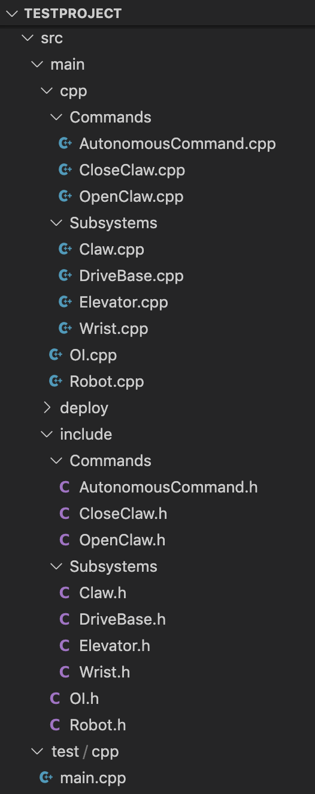
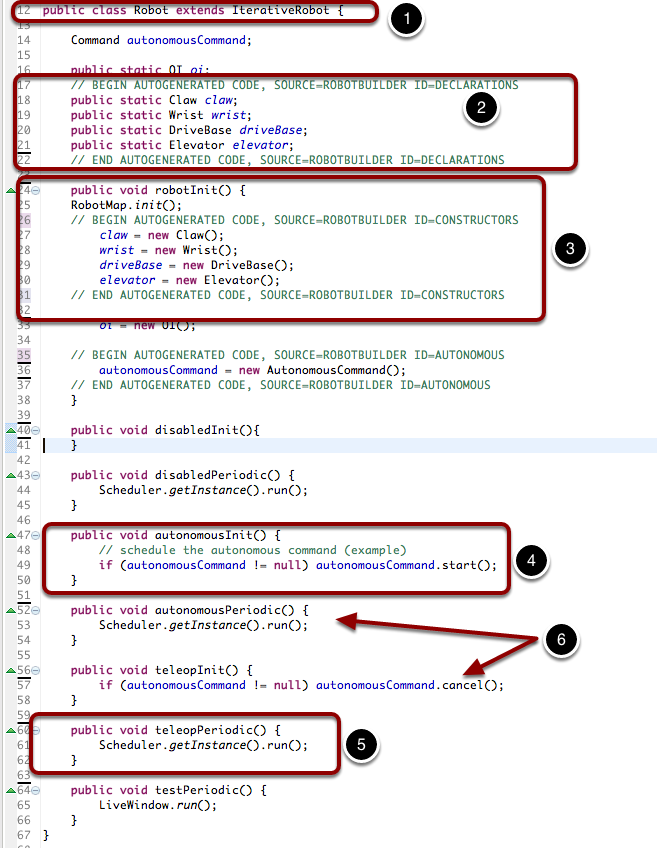
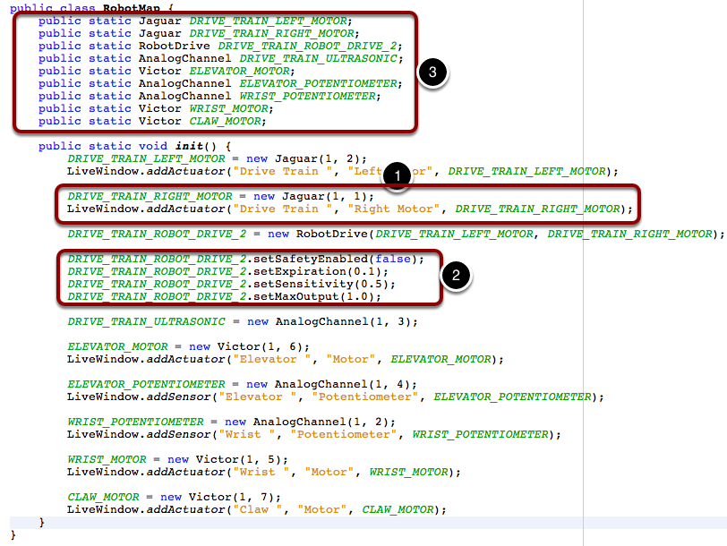
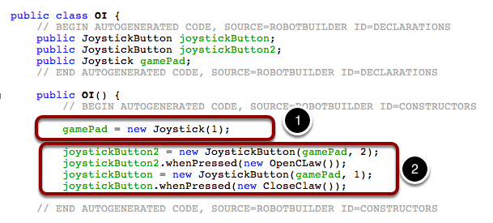

RobotBuilder Created Code
=========================

The Layout of a RobotBuilder Generated Project
----------------------------------------------

A RobotBuilder generated project consists of a package (in Java) or a folder (in C++) for Commands and another for Subsystems (1). Each command or subsystem object is stored under those containers (2). At the top level of the project you'll find the robot main program (Robot.java), the Operator Interface file (OI.java) and the RobotMap that contains the code to create all the subsystem components that were added to the robot description.

Autogenerated Code
------------------

When the robot description is modified and code is re-exported RobotBuilder is designed to not modify any changes you made to the file, thus preserving your code. This makes RobotBuilder a full-lifecycle tool. To know what code is OK to be modified by RobotBuilder, it generates sections that will potentially have to be rewritten delimited with some special comments. These comments are shown in the example above. Don't add any code within these comment blocks, it will be rewritten next time the project is exported from RobotBuilder.

If code inside one of these blocks must be modified, the comments can be removed, but this will prevent further updates from happening later. In the above example, if the //BEGIN and //END comments were removed, then later another required subsystem was added in RobotBuilder, it would not be generated on that next export.

Main Robot Program
------------------

This is the main program generated by RobotBuilder. There are a number of parts to this program:

1. This class extends TimedRobot. TimedRobot will call your ``autonomousPeriodic()`` and ``teleopPeriodic()`` methods every 20ms.
2. Each of the subsystems is declared here. These are public static variables so that they can be referenced from throughout your robot program by writing Robot.<subsystem-name>.method(), for example ``Robot.elevator.setSetpoint(4)``.
3. The subsystems are instantiated in the robotInit() method that is called after the construtor runs for this class. It is important to be create the subsystems after the constructor to avoid recursive loops. Also instance of the ``OI()`` class (for your operator interface) and the autonomous command are created here.
4. In the ``autonomousInit()`` method which is called every ``20ms``, make one scheduling pass. That will call the ``isFinished()`` and ``execute()`` methods of every command that is currently scheduled.
5. In the teleopPeriodic method which is called every 20ms, make one scheduling pass.
6. If there is an autonomous command provided in RobotBuilder robot properties, it is scheduled at the start of autonomous in the ``autonomousInit()`` method and canceled at the end of the autonomous period in ``teleopInit()``.

RobotMap - Generation of Actuator and Sensor Objects
----------------------------------------------------

The RobotMap is a mapping from the ports sensors and actuators are wired into to a variable name. This provides flexibility changing wiring, makes checking the wiring easier and significantly reduces the number of magic numbers floating around. All the definitions of sensors and motors from the robot description are generated here.

Notice that each sensor and actuator is added to the LiveWindow class (1) so that the can be automatically displayed when the SmartDashboard is set to LiveWindow mode. Also any properties for the particular sensor or actuator is set here to reflect the settings made in the robot description. (2)

Each of the references for the objects are declared and instantiated here (3, 1), but they are copied into every subsystem to make it easy and clean to write code that uses them.

OI Class - The Operator Interface
---------------------------------

The code for all the operator interface components is generated here (1). In addition the code to link the OI buttons to commands that should run is also generated here (2).
