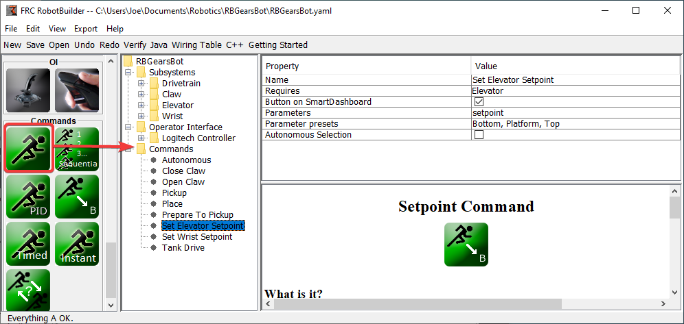
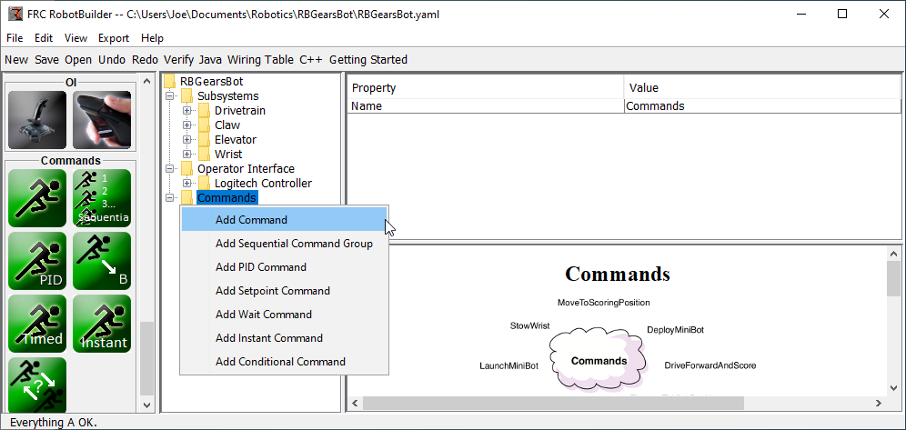
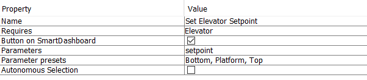
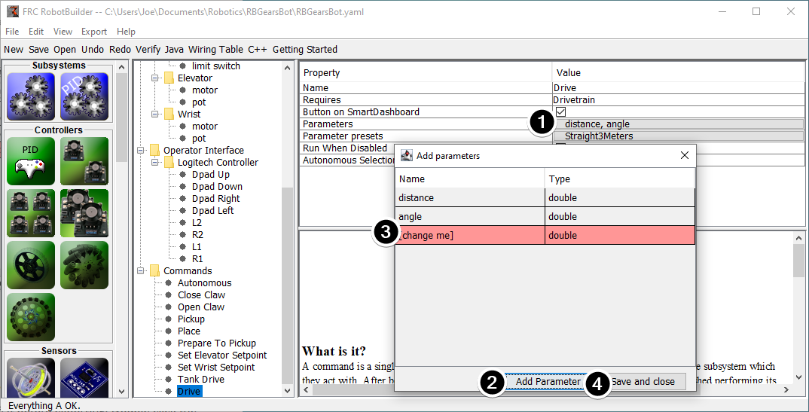
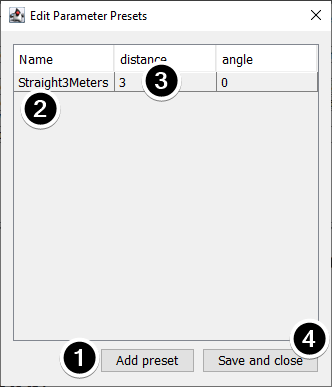

Creating a Command
==================

Commands are classes you create that provide behaviors or actions for your subsystems. The subsystem class should set the operation of the subsystem, like MoveElevator to start the elevator moving, or ElevatorToSetPoint to set the elevator's PID setpoint. The commands initiate the subsystem operation and keep track of when it is finished.

Drag the Command to the Commands Folder
---------------------------------------

Simple commands can be dragged from the palette to the robot description. The command will be created under the Commands folder.

Creating Commands using the Context Menu
----------------------------------------

You can also create commands using the right-click context menu on the Command folder in the robot description.

Configuring the Command
-----------------------

1. Name the command with something meaningful that describes what the command will do. Commands should be named as if they were in code, although there can be spaces between words.
2. Set the subsystem that is required by this command. When this command is scheduled, it will automatically stop any command currently running that also requires this command. If a command to open the claw is currently running (requiring the claw subsystem) and the close claw command is scheduled, it will immediately stop opening and start closing.
3. Tell RobotBuilder if it should create buttons on the SmartDashboard for the command. A button will be created for each parameter preset.
4. Set the parameters this command takes. A single command with parameters can do the same thing as two or more commands that do not take parameters. For example, "Drive Forward", "Drive Backward", and "Drive Distance" commands can be consolidated into a single command that takes values for direction and distance.
5. Set presets for parameters. These can be used elsewhere in RobotBuilder when using the command, such as binding it to a joystick button or setting the default command for a subsystem.
6. *Run When Disabled*. Allows the command to run when the robot is disabled. However, any actuators commanded while disabled will not actuate.
7. *Autonomous Selection*. Whether the command should be added to the Sendable Chooser so that it can be selected for autonomous.

Setpoint commands come with a single parameter ('setpoint', of type double); parameters cannot be added, edited, or deleted for setpoint commands.

Adding and Editing Parameters
^^^^^^^^^^^^^^^^^^^^^^^^^^^^^

To add or edit parameters:

1. Click the button in the :guilabel:`Value` column of the property table
2. Press the :guilabel:`Add Parameter` button to add a parameter
3. A parameter that has just been added. The name defaults to `[change me]` and the type defaults to String. The default name is invalid, so you will have to change it before exporting. Double click the :guilabel:`Name` cell to start changing the name. Double click the :guilabel:`Type` cell to select the type.
4. Save and close button will save all changes and close the window.

Rows can be reordered simply by dragging, and can be deleted by selecting them and pressing delete or backspace.

Adding and Editing Parameter Presets
^^^^^^^^^^^^^^^^^^^^^^^^^^^^^^^^^^^^

1. Click :guilabel:`Add parameter set` to add a new preset.
2. Change the name of the preset to something descriptive. The presets in this example are for opening and closing the gripper subsystem.
3. Change the value of the parameter(s) for the preset. You can either type a value in (e.g. "3.14") or select from constants defined in the subsystem that the command requires. Note that the type of the constant has to be the same type as the parameter -- you can't have an int-type constant be passed to a double-type parameter, for example
4. Click :guilabel:`Save and close` to save changes and exit the dialog; to exit without saving, press the exit button in the top bar of the window.
