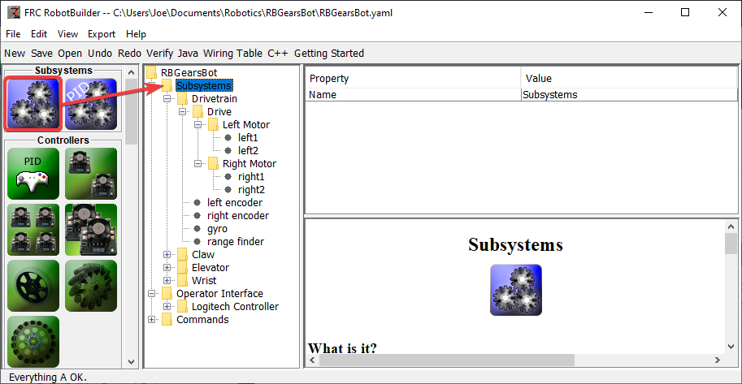
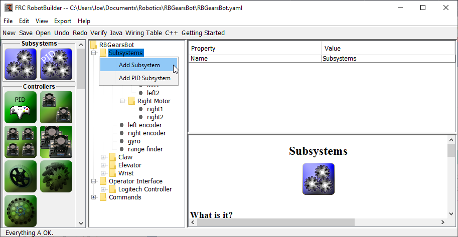
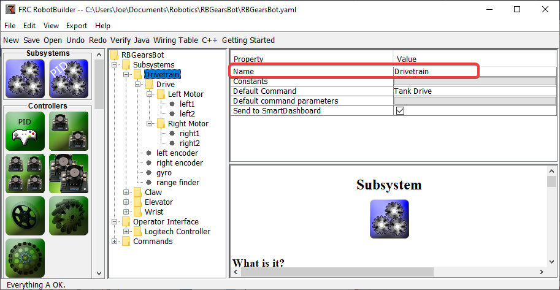
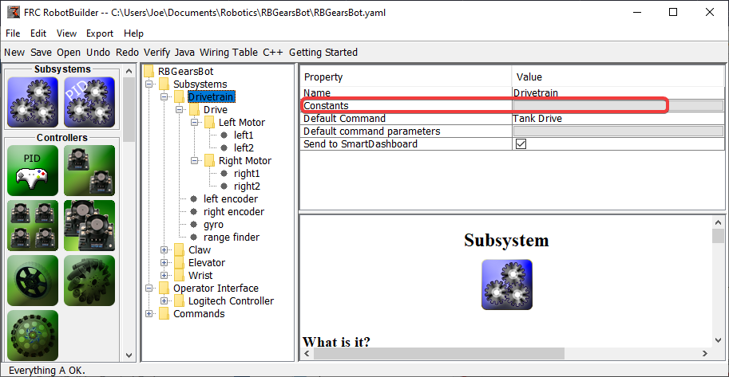
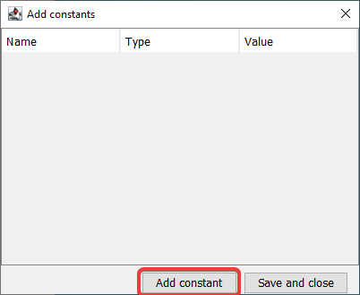
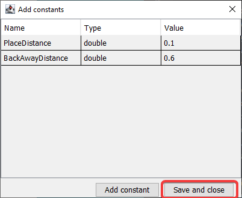
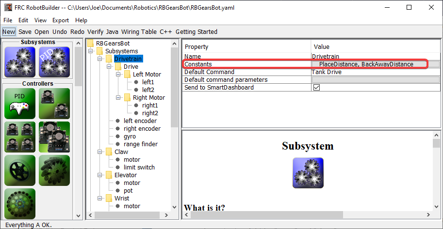
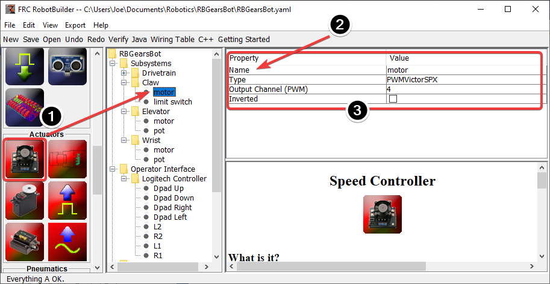

Creating a Subsystem
====================

Subsystems are classes that encapsulate (or contain) all the data and code that make a subsystem on your robot operate. The first step in creating a robot program with the RobotBuilder is to identify and create all the subsystems on the robot. Examples of subsystems are grippers, ball collectors, the drive base, elevators, arms, etc. Each subsystem contains all the sensors and actuators that are used to make it work. For example, an elevator might have a Victor SPX motor controller and a potentiometer to provide feedback of the robot position.

Creating a Subsystem using the Palette
--------------------------------------

Drag the subsystem icon from the palette to the Subsystems folder in the robot description to create a subsystem class.

Creating a Subsystem using the Context Menu
-------------------------------------------

Right-click on the Subsystem folder in the robot description to add a subsystem to that folder.

Name the Subsystem
------------------

After creating the subsystem by either dragging or using the context menu as described above, simply type the name you would like to give the subsystem. The name can be multiple words separated by spaces, RobotBuilder will concatenate the words to make a proper Java or C++ class name for you.

Adding Constants
----------------

Constants are very useful to reduce the amount of magic numbers in your code. In subsystems, they can be used to keep track of certain values, such as sensor values for specific heights of an elevator, or the speed at which to drive the robot.

By default, there will be no constants in a subsystem. Press the button next to "Constants" to open a dialog to create some.

Creating Constants
^^^^^^^^^^^^^^^^^^

The constants table will be empty at first. Press "Add constant" to add one.

Add Constants
^^^^^^^^^^^^^

.. image:: images/creating-subsystem-6.png

1. The name of the constant. Change this to something descriptive. In this example of a drivetrain some good constants might be "PlaceDistance" and "BackAwayDistance".
2. The type of the constant. This will most likely be a double, but you can choose from one of: String, double, int, long, boolean, or byte.
3. The value of the constant.

Saving Constants
^^^^^^^^^^^^^^^^

After adding constants and setting their values, just press "Save and close" to save the constants and close the dialog. If you don't want to save, press the exit button on the top of the window.

After Saving
^^^^^^^^^^^^

After saving constants, the names will appear in the "Constants" button in the subsystem properties.

Dragging Actuators/Sensors into the Subsystem
---------------------------------------------

There are three steps to adding components to a subsystem:

1. Drag actuators or sensors from the palette into the subsystem as required.
2. Give the actuator or sensor a meaningful name
3. Edit the properties such as module numbers and channel numbers for each item in the subsystem.

RobotBuilder will automatically use incrementing channel numbers for each module on the robot. If you haven't yet wired the robot you can just let RobotBuilder assign unique channel numbers for each sensor or actuator and wire the robot according to the generating wiring table.

This just creates the subsystem in RobotBuilder, and will subsequently generate skeleton code for the subsystem. To make it actually operate your robot please refer to :ref:`Writing Code for a Subsystem <docs/software/wpilib-tools/robotbuilder/writing-code/robotbuilder-writing-subsystem-code:Writing the Code for a Subsystem>`.
