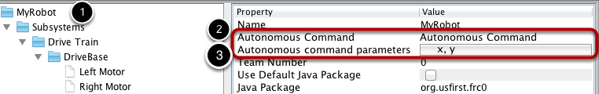

Setting the Default Autonomous Command
======================================

.. important:: RobotBuilder has been updated to support the new commandbased framework! Unfortunately, this documentation is outdated and only for the old commandbased framework. Individuals interested in updating this documentation can open a pull request on the `frc-docs <https://github.com/wpilibsuite/frc-docs>`__ repository.

Since a command is simply one or more actions (behaviors) that the robot performs, it makes sense to describe the autonomous operation of a robot as a command. While it could be a single command, it is more likely going to be a command group (a group of commands that happen together).

To designate a command that runs when the robot starts during the autonomous period of a competition:

    Select the robot in the robot program description
    Fill in the Autonomous command field with the command that should run when the robot is placed in autonomous mode. This is a drop-down field and will give you the option to select any command that has been defined.
    Set the parameters the command takes, if any

When the robot is put into autonomous mode, the defined Autonomous command will be scheduled.
