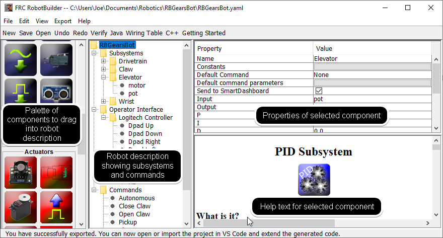
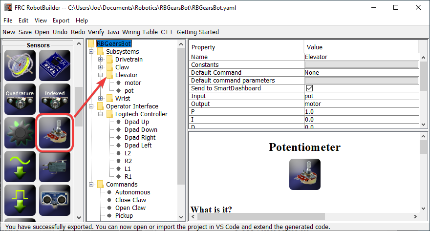
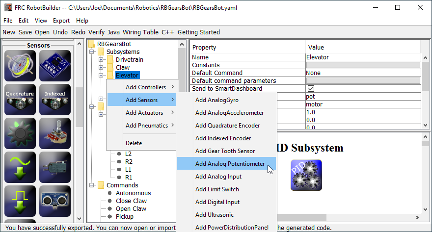
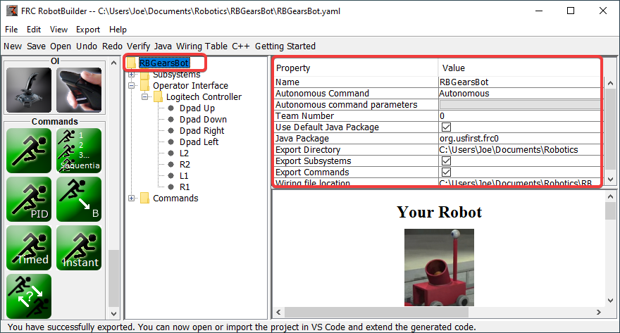
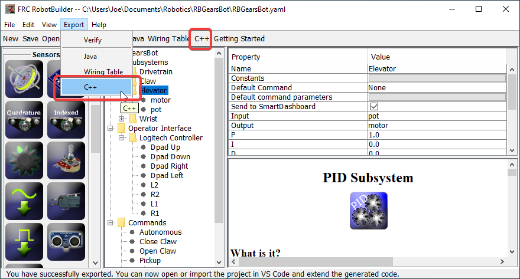

RobotBuilder User Interface
===========================

RobotBuilder has a user interface designed for rapid development of robot programs. Almost all operations are performed by drag-and-drop or selecting options from drop-down lists.

Dragging Items from the Palette to the Robot Description
--------------------------------------------------------

You can drag items from the palette to the robot description by starting the drag on the palette item and ending on the container where you would like the item to be located. In this example, dropping a potentiometer to the Elevator subsystem.

Adding Components using the Right-Click Context Menu
----------------------------------------------------

A shortcut method of adding items to the robot description is to right-click on the container object (Elevator) and select the item that should be added (Potentiometer). This is identical to using drag and drop but might be easier for some people.

Editing Properties of Robot Description Items
---------------------------------------------

The properties for a selected item will appear in the properties viewer. The properties can be edited by selecting the value in the right hand column.

Using the Menu System
---------------------

Operations for RobotBuilder can either be selected through the menu system or the equivalent item (if it is available) from the toolbar.
